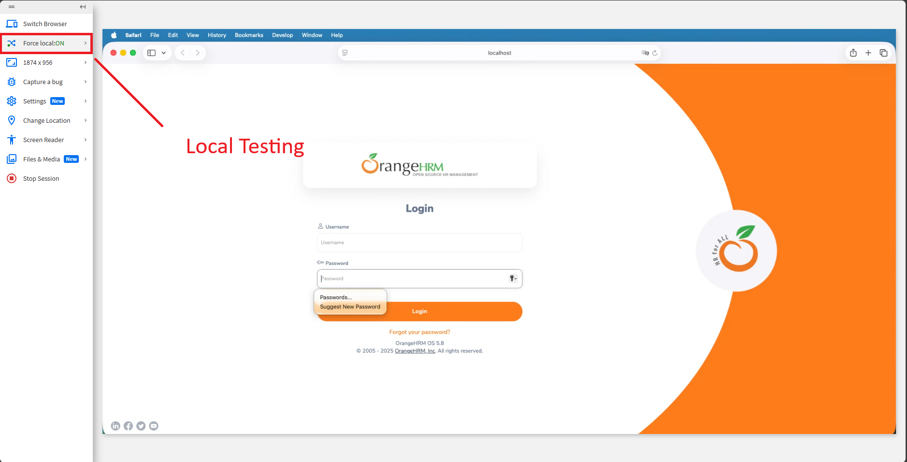

# CASE STUDY PROJECT REPORT
## OrangeHRM Testing

**Lecturer:** Dr. Tran Duy Hoang
**TA:** MSc. Truong Phuoc Loc

**Student Info:**
* **Name:** Giang Đức Nhật
* **Student ID:** 22120252
* **Group:** 11

---

## Task Allocation

Theo yêu cầu của đồ án, các thành viên trong nhóm phân chia công việc như sau:

| Tính năng | Mô tả | Thành viên |
|:---|:---|:---|
| HR Administration | Quản trị hệ thống, cấu trúc tổ chức, user | Giang Đức Nhật |
| Employee Self-Service (ESS) | Cổng thông tin nhân viên tự phục vụ | Giang Đức Nhật |
| Recruitment | Tuyển dụng, theo dõi ứng viên | Phan Thanh Tiến |
| Performance Management | Đánh giá KPI, đề nghị xem xét, lưu lịch sử performance review | Phan Thanh Tiến |
| Reporting & Analytics | Báo cáo tùy chỉnh, xuất dữ liệu | Nguyễn Bùi Vương Tiễn |
| Time and Attendance | Chấm công, Timesheets | Nguyễn Bùi Vương Tiễn |
| Employee Management (PIM) | Quản lý hồ sơ nhân viên, báo cáo | Lý Trọng Tín |
| Leave Management | Quản lý ngày nghỉ, quy tắc nghỉ phép | Lý Trọng Tín |

---

# Requirement 4: GUI Testing

**Chức năng được phân công:**
1. HR Administration (GUI: Users Management)
2. Employee Self-Service (GUI: My Info)

## 1. Giới thiệu (Introduction)
Báo cáo này ghi lại quy trình Kiểm thử Giao diện (GUI Testing) được thực hiện trên hệ thống OrangeHRM nhằm đảm bảo tính nhất quán, tính tiện dụng và độ phản hồi của giao diện người dùng trên các nền tảng khác nhau.

Checklist được sử dụng cho quá trình kiểm thử bao gồm hơn 30 tiêu chí, bao quát các khía cạnh về Bố cục (Layout), Phông chữ (Fonts), Điều hướng (Navigation) và Tính nhất quán (Consistency).

## 2. Thiết lập môi trường kiểm thử (Testing Environment Setup)

Để đảm bảo Giao diện Người dùng (GUI) hiển thị nhất quán trên các nền tảng khác nhau, em đã sử dụng **BrowserStack** - một nền tảng kiểm thử dựa trên đám mây.

### 2.1. Công cụ & Cấu hình
* **Công cụ kiểm thử:** BrowserStack (Live Testing).
* **Phương thức kết nối:** Vì ứng dụng OrangeHRM được lưu trữ trên máy cá nhân (`localhost`), em đã cấu hình **BrowserStack Local** để thiết lập một kết nối giữa cloud của BrowserStack và máy chủ local.
* **URL mục tiêu:** `http://localhost/orangehrm/` (truy cập thông qua tunnel).

*(Hình 1: Cấu hình BrowserStack Local thành công)*

### 2.2. Các môi trường được chọn
Em đã chọn 3 môi trường khác biệt sau đây để xác minh độ tương thích của GUI:

1.  **Desktop (Windows):** Windows 11 - Microsoft Edge (Phiên bản mới nhất).
2.  **Desktop (macOS):** macOS Tahoe - Safari.
3.  **Mobile (iOS):** iPhone 14 - Safari - iOS, v16.3.

## 3. Quy trình thực hiện (Testing Process)
Với mỗi chức năng được phân công (HR Admin & ESS), em đã thực hiện các bước sau:
1.  Mở OrangeHrm trên các môi trường đã chọn.
2.  Đối chiếu các thành phần giao diện với checklist (Phông chữ, Căn lề, Màu sắc, Độ phản hồi).
3.  Chụp ảnh màn hình để làm tài liệu minh chứng.
4.  Ghi lại kết quả Đạt/Không đạt (Pass/Fail) vào file checklist.

## 4. Kết quả kiểm thử & Hình ảnh (Test Results & Screenshots)

### 4.1. GUI 1: HR Administration - System Users
**Hình ảnh minh chứng đã Cross Browser Testing:**

| Môi trường | Hình ảnh |
| :--- | :--- |
| **Microsoft Edge (Windows)** |  |
| **Safari (macOS)** |  |
| **Android (Mobile)** |  |

**Quan sát:**
* **Vấn đề tìm thấy:** 

    + Không có giới hạn input của field search theo username

    + Cỡ chữ mặc định của hệ thống (`0.75rem` / tương đương ~12px) quá nhỏ, gây khó đọc trên các thiết bị có màn hình lớn.

    + Các hyperlinks không thay đổi màu khi hover và sau khi truy cập
    
    + Không có giao diện tối

    + Không có trang custom 404, hoặc điều hướng về trang chủ khi nhập url không hợp lệ

    + Có một số vấn đề về khoảng trắng khi search (Leading space)
* **Hiển thị trên Desktop:** Khá chính xác, hiện được nhiều thông tin hơn do kích thước màn hình lớn hơn
* **Hiển thị trên Mobile:** 
    + Trên mobile mỗi row trong list user đã được thiết kế lại. Không phải cuộn ngang.
    + Tuy nhiên checkbox chọn nhiều user trong list bị ẩn đi so với bản web

---

### 4.2. GUI 2: ESS - My Info
**Hình ảnh minh chứng:**

| Môi trường | Hình ảnh |
| :--- | :--- |
| **Microsoft Edge (Windows)** |  |
| **Safari (macOS)** |  |
| **Android (Mobile)** |  |

**Quan sát:**

* **Vấn đề tìm thấy:**

+ Cỡ chữ mặc định của hệ thống (0.75rem / tương đương ~12px) quá nhỏ, các label trong bảng danh sách User gây khó đọc trên màn hình lớn.

+ Các hyperlinks (liên kết tên nhân viên, sorting header) không thay đổi màu sắc khi hover hoặc sau khi đã truy cập (visited).

+ Không hỗ trợ giao diện tối (Dark Mode).

+ Không có trang lỗi 404 tùy chỉnh; hệ thống điều hướng không rõ ràng khi nhập URL sai vào thanh địa chỉ.

+ Lỗi xử lý khoảng trắng (Leading/Trailing space): Khi tìm kiếm user "   Admin " (có dấu cách) hệ thống có thể không trả về kết quả chính xác.

+ Thiếu Tooltip hướng dẫn khi hover vào các icon tác vụ (Sửa/Xóa) hoặc các trạng thái (Enabled/Disabled).

**Hiển thị trên Desktop:**

+ Bố cục form được chia thành các cột hợp lý, tận dụng tốt không gian màn hình rộng.

+ Các Tab điều hướng (Personal Details, Contact Details...) nằm bên trái dễ dàng truy cập.

**Hiển thị trên Mobile:**

+ Các form nhập liệu đã được responsive tốt, chuyển về dạng một cột (single column) để người dùng không phải cuộn ngang.

+ Phải cuộn ngang ở các option trong My Info, tuy nhiên UX này là hợp lý và chấp nhận được

## 5. Kết luận
Quá trình kiểm thử giao diện (GUI Testing) trên ba nền tảng (Windows, macOS và iOS) thông qua công cụ BrowserStack cho thấy hệ thống OrangeHRM có mức độ tương thích trình duyệt (Cross-browser compatibility) khá tốt. Hệ thống đã xử lý thành công việc hiển thị đáp ứng (Responsive Design), đặc biệt là sự chuyển đổi linh hoạt từ dạng bảng/nhiều cột trên Desktop sang dạng danh sách/một cột trên Mobile, đảm bảo người dùng vẫn có thể thao tác được trên màn hình nhỏ.

Tuy nhiên, báo cáo cũng ghi nhận nhiều vấn đề tồn đọng ảnh hưởng trực tiếp đến Trải nghiệm người dùng (UX) và Tính tiện dụng (Usability) cần được khắc phục:

1. **Vấn đề hiển thị (Visual & Layout):** Nghiêm trọng nhất là kích thước phông chữ mặc định (`0.75rem` ~ 12px) quá nhỏ so với tiêu chuẩn web hiện đại, gây khó khăn cho việc đọc nội dung. Ngoài ra, việc thiếu các chỉ dẫn trực quan (hiệu ứng hover, màu sắc liên kết đã truy cập, tooltip) làm giảm tính tương tác của giao diện.
2. **Vấn đề xử lý Input:** Hệ thống chưa xử lý tốt các trường hợp nhập liệu biên (như khoảng trắng thừa ở đầu/cuối chuỗi tìm kiếm), dẫn đến kết quả tìm kiếm không chính xác.
3. **Vấn đề điều hướng lỗi:** Việc thiếu trang 404 tùy chỉnh (Custom 404 Page) khiến trải nghiệm người dùng bị ngắt quãng khi truy cập đường dẫn sai.

**Đề xuất cải tiến:**

* Tăng kích thước phông chữ cơ sở lên tối thiểu **14px** để cải thiện khả năng đọc.
* Bổ sung hiệu ứng CSS cho các trạng thái `hover`, `active`, `visited` của liên kết và nút bấm.
* Thực hiện `trim()` dữ liệu đầu vào trong các ô tìm kiếm để loại bỏ khoảng trắng thừa.
* Xây dựng trang 404 thân thiện để điều hướng người dùng quay lại trang chủ.

Tổng thể, giao diện của OrangeHRM ở mức **Chấp nhận được** về mặt chức năng hiển thị, nhưng cần tinh chỉnh đáng kể về mặt thẩm mỹ và tiện dụng (Look & Feel) để mang lại trải nghiệm chuyên nghiệp hơn.