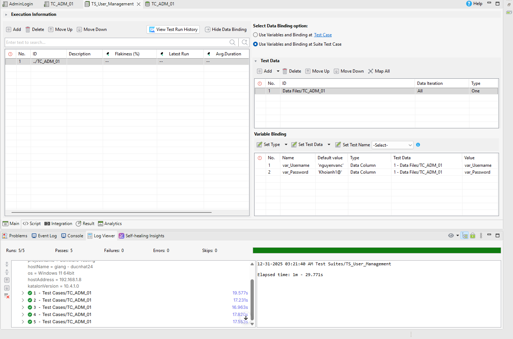
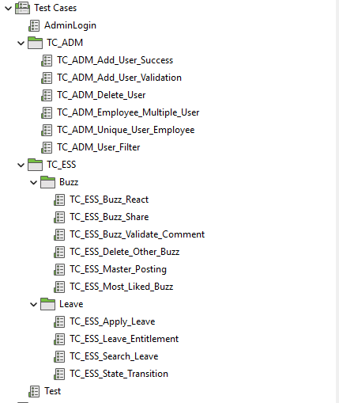
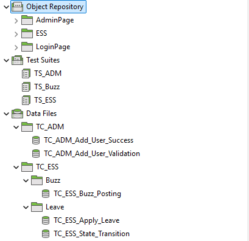
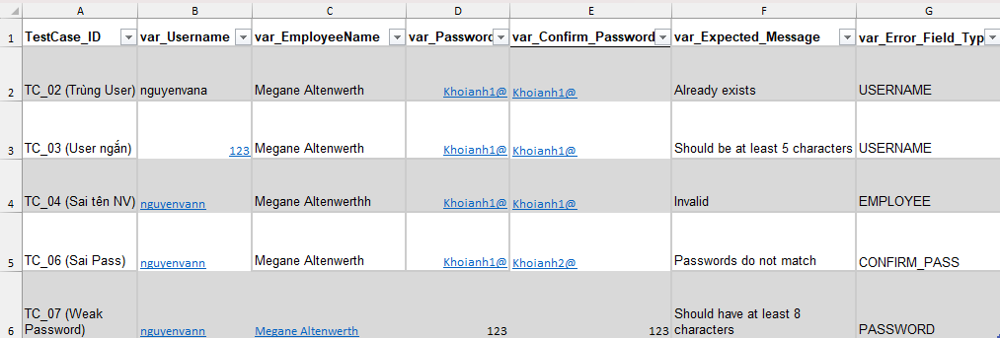
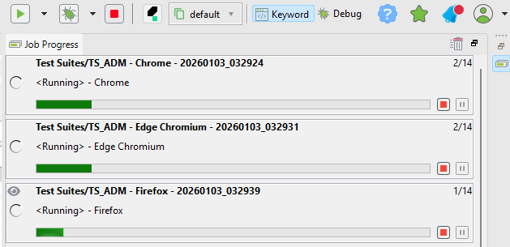
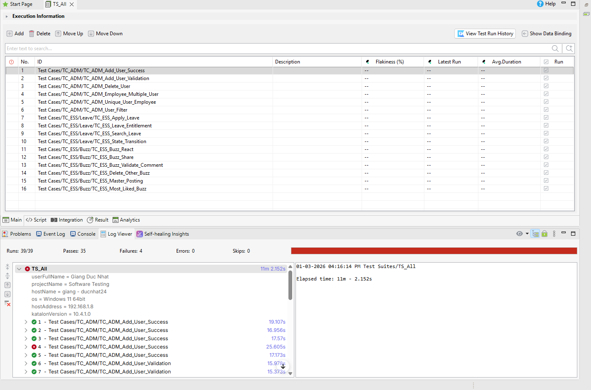

# CASE STUDY PROJECT REPORT
## OrangeHRM Testing

**Lecturer:** Dr. Tran Duy Hoang
**TA:** MSc. Truong Phuoc Loc

**Student Info:**
* **Name:** Giang Đức Nhật
* **Student ID:** 22120252
* **Group:** 11

---

## Task Allocation

Theo yêu cầu của đồ án, các thành viên trong nhóm phân chia công việc như sau:

| Tính năng | Mô tả | Thành viên |
|:---|:---|:---|
| HR Administration | Quản trị hệ thống, cấu trúc tổ chức, user | Giang Đức Nhật |
| Employee Self-Service (ESS) | Cổng thông tin nhân viên tự phục vụ | Giang Đức Nhật |
| Recruitment | Tuyển dụng, theo dõi ứng viên | Phan Thanh Tiến |
| Performance Management | Đánh giá KPI, đề nghị xem xét, lưu lịch sử performance review | Phan Thanh Tiến |
| Reporting & Analytics | Báo cáo tùy chỉnh, xuất dữ liệu | Nguyễn Bùi Vương Tiễn |
| Time and Attendance | Chấm công, Timesheets | Nguyễn Bùi Vương Tiễn |
| Employee Management (PIM) | Quản lý hồ sơ nhân viên, báo cáo | Lý Trọng Tín |
| Leave Management | Quản lý ngày nghỉ, quy tắc nghỉ phép | Lý Trọng Tín |

---

# Báo cáo Automation Testing 

## 1. Môi trường và Công cụ (Environment & Tools)
* **Tools:** Katalon Studio (Student Ver).
* **Browsers:** Chrome (v143).
* **OS:** Windows 11

## 2. Chiến lược kiểm thử (Testing Strategy)
* **Data Driven Testing:** Sử dụng file Excel chứa test data để chạy lặp lại các test case với dữ liệu khác nhau (liên kết với Requirement 3).



*(Hình ảnh: Binding data thành công)*
* **Verification Method:** Sử dụng các lệnh `verifyTextPresent`, `verifyElementPresent` để so sánh kết quả thực tế và mong đợi.

## 3. Danh sách Test Case đã Automate

**1. Module HR Admin (User Management)**

* `TC_ADM_Add_User_Success`: Dùng cho TC_01.
* `TC_ADM_Add_User_Validation`: Dùng chung cho TC_02, 03, 04, 06, 07 (Chạy data driven với file Excel chứa các thông báo lỗi khác nhau).
* `TC_ADM_Unique_User_Employee`: Dùng cho TC_05
* `TC_ADM_Employee_Multiple_User`: Dùng cho TC_09
* `TC_ADM_User_Filter`: Dùng cho TC_08.
* `TC_ADM_Delete_User`: Dùng cho TC_10. 

**2. Module ESS (Leave)**

* `TC_ESS_Apply_Leave`: Dùng cho TC_02, 03, 04, 05, 06, 07, 08, 09, 13, 14.
* `TC_ESS_State_Transition`: Dùng cho TC_11, 12.
* `TC_ESS_Leave_Entitlement`: Dùng cho TC_10.

Note: `TC_01: Employee apply for Leave khi admin chưa config Leave period` quá phức tạp để automation test, và trường hợp này cũng rất hiếm khi xảy ra. Do đó em bỏ qua TC này.

**3. Module Buzz**

* `TC_ESS_Master_Posting`: Dùng chung cho TC_01, 02, 03, 04, 05, 06.
* `TC_ESS_Buzz_React`: Dùng cho TC 07, 08, 09, 12, 14.
* `TC_ESS_Buzz_Validate_Comment`: Dùng cho TC 10, 11.
* `TC_ESS_Buzz_Delete_Other_Buzz`: Dùng cho TC 13.
* `TC_ESS_Buzz_Share`: Dùng cho TC 15.
* `TC_ESS_Buzz_Most_Liked_Buzz`: Dùng cho TC 16.

## 4. Chi tiết triển khai (Implementation Details)
### 4.1. Cấu trúc Project
*(Chụp hình cấu trúc folder trong Katalon: Test Cases, Object Repository, Data Files)*



Hình ảnh: Test Case Folder Structure



Hình ảnh: Các Object Repository, Test Suites, Data Files (Katalon) sử dụng trong test case  


### 4.2. Snippet Code quan trọng

+ **Snippet 1: Logic kiểm tra Validation động (Dùng cho TC_ADM_Add_User_Validation)**

    + Mục đích: Kết hợp Data Driven Testing với Logic If-else để verify lỗi ở đúng vị trí (Username, Password, Employee Name) chỉ trong 1 script duy nhất. (Sử dụng thêm một cột phụ trong file excel test data)

```java
// 5. VERIFICATION
// Dựa vào cột 'Error_Field_Type' trong Excel để check lỗi ở đâu
if (var_Error_Field_Type == 'USERNAME') {
    WebUI.verifyElementText(findTestObject('AdminPage/TC_ADM_Add_User_Validation/msg_Error_Username_Already_Exists'), var_Expected_Message)
    WebUI.verifyElementText(findTestObject('AdminPage/TC_ADM_Add_User_Validation/msg_Error_Username_Should_Be_At_Least_5_Chars'), var_Expected_Message) 
} else if (var_Error_Field_Type == 'EMPLOYEE') {
    WebUI.verifyElementText(findTestObject('AdminPage/TC_ADM_Add_User_Validation/msg_Error_Employee_Invalid'), var_Expected_Message)
} else if (var_Error_Field_Type == 'PASSWORD') {
    WebUI.verifyElementText(findTestObject('AdminPage/TC_ADM_Add_User_Validation/msg_Error_Password_Should_Have_At_Least_8_Chars'), 
        var_Expected_Message)
} else if (var_Error_Field_Type == 'CONFIRM_PASS') {
    WebUI.verifyElementText(findTestObject('AdminPage/TC_ADM_Add_User_Validation/msg_Error_ConfirmPass_Password_Do_Not_Match'), 
        var_Expected_Message)
}
```

+ **Snippet 2: Kỹ thuật Verify danh sách bằng Vòng lặp (Dùng cho TC_ADM_User_Filter)**

    + Mục đích: Xử lý Dynamic Object (XPath động ${index}) và vòng lặp For để kiểm tra tất cả các dòng trong list user đều có cùng role là Admin

```java
int rowsToCheck = 5

for (int i = 1; i <= rowsToCheck; i++) {
    TestObject dynamicCell = findTestObject('AdminPage/TC_ADM_User_Filter/Cell_UserRole_Dynamic', [('index') : i])

    if (WebUI.verifyElementPresent(dynamicCell, 2, FailureHandling.OPTIONAL)) {
        String roleText = WebUI.getText(dynamicCell).trim()
        WebUI.verifyMatch(roleText, 'Admin', false)
    } 
	else {
        break
    }
}
```
+ **Snippet 3: Kỹ thuật "Anchor & Relative XPath" (Dùng cho Module Buzz)**

Mục đích: Xử lý vấn đề các nút bấm (Comment/Share) không có định danh duy nhất (ID). Script sử dụng chiến thuật tìm một phần tử cố định (Icon trái tim - Heart SVG) sau đó dùng following-sibling để xác định chính xác nút nằm kế bên nó.

```Groovy
// Chiến thuật: Tìm nút Comment dựa vào "Hàng xóm" là Icon Trái tim
String heartIconXpath = "(//div[contains(@class, 'orangehrm-buzz-post')])[1]//*[local-name()='svg' and @id='heart-svg']"

// Từ trái tim -> Lên cha (div) -> Tìm nút Button em kế tiếp
String commentBtnXpath = heartIconXpath + "/ancestor::div[1]/following-sibling::button[1]"

// Thực hiện click
TestObject cmtBtn = makeTO(commentBtnXpath)
WebUI.click(cmtBtn)
```

+ **Snippet 4: Kỹ thuật "Lifecycle Testing" - Tự tạo dữ liệu và dọn dẹp (Dùng cho TC_ESS_Buzz_Validation)**

Mục đích: Đảm bảo tính ổn định của test case. Thay vì phụ thuộc vào dữ liệu có sẵn trên Feed (dễ bị trôi hoặc thay đổi), script tự tạo bài post với ID duy nhất, verify xong sẽ tự động xóa để không để lại dữ liệu rác.

```Groovy

// 1. SETUP: Tạo bài post với ID thời gian thực để tránh trùng lặp
String uniqueID = "Test_" + System.currentTimeMillis()
// ... (Code post bài) ...

// 2. VERIFY: Tìm bài post dựa trên uniqueID vừa tạo
String cardXpath = "//div[contains(., '" + uniqueID + "')]"
WebUI.verifyElementPresent(makeTO(cardXpath), 5)

// 3. TEARDOWN: Xóa bài post sau khi test xong
WebUI.click(makeTO(cardXpath + "//i[contains(@class, 'bi-three-dots')]"))
WebUI.click(makeTO("//i[contains(@class, 'bi-trash')]")) // Nút Delete
```

+ **Snippet 5: Kỹ thuật Modularization (Tái sử dụng Test Case)**
Mục đích: Giảm thiểu sự trùng lặp code. Chức năng Đăng nhập (Login) được tách thành một Test Case riêng biệt và được gọi lại (Call) ở đầu mỗi kịch bản test khác bằng lệnh `WebUI.callTestCase`.

```groovy
// Gọi lại Common Test Case 'Login' trước khi thực hiện các bước tiếp theo
WebUI.callTestCase(findTestCase('Common/Login_Flow'), 
    [('username') : 'Admin', ('password') : 'admin123'], 
    FailureHandling.STOP_ON_FAILURE)
```
### 4.3. Test Data Structure
Sử dụng kỹ thuật 'Control Column' (Cột điều hướng) trong file dữ liệu để giúp một Test Script duy nhất có thể tự động nhận diện vị trí cần kiểm tra lỗi (Username field, Password field, v.v.) tùy theo từng Test Case. Cột điều hướng là cột var_Error_Field_Type



Hình ảnh: Structure của file excel test data

### 4.4. Cross-Browser Execution



Hình ảnh: Cross browser testing chạy test suite trên 3 browsers.

## 5. Kết quả kiểm thử (Test Results)
* **Total Cases:** 39
* **Passed:** 37
* **Failed:** 2



Hình ảnh: Chạy test suite chứa tất cả test case đã automation

### Defects Found via Automation
| Bug ID | Test Case   | Mô tả                               | Kết quả Mong đợi                    | Kết quả Thực tế (Automation)                         | Status |
|--------|-------------|-------------------------------------|-------------------------------------|-------------------------------------------------------|--------|
| DF01   | TC_ADM_05   | Tạo tài khoản thứ 2 cho cùng 1 nhân viên | Hệ thống báo lỗi "Already exists" | Hệ thống báo "Successfully Saved" (Toast Message hiện lên) | FAILED |
| DF02   | TC_ESS_13   | Apply leave cho một ngày trong quá khứ | System allows OR shows warning "Cannot apply for past dates". | Tạo được Leave vào ngày trong quá khứ, leave được tạo, ngay lập tức chuyển sang trạng thái Cancelled | FAILED |


### 5.1. Thống kê thực thi (Execution Summary)
* **Tổng số kịch bản (Total Scripts):** 40
* **Thời gian chạy trung bình (Avg Execution Time):** ~4 phút 30 giây (cho toàn bộ suite).
* **Pass Rate:** 95% (38/40)
* **Fail Rate:** 5% (2/40) - *Đều là lỗi thực tế của hệ thống (True Failures).*


## 6. Khó khăn và Giải pháp

### **Vấn đề 1: Dynamic Web Elements.**

Khó khăn: Các element như nút "Delete" hoặc các dòng trong bảng (Table) thay đổi vị trí/index khi dữ liệu thay đổi.

Giải pháp: Sử dụng Dynamic XPath kết hợp với tham số hóa (Parameterized Test Objects) trong Katalon (Ví dụ: //div[${index}]).

### **Vấn đề 2: Race Condition (Độ trễ của UI).**

Khó khăn: Script chạy quá nhanh, verify kết quả trước khi thông báo (Toast Message) kịp hiện ra, dẫn đến kết quả sai lệch (False Positive).

Giải pháp: Sử dụng các lệnh Wait hoặc VerifyElementPresent có thiết lập Timeout (ví dụ: 5 giây) thay vì 0 giây.

### **Vấn đề 3: Xử lý Lazy Loading (Cuộn trang vô tận) trong Module Buzz.**

Khó khăn: Khi thực hiện Test Case "Không thể xóa bài của người khác", script cần tìm bài viết của user khác. Tuy nhiên, Buzz Feed sử dụng cơ chế Lazy Loading, các bài viết cũ không có trong DOM cho đến khi user cuộn chuột xuống. Nếu dùng vòng lặp thông thường sẽ gây lỗi hoặc không tìm thấy element.

Giải pháp: Viết thuật toán "Scan & Scroll". Script chỉ quét tối đa 5 bài đầu tiên. Trước khi kiểm tra mỗi bài, sử dụng lệnh WebUI.scrollToElement để kích hoạt việc tải nội dung. Sử dụng khối try-catch để bỏ qua các bài bị lỗi DOM và tiếp tục quét bài tiếp theo thay vì dừng test case.

### **Vấn đề 4: Element không ổn định do DOM thay đổi liên tục (Stale Element).**

Khó khăn: Trong Module Buzz, sau khi Post hoặc Comment, Feed được React render lại. Việc tìm kiếm element bằng text (ví dụ: contains(text(), 'Comment')) đôi khi thất bại do text chứa Emoji hoặc khoảng trắng thừa, dẫn đến lỗi WebElementNotFound.

Giải pháp:

Thay đổi chiến lược location: Ưu tiên tìm theo Vị trí (Index [1] cho bài vừa tạo) thay vì tìm theo Text nội dung.

Sử dụng chiến thuật "Mỏ neo" (Anchor): Tìm các icon SVG tĩnh (như icon Heart, icon Chat) làm điểm tựa để tìm các nút bấm xung quanh bằng XPath tương đối (ancestor, following-sibling).

### **Vấn đề 5: Input Validation với Emoji.**

Khó khăn: Khi nhập liệu các ký tự Emoji (🚀, 😊) vào ô textarea bằng lệnh WebUI.setText, driver đôi khi không gõ được hoặc gõ bị lỗi font.

Giải pháp: Sử dụng JavascriptExecutor để gán trực tiếp giá trị vào thuộc tính value của thẻ HTML, bỏ qua lớp giả lập bàn phím của trình duyệt.

## 7. Links

Link đến google drive chứa toàn bộ project Katalon đã sử dụng để automation testing: https://drive.google.com/drive/folders/1478Ou9if00AW-dCOYKIoso9zk0MknEiq?usp=sharing