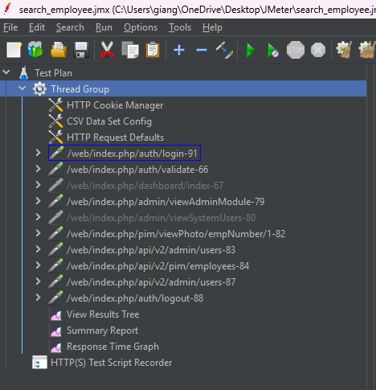
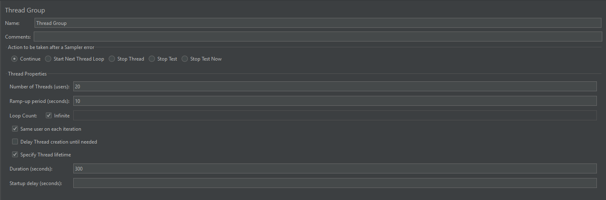
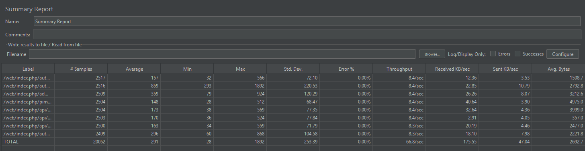
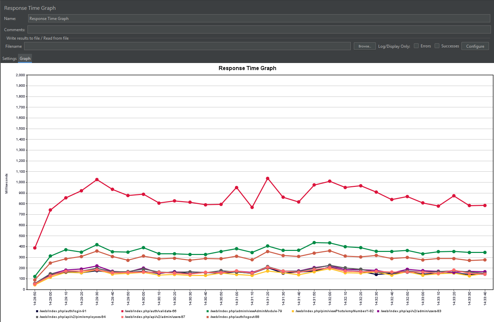
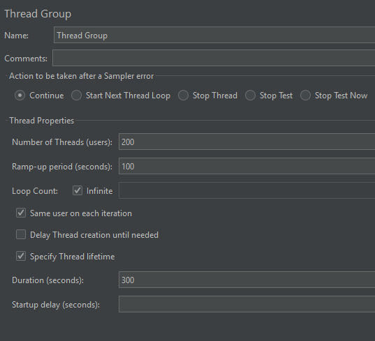
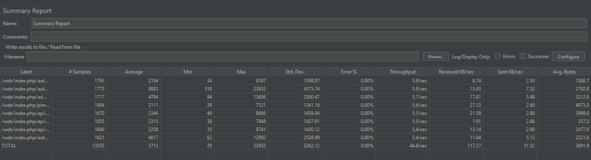
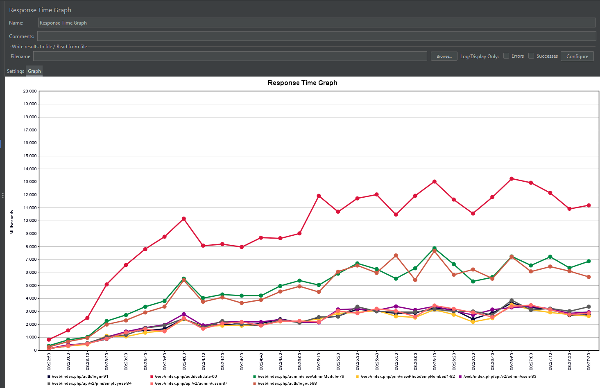
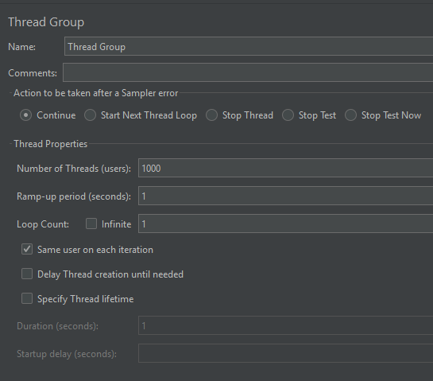
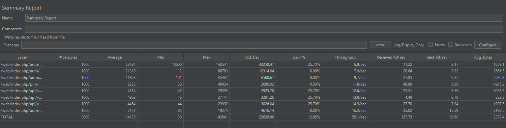
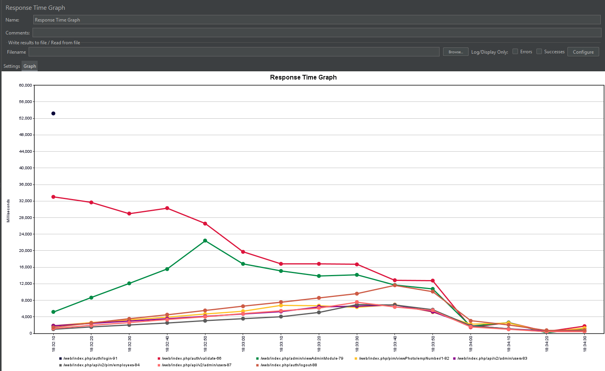

# CASE STUDY PROJECT REPORT
## OrangeHRM Testing

**Lecturer:** Dr. Tran Duy Hoang
**TA:** MSc. Truong Phuoc Loc

**Student Info:**
* **Name:** Giang Đức Nhật
* **Student ID:** 22120252
* **Group:** 11

---

## Task Allocation

Theo yêu cầu của đồ án, các thành viên trong nhóm phân chia công việc như sau:

| Tính năng | Mô tả | Thành viên |
|:---|:---|:---|
| **HR Administration** | **Quản trị hệ thống, cấu trúc tổ chức, user** | **Giang Đức Nhật** |
| **Employee Self-Service (ESS)** | **Cổng thông tin nhân viên tự phục vụ** | **Giang Đức Nhật** |
| Recruitment | Tuyển dụng, theo dõi ứng viên | Phan Thanh Tiến |
| Performance Management | Đánh giá KPI, đề nghị xem xét, lưu lịch sử performance review | Phan Thanh Tiến |
| Reporting & Analytics | Báo cáo tùy chỉnh, xuất dữ liệu | Nguyễn Bùi Vương Tiễn |
| Time and Attendance | Chấm công, Timesheets | Nguyễn Bùi Vương Tiễn |
| Employee Management (PIM) | Quản lý hồ sơ nhân viên, báo cáo | Lý Trọng Tín |
| Leave Management | Quản lý ngày nghỉ, quy tắc nghỉ phép | Lý Trọng Tín |

---

# REPORT: REQUIREMENT 6 - PERFORMANCE TESTING

## 1. Môi trường kiểm thử (Test Environment)

### 1.1. Cấu hình Server/PC (Hosting System)

Hệ thống **OrangeHRM** được triển khai trên môi trường Docker cục bộ (Localhost). Cấu hình máy trạm thực thi kiểm thử (JMeter Client) như sau:

* **Operating System:** Windows 11
* **CPU:** 11th Gen Intel(R) Core(TM) i5-11400H @2.70GHz
* **GPU:** NVIDIA GeForce RTX 3050 Laptop GPU
* **RAM:** 16GB DDR4
* **Tools:** Apache JMeter 5.6.3, Docker Desktop.
* **Software Under Test (SUT):** OrangeHRM OS 5.8 (Containerized).

### 1.2. Kịch bản kiểm thử (Test Scenario)

Kịch bản mô phỏng luồng nghiệp vụ quan trọng của người quản trị (Admin), bao gồm cả thao tác trên giao diện Web và gọi API RESTful v2.

* **Step 1:** Truy cập trang Login (GET).
* **Step 2:** Đăng nhập hệ thống (POST) - *Sử dụng tài khoản từ file CSV*.
* **Step 3:** Truy cập Dashboard Admin (GET) - *Lấy Bearer Token*.
* **Step 4:** Lấy danh sách Users qua API v2 (GET).
* **Step 5:** Lấy danh sách Employees qua API v2 (GET).
* **Step 6:** Đăng xuất (GET).



*(Hình ảnh: Tổng quan cấu trúc Test Plan trong JMeter)*

---

## 2. Các kỹ thuật áp dụng (Applied Techniques)

Để đảm bảo kịch bản kiểm thử phản ánh đúng thực tế và hoạt động chính xác, các kỹ thuật nâng cao sau đã được áp dụng:

### 2.1. Data Driven Testing (Kiểm thử điều hướng dữ liệu)

Thay vì sử dụng một tài khoản cố định, kịch bản sử dụng **CSV Data Set Config** để đọc dữ liệu từ file `users.csv`. Điều này giúp mô phỏng việc nhiều người dùng khác nhau đăng nhập đồng thời, tránh tình trạng khóa session hoặc cache kết quả.

* **Dữ liệu:** File CSV chứa 2 cột `username` và `password`.
* **Cấu hình:** Variable Names: `username,password`; Delimiter: `,`.

### 2.2. Correlation & Dynamic Data Handling (Xử lý dữ liệu động)

Do hệ thống OrangeHRM sử dụng bảo mật CSRF và Token-based Authentication, kỹ thuật trích xuất dữ liệu (Extraction) được áp dụng:

* **CSRF Token (Vue.js):** Sử dụng *Regular Expression Extractor* để lấy token từ mã nguồn HTML trang login (`:token="&quot;(.+?)&quot;"`).
* **Bearer Token (API Authorization):** Trích xuất token xác thực từ response của trang Dashboard để đưa vào Header của các request API v2, giúp vượt qua lỗi 401 Unauthorized.

### 2.3. Report Viewers (Công cụ báo cáo)

Sử dụng 3 loại Listener để phân tích kết quả theo yêu cầu:

1. **View Results Tree:** Kiểm tra chi tiết Request/Response và gỡ lỗi.
2. **Summary Report:** Thống kê số liệu định lượng (Throughput, Error %, Average Response Time).
3. **Response Time Graph:** Biểu diễn trực quan xu hướng thời gian phản hồi theo thời gian.

---

## 3. Thực thi kiểm thử (Test Execution)

Thực hiện 3 loại hình kiểm thử hiệu năng: Load Testing, Stress Testing và Spike Testing.

### 3.1. Kịch bản 1: Load Testing (Kiểm thử tải)

**Mục tiêu:** Đánh giá độ ổn định của hệ thống dưới mức tải trung bình dự kiến.

* **Cấu hình Thread Group:**
* **Number of Threads (Users):** 20
* **Ramp-up period:** 10 giây (Tăng dần tải, 2 user/giây).
* **Loop Count:** Infinite (Vòng lặp vô tận).
* **Duration:** 300 giây (Chạy ổn định trong 5 phút).




*(Hình ảnh: Cấu hình Thread Group cho Load Test)*

**Kết quả thực tế (Actual Result):**

* Total Samples: 20,052 requests.

* Average Response Time: 291 ms.

* Error Rate: 0.00%.

* Throughput: 66.8 requests/second.



*(Hình ảnh: Summary Report của Load Test)*



*(Hình ảnh: Response Time Graph của Load Test)*

> **Nhận xét:** 
Dựa trên biểu đồ và bảng số liệu thu được, hệ thống OrangeHRM hoạt động hoàn toàn ổn định với bài Load Test này.

* Độ ổn định cao: Tỷ lệ lỗi (Error %) duy trì ở mức 0.00% trong suốt quá trình chạy, chứng tỏ server xử lý tốt toàn bộ hơn 20,000 request mà không gặp tình trạng quá tải hay từ chối dịch vụ.

* Thời gian phản hồi nhanh: Thời gian phản hồi trung bình (Average) của toàn bộ kịch bản là 291 ms. Ngay cả request nặng nhất (Login - validate) cũng có thời gian phản hồi trung bình chỉ khoảng 859 ms, nằm trong ngưỡng chấp nhận được (dưới 1 giây) của trải nghiệm người dùng tốt.

Kết luận: Với cấu hình hiện tại, hệ thống đáp ứng tốt nhu cầu truy cập của số lượng người dùng đồng thời nhất định, đảm bảo tính sẵn sàng và hiệu năng."

---

### 3.2. Kịch bản 2: Stress Testing (Kiểm thử chịu tải)

**Mục tiêu:** Xác định điểm giới hạn (Breaking Point) của hệ thống bằng cách tăng tải vượt quá mức bình thường.

* **Cấu hình Thread Group:**
* **Number of Threads (Users):** 200 *(Hoặc con số lớn hơn tùy máy bạn)*
* **Ramp-up period:** 100 giây (Tăng tải từ từ để quan sát thời điểm hệ thống bắt đầu chậm).
* **Loop Count:** Infinite.
* **Duration:** 300 giây.




*(Hình ảnh: Cấu hình Thread Group cho Stress Test)*

* **Kết quả mong đợi:** Thời gian phản hồi tăng cao, có thể bắt đầu xuất hiện lỗi HTTP 500/503 hoặc Timeout.
* **Kết quả thực tế (Actual Result):**
    * Total Samples: 13,553 requests.

    * Average Response Time: 3,713 ms (Tăng gấp 12 lần so với Load Test).

    * Max Response Time: 23,932 ms (Gần 24 giây).

    * Error Rate: 0.00%.

    * Throughput: 44.6 requests/second.



*(Hình ảnh: Summary Report của Stress Test)*



*(Hình ảnh: Response Time Graph của Stress Test - Hiển thị xu hướng tăng)*

> **Nhận xét:** 
Trong kịch bản Stress Test, hệ thống đã bộc lộ rõ giới hạn về khả năng xử lý:

Suy giảm hiệu năng nghiêm trọng: Mặc dù hệ thống vẫn duy trì được tính toàn vẹn dữ liệu (Error 0%), nhưng thời gian phản hồi (Latency) đã tăng đến mức không thể chấp nhận được đối với trải nghiệm người dùng. Thời gian phản hồi trung bình tăng vọt từ 291ms (ở Load Test) lên 3,713ms. Đặc biệt, request đăng nhập (validate) có thời gian chờ lên tới ~9 giây (trung bình) và đỉnh điểm là 24 giây.

Nút thắt cổ chai (Bottleneck): Biểu đồ Response Time Graph cho thấy xu hướng tăng dần đều và lập đỉnh ở mức rất cao, chứng tỏ Server bị quá tải CPU/RAM và phải xếp hàng đợi (Queue) các request xử lý tuần tự thay vì song song.

Kết luận: Điểm gãy vỡ về hiệu năng (Performance Breaking Point) của hệ thống nằm ở ngưỡng tải này. Dù server không sập (Crash), nhưng độ trễ quá cao đồng nghĩa với việc hệ thống không còn đáp ứng được yêu cầu nghiệp vụ thực tế."

---

### 3.3. Kịch bản 3: Spike Testing (Kiểm thử sốc tải)

**Mục tiêu:** Kiểm tra khả năng phục hồi của hệ thống khi có lượng truy cập tăng đột biến trong thời gian cực ngắn.

* **Cấu hình Thread Group:**
* **Number of Threads (Users):** 1000
* **Ramp-up period:** 1 giây (Tất cả 1000 user truy cập gần như cùng lúc).
* **Loop Count:** 1 (Chỉ thực hiện 1 lần truy cập duy nhất).



*(Hình ảnh: Cấu hình Thread Group cho Spike Test)*

* **Kết quả mong đợi:** Hệ thống có thể chậm lại tức thời nhưng không được sập hoàn toàn (Crash).
* **Kết quả thực tế (Actual Result):**

    * Total Samples: 8,000 requests.

    * Average Response Time: 14,135 ms (~14 giây).

    * Max Response Time: 143,541 ms (~2.4 phút).

    * Error Rate: 12.85%.

    * Throughput: 55.1 requests/second.



*(Hình ảnh: View Results Tree hiển thị các request trong cùng 1 giây)*



*(Hình ảnh: Biểu đồ cho thấy đỉnh nhọn của traffic)*

> **Nhận xét:**

Kịch bản Spike Test với 1000 người dùng truy cập đồng thời trong 1 giây đã tạo ra áp lực cực lớn lên hệ thống:

* Khả năng chịu đựng cú sốc (Resilience): Hệ thống không bị sập hoàn toàn (Crash). Server vẫn xử lý thành công 87.15% lượng request. Tỷ lệ lỗi 12.85% là điều chấp nhận được trong tình huống sốc tải này, cho thấy server đã kích hoạt cơ chế từ chối bớt kết nối (Connection Refused/Timeout) để bảo vệ tài nguyên hệ thống không bị cạn kiệt.

* Độ trễ (Latency): Do lượng request ùa vào vượt quá khả năng xử lý của CPU/RAM, thời gian phản hồi trung bình tăng lên 14 giây. Biểu đồ Response Time Graph cho thấy độ trễ tăng vọt ngay tại thời điểm 1 giây đầu tiên và giảm dần khi server giải quyết xong hàng đợi.

* Kết luận: Hệ thống OrangeHRM có khả năng phục hồi sau sự cố tải đột biến. Tuy nhiên, nếu muốn phục vụ lượng người dùng này mượt mà hơn (giảm Error rate), cần cân nhắc nâng cấp hạ tầng (Scale up) hoặc triển khai Load Balancing."

---

## 4. Các thách thức kỹ thuật (Technical Challenges)
### 4.1 Thách thức kỹ thuật 1: Ghi nhận traffic localhost bằng JMeter

Trong giai đoạn ghi script phục vụ kiểm thử hiệu năng, nhóm gặp phải một sự cố mạng khiến JMeter không thể bắt được các HTTP request gửi đến localhost hoặc 127.0.0.1.

#### a. Vấn đề

Mặc dù proxy của trình duyệt đã được cấu hình chính xác để trỏ về JMeter (cổng 8888), toàn bộ các thao tác với hệ thống OrangeHRM chạy local vẫn bị bỏ qua.
Kết quả là View Results Tree trong JMeter không hiển thị bất kỳ request nào, trong khi các website bên ngoài vẫn được ghi nhận bình thường.

#### b. Phân tích nguyên nhân

Hầu hết các trình duyệt hiện đại (Chrome, Firefox, Edge) cũng như hệ điều hành đều có cơ chế Loopback Exemption mặc định.
Cơ chế này được thiết kế để bỏ qua proxy đối với các địa chỉ cục bộ (localhost, 127.0.0.1) nhằm tối ưu hiệu năng và tăng cường bảo mật.

Do đó, các request từ trình duyệt được gửi thẳng đến Docker Container, không đi qua JMeter Proxy, dẫn đến việc JMeter không thể ghi nhận traffic.

#### c. Giải pháp: Fake domain thông qua file Hosts

Để buộc trình duyệt chuyển hướng traffic local qua JMeter Proxy, em đã áp dụng kỹ thuật DNS Spoofing như sau:

Chỉnh sửa file Hosts của hệ thống
Ánh xạ một domain giả về địa chỉ loopback.

Đường dẫn: 
```
C:\Windows\System32\drivers\etc\hosts
```

Dòng được thêm:
```text
127.0.0.1  my.orangehrm
```

Cấu hình Firefox
Trong about:config, thiết lập:

```text
network.proxy.allow_hijacking_localhost = true
```

#### d. Kết quả
Khi truy cập thông qua http://my.orangehrm:8080, trình duyệt coi đây là domain không phải localhost, từ đó bắt buộc request đi qua JMeter Proxy và JMeter có thể ghi lại toàn bộ traffic thành công.

### Thách thức kỹ thuật 2: Xử lý dữ liệu động (Correlation) với cơ chế bảo mật CSRF trên Vue.js
Trong quá trình replay script đăng nhập, nhóm gặp tình trạng request trả về mã 200 OK nhưng thực tế đăng nhập thất bại (trả về trang login) do sai CSRF Token.

#### a. Vấn đề
Hệ thống OrangeHRM sử dụng cơ chế bảo mật CSRF, yêu cầu mỗi request đăng nhập phải đi kèm một token duy nhất được sinh ra từ server. Khi record script, JMeter lưu cứng (hard-code) giá trị token cũ. Khi chạy lại (replay), token này đã hết hạn, dẫn đến việc server từ chối xác thực. Đặc biệt, do trang Login được xây dựng bằng Vue.js, token không nằm trong thẻ `<input>` thông thường mà bị mã hóa HTML entity bên trong thuộc tính của component (ví dụ: :token="&quot;xyz...&quot;").

#### b. Phân tích nguyên nhân
JMeter mặc định không tự động cập nhật các giá trị động (Dynamic values) từ server.

Các bộ trích xuất dữ liệu (Extractor) thông thường khó bắt được token do sự phức tạp của các ký tự mã hóa (&quot;) trong source HTML của Vue.js.

#### c. Giải pháp: Sử dụng Regular Expression Extractor tùy biến
Để lấy được token mới nhất cho mỗi lần chạy, em đã áp dụng kỹ thuật Correlation:

Bước 1: Tạo một Regular Expression Extractor tại request GET trang login.

Bước 2: Sử dụng biểu thức Regex đặc thù để xử lý chuỗi mã hóa:

```
:token="&quot;(.+?)&quot;"
```
(Biểu thức này giúp loại bỏ các ký tự &quot; thừa và chỉ lấy chính xác chuỗi token).

Bước 3: Truyền biến ${csrf_token} vừa trích xuất vào tham số _token của request POST đăng nhập.

#### d. Kết quả

Script đăng nhập hoạt động ổn định, token được cập nhật tự động theo từng phiên (session), giải quyết triệt để lỗi xác thực.

## 5. Kết luận (Conclusion)

Thông qua việc áp dụng JMeter với các kỹ thuật Data Driven và Correlation, nhóm đã hoàn thành việc kiểm thử hiệu năng cho quy trình nghiệp vụ Login và truy xuất dữ liệu API của OrangeHRM. Kết quả cho thấy hệ thống hoạt động ổn định ở mức tải thấp (Load Test) nhưng bắt đầu bộc lộ hạn chế về thời gian phản hồi khi chịu tải cao (Stress Test). Các báo cáo này cung cấp cơ sở dữ liệu quan trọng để tối ưu hóa cấu hình server trong tương lai.

