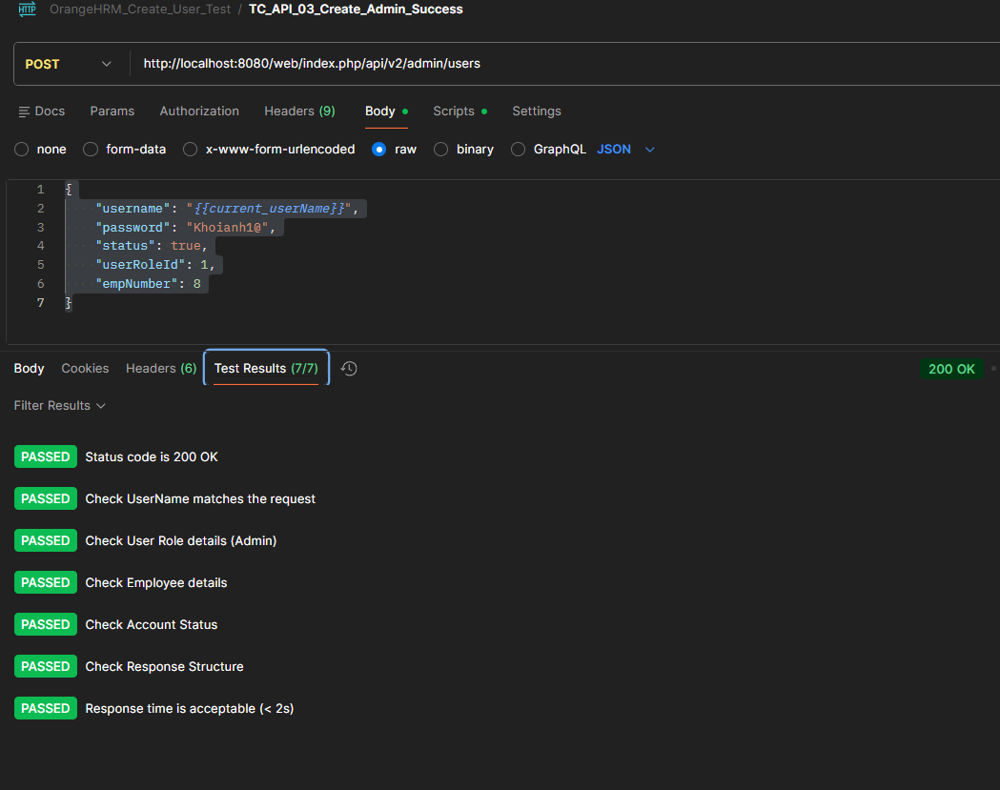
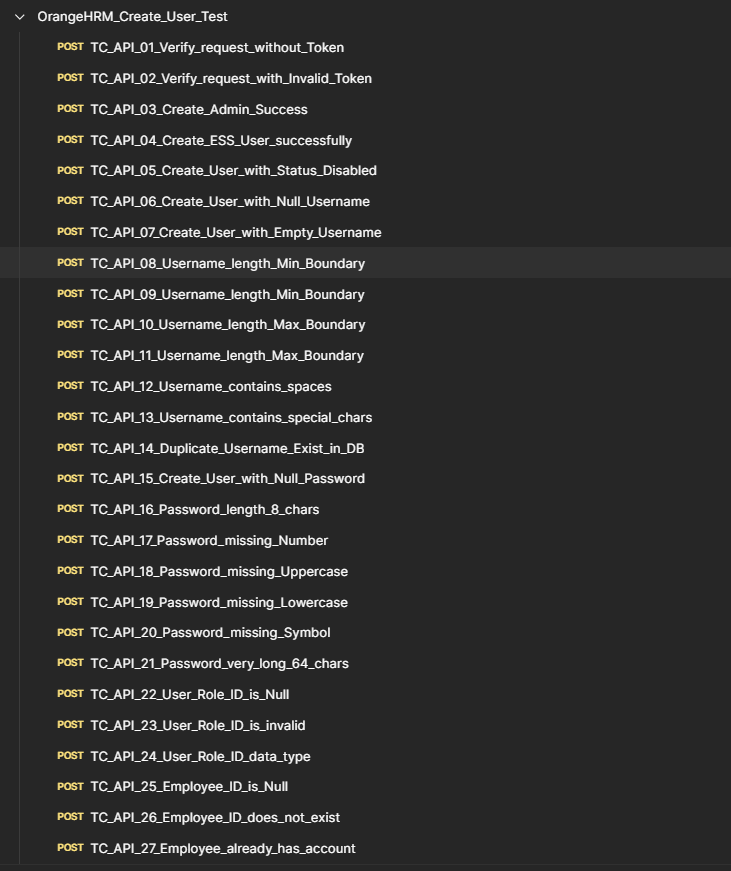
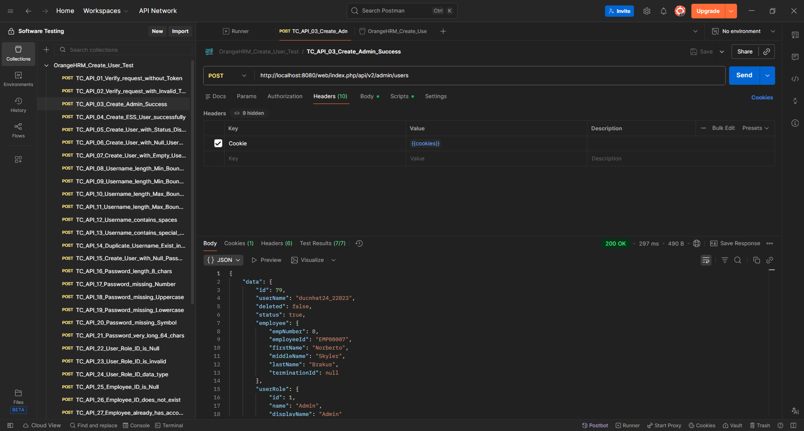
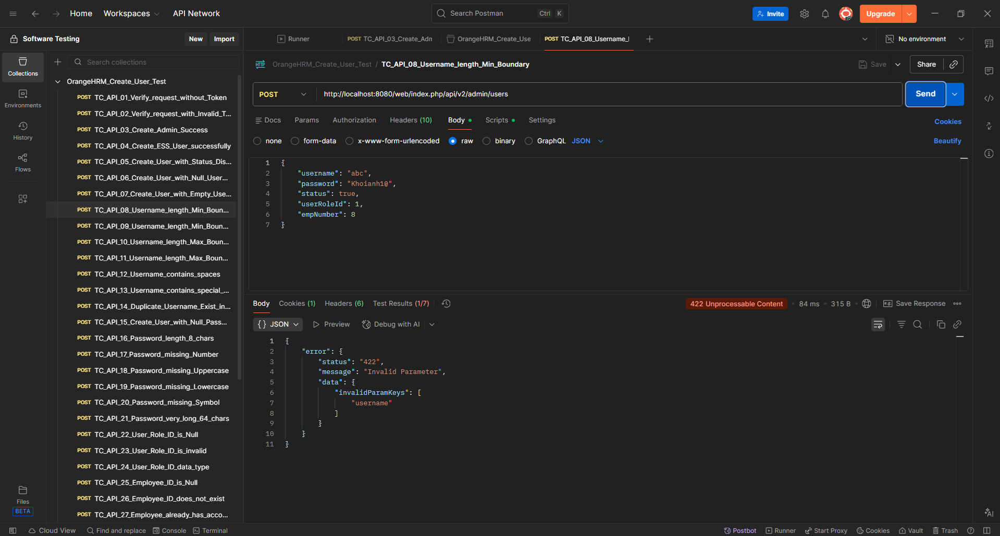

# REPORT: REQUIREMENT 7 - API TESTING

## 1. Giới thiệu (Introduction)

Báo cáo này tóm tắt quá trình và kết quả kiểm thử API (API Testing) đối với chức năng **Create User** (Tạo người dùng quản trị/nhân viên). Mục tiêu nhằm đảm bảo endpoint hoạt động đúng theo tài liệu kỹ thuật, xử lý tốt các ngoại lệ và đảm bảo tính bảo mật.

### 1.1. Phạm vi kiểm thử (Test Scope)
* **Endpoint:** `http://localhost:8080/web/index.php/api/v2/admin/users`
* **Method:** `POST`
* **Authorization:** Bearer Token (JWT).
* **Chức năng chính:** Tạo mới tài khoản đăng nhập cho nhân viên đã tồn tại trong hệ thống.

### 1.2. Môi trường & Công cụ (Environment & Tools)
* **Công cụ thực hiện:** Postman v10.x.
* **Môi trường server:** Localhost (Docker Container).
* **Kỹ thuật áp dụng:** Black-box Testing, Equivalence Partitioning (Phân vùng tương đương), Boundary Value Analysis (Phân tích giá trị biên).

---

## 2. Chiến lược kiểm thử (Test Strategy)

Để đảm bảo độ bao phủ (Coverage) cho endpoint này, bộ Test Case được thiết kế bao gồm **36** trường hợp, chia thành các nhóm chính:

1.  **Authentication/Authorization:** Kiểm tra tính hợp lệ của Token.
2.  **Happy Path:** Các trường hợp tạo User thành công (Admin, ESS, Enabled/Disabled).
3.  **Data Validation:** Kiểm tra ràng buộc dữ liệu đầu vào (Username độ dài/ký tự đặc biệt, Password complexity).
4.  **Business Logic:** Kiểm tra các quy tắc nghiệp vụ (Username trùng lặp, Employee ID không tồn tại, User Role không hợp lệ).

**Cấu trúc dữ liệu mẫu (Sample JSON Payload):**
```json
{
    "username": "ducnhat24",
    "password": "Password123!",
    "status": true,
    "userRoleId": 1,
    "empNumber": 8
}

```


## 2.1. Kỹ thuật Script Tự động (Automation Scripting Strategy)

Để đảm bảo dữ liệu kiểm thử luôn mới (tránh lỗi trùng lặp dữ liệu) và kết quả phản hồi được kiểm tra chặt chẽ, em đã áp dụng các kỹ thuật scripting nâng cao trong Postman:

### a. Xử lý dữ liệu động (Pre-request Script)

Với test case tạo User thành công, yêu cầu `userName` phải là duy nhất. Do đó, kỹ thuật **Randomization** được sử dụng để sinh tên người dùng ngẫu nhiên trước khi gửi request.

* **Mục đích:** Tạo chuỗi `userName` không trùng lặp (ví dụ: `ducnhat_4821`).
* **Cơ chế:**
1. Sử dụng Javascript `Math.random()` để tạo số ngẫu nhiên.
2. Lưu giá trị vào **Collection Variables** (`current_userName`) để tái sử dụng ở các bước sau.


**Code snippet:**

```javascript
// Tạo username ngẫu nhiên để tránh lỗi Duplicate
var randomNum = Math.floor(Math.random() * 10000);
var dynamicUser = "ducnhat_" + randomNum;
pm.collectionVariables.set("current_userName", dynamicUser);

```

*(Hình: Cấu hình Pre-request Script để sinh dữ liệu động)*

### b. Tham số hóa Request Body (Parameterization)

Thay vì nhập cứng giá trị, Request Body sử dụng biến môi trường `{{current_userName}}` đã được khởi tạo từ Pre-request Script.

**JSON Payload:**

```json
{
    "userName": "{{current_userName}}",
    "password": "Password123!",
    "status": true,
    "userRole": { "id": 1 },
    "empNumber": 8
}

```

*(Hình: Sử dụng biến {{current_userName}} trong Body Request)*

### c. Kiểm thử tự động (Post-response / Tests Script)

Sau khi nhận phản hồi từ Server, bộ Script kiểm thử tự động được kích hoạt để xác minh tính đúng đắn của dữ liệu (**Data Integrity**) và cấu trúc phản hồi (**Schema Validation**).

Các tiêu chí kiểm tra bao gồm:

1. **Status Code Check:** Xác nhận mã phản hồi là `200 OK`.
2. **Data Verification:**
* So sánh `userName` trả về từ server phải khớp với `userName` đã gửi đi.
* Kiểm tra `userRole` phải là "Admin" (ID: 1).
* Kiểm tra `employee` được liên kết phải đúng mã nhân viên (ID: 8).
* Kiểm tra `status` tài khoản phải là `true` (Enabled).


3. **Schema Check:** Đảm bảo JSON trả về có đầy đủ các trường bắt buộc (`id`, `userRole`, `employee`...).
4. **Performance Check:** Đảm bảo thời gian phản hồi API dưới 2000ms.

**Code snippet:**

```javascript
// Verify Data Integrity
pm.test("Check UserName matches the request", function () {
    var expectedUser = pm.collectionVariables.get("current_userName");
    pm.expect(pm.response.json().data.userName).to.eql(expectedUser);
});
// Verify Performance
pm.test("Response time is acceptable (< 2s)", function () {
    pm.expect(pm.response.responseTime).to.be.below(2000);
});

```



*(Hình: Các test case tự động hiển thị trạng thái PASS trong tab Test Results)*

---

## 2.2. Postman Collection 

Toàn bộ phần API Testing cho endpoint `http://localhost:8080/web/index.php/api/v2/admin/users` được tổ chức trong một collection Postman:



*(Hình: Postman collection)*

Link Drive Postman Collection: `https://drive.google.com/file/d/1nsSc8KJsucNunHjULnceiUGVkOtBX191/view?usp=sharing`


## 3. Kết quả thực thi (Test Execution Results)

Quá trình kiểm thử được thực hiện bằng công cụ **Postman**.


### 3.1. Thống kê (Statistics)


| Category        | Total Cases | Passed | Failed | Pass Rate |
|-----------------|-------------|--------|--------|-----------|
| Authentication  | 2           | 2      | 0      | 100%      |
| Happy Path      | 3           | 3      | 0      | 100%      |
| Data Validation | 20          | 18     | 2      | 90.00%    |
| Business Logic  | 4           | 2      | 2      | 50.00%    |
| Security & Misc | 7           | 7      | 0      | 100%      |
| **TỔNG CỘNG**   | **36**      | **32** | **4**  | **88.8%** |


### 3.2. Minh họa kết quả (Evidence)

**Trường hợp thành công (Status 200):**



*(Hình 2: Chi tiết Request/Response khi tạo User thành công)*

**Trường hợp xử lý lỗi hợp lệ (Status 422 - Unprocessable Content):**



*(Hình 3: Hệ thống trả về lỗi 400 khi Username không đúng định dạng)*

---

## 4. Tài liệu tham chiếu (References)

Theo yêu cầu của đồ án, chi tiết danh sách Test Cases và danh sách Lỗi (Bugs) được trình bày trong các tệp tin riêng biệt đính kèm báo cáo này.

### 4.1. Chi tiết Test Cases

* **Tên file:** `Test_cases.xlsx` 
* **Mô tả:** Chứa danh sách đầy đủ 36 test cases, bao gồm các bước thực hiện (Steps), dữ liệu đầu vào (Test Data), kết quả mong đợi (Expected Result) và kết quả thực tế (Actual Result).

### 4.2. Báo cáo lỗi (Bug Report)

* **Tên file:** `Bug_reports.xlsx`
* **Mô tả:** Chi tiết các lỗi được phát hiện trong quá trình kiểm thử, bao gồm mức độ nghiêm trọng (Severity), các bước tái hiện lỗi (Steps to reproduce) và phản hồi từ API.

---

## 5. Kết luận (Conclusion)

Dựa trên kết quả kiểm thử đối với API `POST /admin/users`:

* **Độ ổn định:** API hoạt động ổn định, xử lý nhanh các request hợp lệ.
* **Tính đúng đắn:** Cơ chế Validate dữ liệu đầu vào (Username, Password) hoạt động hiệu quả, ngăn chặn được dữ liệu rác.
* **Vấn đề tồn đọng:** Đã phát hiện và ghi nhận 4 lỗi tồn đọng, trong đó nghiêm trọng nhất là lỗi Duplicate User Account (1 nhân viên có nhiều tài khoản) và lỗi System Crash (500 Internal Server Error) khi request sai User Role ID.

Đề xuất đội ngũ phát triển xem xét các lỗi đã báo cáo để hoàn thiện tính năng trước khi đưa vào môi trường Production.