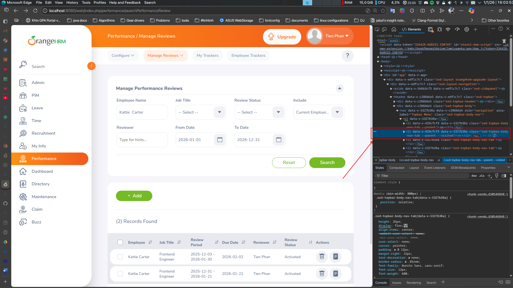
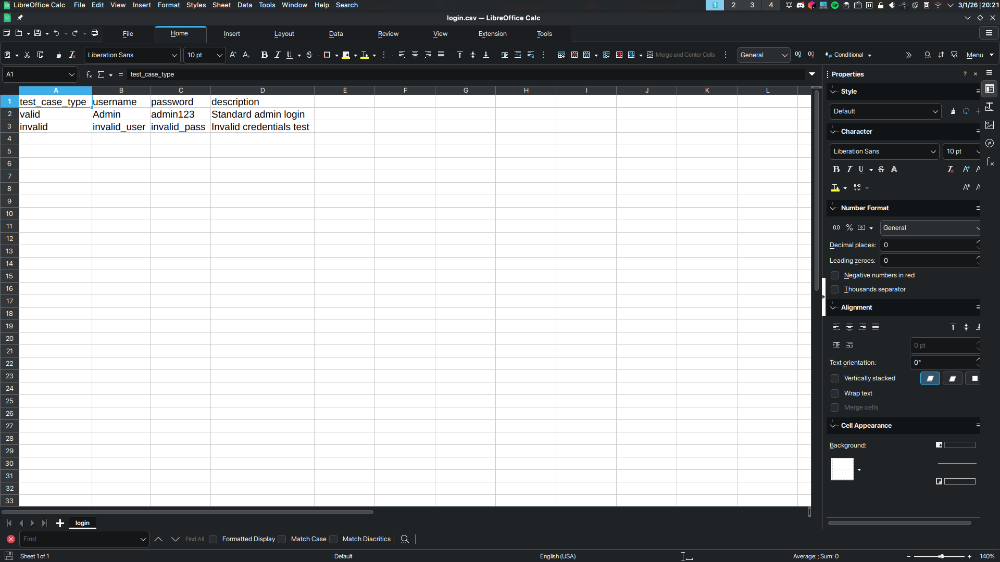
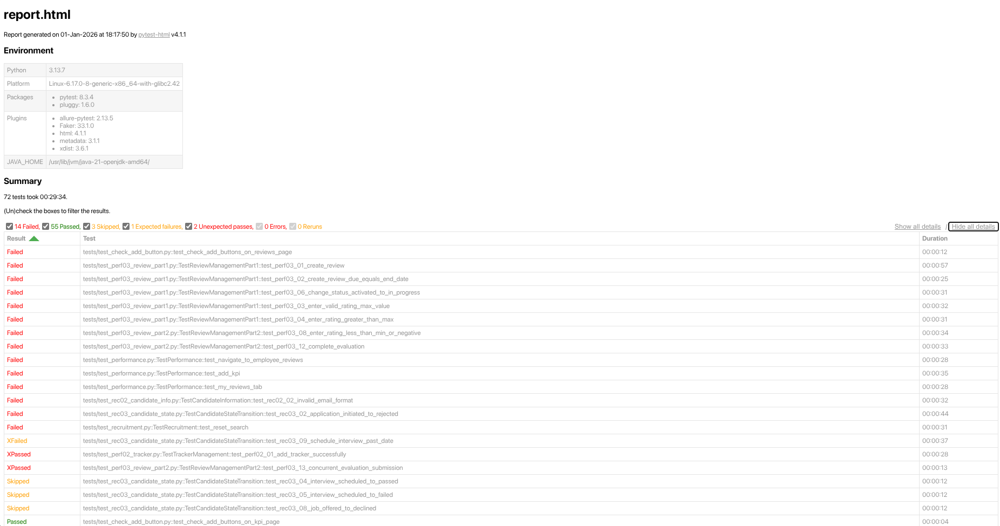
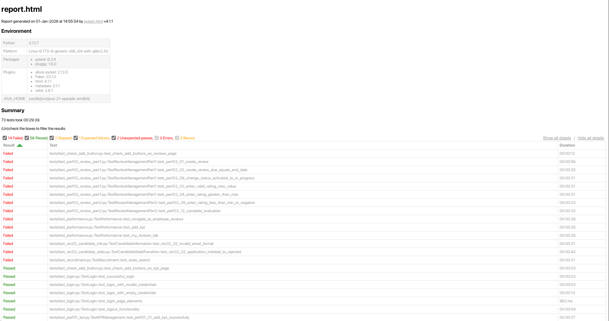
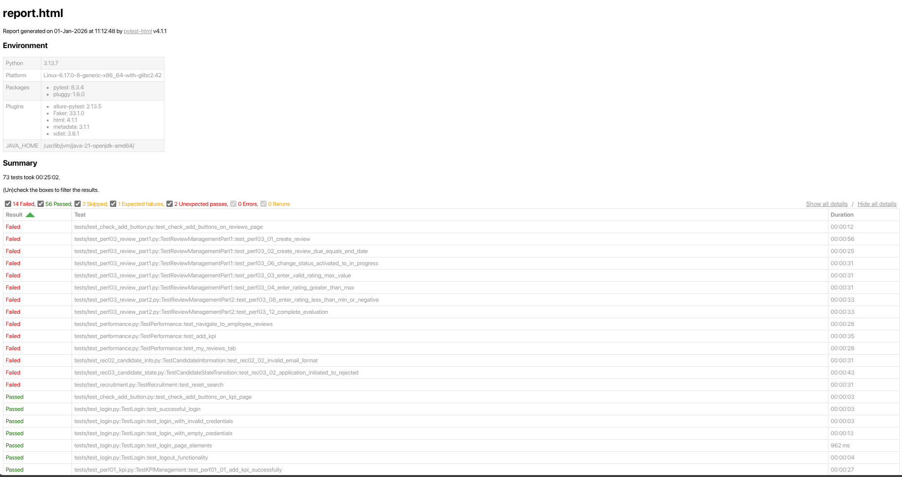

# Requirement 5 - Automation testing

## Mục lục

- [Requirement 5 - Automation testing](#requirement-5---automation-testing)
  - [Mục lục](#mục-lục)
  - [Thông tin cá nhân \& nhóm](#thông-tin-cá-nhân--nhóm)
    - [Thông tin nhóm 11](#thông-tin-nhóm-11)
  - [1. Tổng Quan](#1-tổng-quan)
  - [2. Thiết kế chung của các bộ test](#2-thiết-kế-chung-của-các-bộ-test)
    - [2.1. Triển Khai Mô Hình Page Object](#21-triển-khai-mô-hình-page-object)
    - [2.2. Lớp Base Page](#22-lớp-base-page)
    - [2.3. Cấu trúc các bộ test](#23-cấu-trúc-các-bộ-test)
  - [3. Quy trình triển khai và cách tiếp cận](#3-quy-trình-triển-khai-và-cách-tiếp-cận)
    - [Bước 1: Xác định DOM tree và phân tích các element để xây dựng page object](#bước-1-xác-định-dom-tree-và-phân-tích-các-element-để-xây-dựng-page-object)
    - [Bước 2: Xây dựng các phương thức trong page object để tương tác với các element](#bước-2-xây-dựng-các-phương-thức-trong-page-object-để-tương-tác-với-các-element)
    - [Bước 3: Viết bộ test sử dụng các phương thức từ page object](#bước-3-viết-bộ-test-sử-dụng-các-phương-thức-từ-page-object)
    - [Bước 4: Chạy thử bộ test, ghi nhận lỗi và điều chỉnh trên các trình duyệt khác nhau](#bước-4-chạy-thử-bộ-test-ghi-nhận-lỗi-và-điều-chỉnh-trên-các-trình-duyệt-khác-nhau)
    - [Bước 5: Ghi lại các vấn đề gặp phải và đưa ra giải pháp](#bước-5-ghi-lại-các-vấn-đề-gặp-phải-và-đưa-ra-giải-pháp)
  - [4. Các vấn đề gặp phải và giải pháp](#4-các-vấn-đề-gặp-phải-và-giải-pháp)
    - [4.1. Dynamic UI](#41-dynamic-ui)
    - [4.2. Các thành phần trên viewport có thể xuất hiện đè lên nhau](#42-các-thành-phần-trên-viewport-có-thể-xuất-hiện-đè-lên-nhau)
    - [4.3. HTML nhiễu gây ảnh hưởng trong matching văn bản](#43-html-nhiễu-gây-ảnh-hưởng-trong-matching-văn-bản)
    - [4.4. Phân cấp điều hướng phức tạp](#44-phân-cấp-điều-hướng-phức-tạp)
  - [5. Triển khai Data-Driven Testing](#5-triển-khai-data-driven-testing)
  - [Kết quả](#kết-quả)

## Thông tin cá nhân & nhóm

- Họ tên: Phan Thanh Tiến
- MSSV: 22120368
- Nhóm 11.

### Thông tin nhóm 11

- Thông tin thành viên:

  - Giang Đức Nhật - 22120252
  - Phan Thanh Tiến - 22120368
  - Nguyễn Bùi Vương Tiễn - 22120370
  - Lý Trọng Tín - 222120371

- Bảng phân công nhóm:

| Tính năng                   | Mô tả                                                             | Thành viên            |
| :-------------------------- | :---------------------------------------------------------------- | :-------------------- |
| HR Administration           | Quản trị hệ thống, cấu trúc tổ chức, user                         | Giang Đức Nhật        |
| Employee Self-Service (ESS) | Cổng thông tin nhân viên tự phục vụ                               | Giang Đức Nhật        |
| **Recruitment**             | **Tuyển dụng, theo dõi ứng viên**                                 | **Phan Thanh Tiến**   |
| **Performance Management**  | **Đánh giá KPI, đề nghị xem xét, lưu lịch sử performance review** | **Phan Thanh Tiến**   |
| Reporting & Analytics       | Báo cáo tùy chỉnh, xuất dữ liệu                                   | Nguyễn Bùi Vương Tiễn |
| Time and Attendance         | Chấm công, Timesheets                                             | Nguyễn Bùi Vương Tiễn |
| Employee Management (PIM)   | Quản lý hồ sơ nhân viên, báo cáo                                  | Lý Trọng Tín          |
| Leave Management            | Quản lý ngày nghỉ, quy tắc nghỉ phép                              | Lý Trọng Tín          |

- Các tính năng được phân công là:
  - Recruitment
  - Performance Management & Review

## 1. Tổng Quan

Trong yêu cầu 5, đề bài yêu cầu tự động hóa các test trong yêu cầu 3, gồm các tính năng như sau:

1. Recruiment:
   - REC01: Quản lý và xác thực vị trí tuyển dụng
   - REC02: Thông tin ứng viên và tải lên hồ sơ
   - REC03: Chuyển trạng thái ứng viên và quản lý quy trình làm việc
2. Performance Review:
   - PERF01: Quản lí KPI
   - PERF02: Cấu hình và quản lý tracker
   - PERF03: Tạo và quản lý performance review

## 2. Thiết kế chung của các bộ test

Các bộ test được viết dựa trên Selenium WebDriver để tương tác với trình duyệt web và Pytest làm framework kiểm thử. Mô hình Page Object Model (POM) được áp dụng để tách biệt logic kiểm thử khỏi mã nguồn chuyên biệt cho từng trang, giúp cải thiện khả năng bảo trì và tái sử dụng mã nguồn.

- Ngôn ngữ lập trình: Python 3.13.7
- Framework kiểm thử: Pytest 8.3.4, Selenium WebDriver 4.27.1
- Trình duyệt web: Google Chrome 143.0.7499.169 với ChromeDriver, Firefox 142.0 với GeckoDriver, Microsoft Edge 142.0.3595.65 với EdgeDriver
- Báo cáo: pytest-html 4.1.1
- Tạo dữ liệu: Faker 33.1.0

### 2.1. Triển Khai Mô Hình Page Object

Framework tuân theo mô hình thiết kế Page Object Model để tách biệt logic kiểm thử khỏi mã nguồn chuyên biệt cho từng trang. Cách tiếp cận này mang lại nhiều lợi ích:

**Lợi ích của POM:**

- Khi giao diện thay đổi, chỉ cần cập nhật page object, không cần đi vào từng bộ test để chỉnh sửa.
- Dễ dàng tái sử dụng nhờ việc các page object có thể được sử dụng trong nhiều bộ test khác nhau.
- Bộ test dễ đọc

**Cấu trúc triển khai:**

```
pages/
├── base_page.py          # Phương thức tương tác trang cốt lõi
├── login_page.py         # Chức năng đăng nhập
├── dashboard_page.py     # Điều hướng dashboard chính
├── recruitment_page.py   # Tương tác module Tuyển dụng
└── performance_page.py   # Tương tác module Hiệu suất

tests/
├── test_login.py                    # Kiểm thử đăng nhập/đăng xuất (5 tests)
├── test_recruitment.py              # Kiểm thử tuyển dụng chung (9 tests)
├── test_rec01_vacancy.py            # Kiểm thử quản lý vị trí (6 tests)
├── test_rec02_candidate_info.py     # Kiểm thử thông tin ứng viên (6 tests)
├── test_rec03_candidate_state.py    # Kiểm thử chuyển trạng thái (9 tests)
├── test_performance.py              # Kiểm thử hiệu suất chung (14 tests)
├── test_perf01_kpi.py               # Kiểm thử quản lý KPI (7 tests)
├── test_perf02_tracker.py           # Kiểm thử quản lý tracker (4 tests)
├── test_perf03_review_part1.py      # Kiểm thử tạo đánh giá (7 tests)
└── test_perf03_review_part2.py      # Kiểm thử đánh giá review (6 tests)
```

### 2.2. Lớp Base Page

`base_page.py` đóng vai trò nền tảng cho tất cả page object, cung cấp:

- Khởi tạo và quản lý WebDriver.
- Phương thức tương tác phổ biến (click, nhập văn bản, đợi element sẵn sàng)
- Thiết lập thời gian timeout mặc định.
- Xử lý lỗi và ghi log.
- Chụp ảnh màn hình khi có bug.

Các tính năng chính được triển khai:

```python
- wait.until(EC.element_to_be_clickable())  # Chờ đến khi element có thể click
- scroll_into_view()                        # Quản lý viewport
- is_element_visible()                      # Kiểm tra trạng thái element
- JavaScript execution fallback             # Nếu click thường fail, sử dụng JS click thay thế
```

### 2.3. Cấu trúc các bộ test

Các bộ test được tổ chức theo module và chức năng, với quy ước đặt tên rõ ràng:

- **test_login.py**: Xác thực và quản lý phiên
- **test*recruitment.py / test_rec##*\*.py**: Kiểm thử module tuyển dụng với các test case được đánh số
- **test*performance.py / test_perf##*\*.py**: Kiểm thử module hiệu suất với các test case được đánh số

Mỗi file là các bộ test cho một tính năng nhất định, ví dụ:

```
tests/
├── test_login.py                    # Đăng nhập, đăng xuất, xác thực
├── test_recruitment.py              # Điều hướng, tìm kiếm, hoạt động form
├── test_rec01_vacancy.py            # CRUD và xác thực vị trí
├── test_rec02_candidate_info.py     # Xác thực dữ liệu ứng viên
├── test_rec03_candidate_state.py    # Quy trình chuyển trạng thái
├── test_performance.py              # Điều hướng, KPI, hoạt động đánh giá
├── test_perf01_kpi.py               # CRUD và xác thực KPI
├── test_perf02_tracker.py           # CRUD tracker và quản lý log
├── test_perf03_review_part1.py      # Tạo đánh giá và quản lý trạng thái
└── test_perf03_review_part2.py      # Đánh giá review và hoàn thành
```

## 3. Quy trình triển khai và cách tiếp cận

Nhìn chung, mỗi bộ test khi viết đều phải đi qua các bước sau:

### Bước 1: Xác định DOM tree và phân tích các element để xây dựng page object

Để có thể tương tác được với các thành phần trên trang web, ta cần biết được các element cần thiết và định vị trong DOM tree. Sau đó mới có thể thực hiện các thao tác trên trang web.

Trong bước này, các công việc cụ thể như sau:

- Sử dụng Chrome DevTools hoặc Firefox Developer Tools để inspect các element trên trang
- Xác định các element quan trọng cần tương tác: buttons, input fields, dropdowns, tables, alerts
- Phân tích cấu trúc HTML để tìm locator tối ưu (id, class, xpath, css selector)
- Ghi chú các element động (dropdown menu, modal, dynamic content)
- Xác định các element có class đặc biệt hoặc thuộc tính data-\* để sử dụng làm locator

Ta lấy một ví dụ như sau:



Khi phân tích trang Manage Reviews, ta phát hiện:

```html
<li class="oxd-topbar-body-nav-tab --parent">
  <span class="oxd-topbar-body-nav-tab-item">
    Manage Reviews
    <i class="oxd-icon bi-chevron-down"></i>
  </span>
</li>
```

Từ đây, nhận ra đây là dropdown menu (class `--parent`, icon `bi-chevron-down`) chứ không phải link thông thường.

- **Kết quả:** Danh sách các element cần thiết với locator strategy phù hợp, hiểu rõ luồng tương tác của người dùng.

### Bước 2: Xây dựng các phương thức trong page object để tương tác với các element

Sau khi đã xác định được các element, bước tiếp theo là càu đặt logic tương tác vào các phương thức trong page object class.

- Tạo class mới kế thừa từ `BasePage` (ví dụ: `PerformancePage`, `RecruitmentPage`)
- Định nghĩa constants cho tất cả locator đã xác định ở bước 1
- Viết các phương thức tương tác cơ bản: `click_*()`, `enter_*()`, `select_*()`, `get_*()`, `is_*_visible()`
- Xây dựng các phương thức phức tạp hơn như điều hướng nhiều bước, fill form hoàn chỉnh
- Áp dụng explicit wait cho các element động
- Implement error handling và logging

**Ví dụ:**

```python
class PerformancePage(BasePage):
    # Locators
    MANAGE_REVIEWS_DROPDOWN = (By.XPATH, "//span[@class='oxd-topbar-body-nav-tab-item' and contains(text(), 'Manage Reviews')]")
    MANAGE_REVIEWS_LINK = (By.XPATH, "//a[contains(text(), 'Manage Reviews')]")

    def navigate_to_manage_reviews(self):
        """Điều hướng đến trang Manage Reviews qua dropdown menu"""
        # Bước 1: Click dropdown để mở menu
        self.click(self.MANAGE_REVIEWS_DROPDOWN)
        time.sleep(1)
        # Bước 2: Click link trong menu đã mở
        self.click(self.MANAGE_REVIEWS_LINK)
        time.sleep(2)
```

**Kết quả:** Page object class hoàn chỉnh với các phương thức tái sử dụng được, dễ bảo trì.

### Bước 3: Viết bộ test sử dụng các phương thức từ page object

Với page object đã sẵn sàng, giờ là lúc viết các test case cụ thể theo kịch bản nghiệp vụ. Cụ thể như sau:

- Tạo test class với fixture setup (thường là logged_in_driver)
- Viết test method. Hiện tại các test đang được đặt tên theo convention: `test_<module>_<scenario>`
- Sử dụng các phương thức từ page object để thực hiện các bước test
- Thêm assertions để verify kết quả mong đợi
- Viết docstring mô tả mục đích của test case, dùng để generate báo cáo sau khi chạy.
- Áp dụng markers pytest nếu cần (smoke, regression, slow)

**Ví dụ:** (đọc chi tiết trong comment của code bên dưới)

```python
class TestPerformanceReview:
    @pytest.fixture(autouse=True)
    def setup(self, logged_in_driver):
        """Setup fixture tự động chạy trước mỗi test

        Fixture này khởi tạo:
        - WebDriver đã đăng nhập sẵn (logged_in_driver)
        - Page object cho Performance module
        - Điều hướng đến trang Manage Reviews

        Args:
            logged_in_driver: WebDriver fixture đã đăng nhập với quyền Admin
        """
        # Lưu driver instance để sử dụng trong các test method
        self.driver = logged_in_driver

        # Khởi tạo page object cho Performance module
        self.performance_page = PerformancePage(self.driver)

        # Điều hướng đến module Performance
        self.performance_page.navigate_to_performance()

        # Điều hướng đến trang Manage Reviews (qua dropdown menu)
        self.performance_page.navigate_to_manage_reviews()

    def test_perf03_01_create_review(self):
        """Test PERF03.01: Tạo performance review với thông tin hợp lệ

        Test case này kiểm tra luồng tạo review mới với đầy đủ thông tin:
        - Chọn nhân viên cần đánh giá
        - Gán người đánh giá (reviewer)
        - Lưu review và verify kết quả

        Expected Result:
        - Thông báo thành công hiển thị
        - Review mới xuất hiện trong bảng với đúng thông tin
        """
        # Arrange: Chuẩn bị dữ liệu test
        employee_name = "John Doe"
        reviewer_name = "Admin User"

        # Act: Thực hiện các thao tác test
        # Bước 1: Click nút "Add" để mở form tạo review mới
        self.performance_page.click_add_review_button()
        # Bước 2: Chọn nhân viên từ dropdown
        self.performance_page.select_employee(employee_name)
        # Bước 3: Chọn người đánh giá từ dropdown
        self.performance_page.select_reviewer(reviewer_name)
        # Bước 4: Click nút "Save" để lưu review
        self.performance_page.click_save_button()

        # Assert: Kiểm tra kết quả
        # Assertion 1: Kiểm tra toast "Successfully Saved" hiển thị
        assert self.performance_page.is_success_message_displayed(), \
            "Success message should be displayed after creating review"

        # Assertion 2: Kiểm tra employee name xuất hiện trong bảng review
        review_table_text = self.performance_page.get_review_table_text()
        assert employee_name in review_table_text, \
            f"Employee '{employee_name}' should appear in review table after creation"
```

**Kết quả:** Bộ test hoàn chỉnh, dễ đọc, có tài liệu đầy đủ, tuân theo pattern Arrange-Act-Assert và best practices của pytest.

### Bước 4: Chạy thử bộ test, ghi nhận lỗi và điều chỉnh trên các trình duyệt khác nhau

Sau khi viết xong bộ test, bước tiếp theo là chạy thử và debug các lỗi phát sinh. Quy trình cụ thể như sau:

- Chỉnh `.env` để thay đổi các thông số. Đặc biệt là browser để chạy test trên các trình duyệt khác nhau:

```env
BASE_URL=https://your-orangehrm-instance.com/web/index.php
# các lựa chọn: google-chrome, firefox-devedition, microsoft-edge
BROWSER=chrome
HEADLESS=false

# username/password đăng nhập
ADMIN_USERNAME=Admin
ADMIN_PASSWORD=admin123
```

- Chạy test bằng pytest. Để đơn giản hóa bước này, có thể sử dụng script đã được cung cấp trong code:

```bash
./run_tests.sh
```

Các bộ test đã được thiết lập chạy tự động, nếu fail tự screenshot và lưu lại.

- Quan sát test execution trên trình duyệt (nếu không chạy với flag `headless`)

**Các lỗi thường gặp và cách xử lý:**

1. **TimeoutException:**

   - Nguyên nhân: Element chưa xuất hiện hoặc locator sai
   - Giải pháp: Tăng timeout, kiểm tra lại locator, thêm explicit wait

2. **ElementClickInterceptedException:**

   - Nguyên nhân: Element bị che bởi element khác
   - Giải pháp: Scroll element vào view, chờ overlay biến mất, dùng JavaScript click

3. **NoSuchElementException:**

   - Nguyên nhân: Locator không đúng hoặc element không tồn tại
   - Giải pháp: Verify locator bằng DevTools, kiểm tra điều kiện xuất hiện của element

4. **StaleElementReferenceException:**
   - Nguyên nhân: Element đã bị refresh trong DOM
   - Giải pháp: Re-locate element trước khi tương tác, sử dụng fresh locator

**Ví dụ thực tế:**
Khi test REC03 fail với TimeoutException cho button "Shortlist", phát hiện ra button có HTML comment:

```html
<button>
  <!---->
  Shortlist
  <!---->
</button>
```

Điều chỉnh locator từ `contains(text(), 'Shortlist')` sang `contains(normalize-space(.), 'Shortlist')` để bỏ qua comment.

**Kết quả:** Test chạy thành công, các edge case được xử lý, timing được tối ưu.

### Bước 5: Ghi lại các vấn đề gặp phải và đưa ra giải pháp

Không phải mọi test viết bằng Selenium đều dễ dàng. Sẽ có các test cần chỉnh sửa, ví dụ như nút không chính xác dẫn đến fail test. Ở đây có 2 giải pháp mà em đưa ra như sau:

- Chỉnh sửa lại bộ test/page object để phù hợp với thực tế.
- Test manual nếu màn hình quá phức tạp và thời gian để xác định đúng element quá lâu.


## 4. Các vấn đề gặp phải và giải pháp

### 4.1. Dynamic UI

Element đã xuất hiện trong DOM nhưng không thể click ngay, dẫn đến bước đó thất bại và kéo theo toàn bộ các bước ở sau bị sai..

**Giải pháp**:

- Triển khai explicit wait với điều kiện `element_to_be_clickable`
- Thêm giá trị timeout có thể cấu hình (mặc định 10s, lên đến 15s cho hoạt động chậm hơn)
- Sử dụng `time.sleep()` sau các hành động điều hướng để chờ trang load toàn bộ. Việc này khiến bộ test thực thi lâu hơn nhưng sẽ ổn định hơn.

### 4.2. Các thành phần trên viewport có thể xuất hiện đè lên nhau

Một số nút thất bại khi click ngay cả khi có mặt và có thể click, có thể do phần tử chồng chéo hoặc viewport không ở vị trí chính xác.

**Giải pháp**:

- Thêm hoạt động scroll-into-view trước khi click
- Triển khai JavaScript click như cơ chế dự phòng
- Sử dụng `scrollIntoView({block: 'center'})` để định vị phần tử tối ưu trong viewport

### 4.3. HTML nhiễu gây ảnh hưởng trong matching văn bản

Hàm XPath `text()` thường được sử dụng gặp vấn đề khi khớp label của button do comment HTML trong các button. Các comment này gây nhiễu làm cho việc xác định button không chính xác dẫn đến thao tác sai.

**Giải pháp**:

- Chuyển từ `text()` sang `normalize-space(.)` trong biểu thức XPath
- Thêm filter dựa trên class để dễ dàng lọc ra các element mong muốn hơn, sau đó mới sử dụng cách so khớp văn bản.

### 4.4. Phân cấp điều hướng phức tạp

OrangeHRM sử dụng nhiều cách điều hướng khác nhau (liên kết trực tiếp, dropdown, tab, menu) trong các màn hình, mỗi cách này đều yêu cầu thao tác khác nhau. Một số element phức tạp gây khó nhận diện khi chạy test.

**Giải pháp**:

- Tạo các phương thức điều hướng chuyên biệt trong page object
- Ghi lại mẫu điều hướng cho từng module
- Triển khai logic điều hướng có điều kiện khi có nhiều đường dẫn tồn tại
- Duy trì tính nhất quán thông qua các phương thức page object tập trung

## 5. Triển khai Data-Driven Testing

Để nâng cao khả năng bảo trì và mở rộng của các bộ test, cần áp dụng mô hình Data-Driven Testing. Data-Driven Testing cho phép đưa test data ra khỏi logic, giúp dễ dàng thêm mới, sửa đổi dữ liệu test mà không cần can thiệp vào code.

Dữ liệu được lưu trữ dưới dạng các file CSV và được load vào quá trình chạy test.

- **Thư mục `data/`**: Chứa các file CSV lưu trữ dữ liệu test. Các file data đã triển khai:

  - `data/login.csv`: Dữ liệu đăng nhập.
  - `data/vacancy.csv`: Dữ liệu tạo vacancy (Job Title, Hiring Manager...).
  - `data/candidate.csv`: Dữ liệu ứng viên (Tên, Email, Contact...).
  - `data/kpi.csv`: Dữ liệu tạo KPI Performance.
  - `data/tracker.csv`: Dữ liệu Performance Tracker.
  - `data/review.csv`: Dữ liệu tạo Performance Review.

  
  Hình ảnh: Dữ liệu test login được lưu trong file `data/login.csv`

Tùy thuộc vào input của bộ test, cấu trúc cột sẽ khác nhau.

- **`utils/data_loader.py`**: Utility class chịu trách nhiệm đọc và parse dữ liệu từ file CSV thành danh sách các dictionary trong Python.

- **`config/config.py`**: Tích hợp `DataLoader` để load dữ liệu vào biến toàn cục `TestData` khi khởi chạy framework.

Để chạy các bộ test, cần đi qua các bước sau:

1. Chuẩn bị dữ liệu trong các file csv. Mỗi file csv chứa các trường cần thiết cho bộ test.

   Ví dụ `data/login.csv`:
   

2. Load dữ liệu từ file csv trong script test

   ```python
   # utils/data_loader.py
   class DataLoader:
       @staticmethod
       def load_csv_data(file_path):
           return data_list
   ```

3. Sử dụng trong các bộ test bằng cách lấy từ phần testData đã load ở trên.

   ```python
   # tests/test_login.py
   def test_login_with_invalid_credentials(self, driver, login_page):
       # Lấy dữ liệu từ file CSV đã load
       invalid_data = [d for d in TestData.LOGIN_DATA if d['test_case_type'] == 'invalid']
       data = invalid_data[0]

       login_page.login(username=data['username'], password=data['password'])
       assert login_page.is_error_message_displayed()
   ```

Với thiết lập như vậy, việc chỉnh sửa thông tin test case chỉ cần thay đổi data trong file csv tương ứng với bộ test.

<div style="page-break-after: always;"></div>

## Kết quả

- Toàn bộ source code và các file liên quan: https://github.com/tien4112004/orangehrm-automation-test

- Video chạy test:

  - Edge: https://youtu.be/CP_CfFo29AE
  - Chrome: https://youtu.be/rpZEKWEmSbI
  - Firefox: https://youtu.be/J5qqHCsXZD4

- Test report:

  - Edge:
    
  - Chrome:
    
  - Firefox:
    

- Kết quả gần tương đồng so với test manual.
- Tuy nhiên, kết quả chạy của 3 browser có sự khác biệt. Điều này do cách mỗi browser render UI khác nhau và có một số test không ổn định, có thể fail do hết timeout chưa load xong.
