# Requirement 6 - Performance Testing Report

## Mục lục

- [Requirement 6 - Performance Testing Report](#requirement-6---performance-testing-report)
  - [Mục lục](#mục-lục)
  - [Thông tin cá nhân \& nhóm](#thông-tin-cá-nhân--nhóm)
    - [Thông tin nhóm 11](#thông-tin-nhóm-11)
  - [1. Tổng quan](#1-tổng-quan)
    - [1.1. Các kỹ thuật kiểm thử hiệu năng](#11-các-kỹ-thuật-kiểm-thử-hiệu-năng)
      - [Chi tiết các kỹ thuật:](#chi-tiết-các-kỹ-thuật)
    - [1.2. System under test](#12-system-under-test)
  - [2. Môi trường kiểm thử](#2-môi-trường-kiểm-thử)
    - [2.1. Server](#21-server)
    - [2.2. Client chạy Test](#22-client-chạy-test)
  - [3. Quy trình thực hiện kiểm thử](#3-quy-trình-thực-hiện-kiểm-thử)
      - [Bước 1: Import Test Plan](#bước-1-import-test-plan)
      - [Bước 2: Cấu hình Thread Group](#bước-2-cấu-hình-thread-group)
      - [Bước 3: Cấu hình Data-Driven Testing (CSV)](#bước-3-cấu-hình-data-driven-testing-csv)
      - [Bước 4: Cấu hình Authentication Cookie](#bước-4-cấu-hình-authentication-cookie)
      - [Bước 5: Chạy Test và Xem Kết Quả](#bước-5-chạy-test-và-xem-kết-quả)
  - [4. Test Results](#4-test-results)
    - [4.1 Load test](#41-load-test)
    - [4.2. Stress test](#42-stress-test)
    - [4.3. Spike Test](#43-spike-test)
  - [Phụ lục A: Hướng dẫn cài đặt Apache JMeter](#phụ-lục-a-hướng-dẫn-cài-đặt-apache-jmeter)
    - [Yêu cầu hệ thống](#yêu-cầu-hệ-thống)
    - [Cài đặt trên Linux](#cài-đặt-trên-linux)
  - [Phụ lục B: Hướng dẫn lấy Session Cookie (Authentication)](#phụ-lục-b-hướng-dẫn-lấy-session-cookie-authentication)
    - [Cách 1: Sử dụng Script Python](#cách-1-sử-dụng-script-python)
    - [Cách 2: Lấy thủ công qua Developer Tools (F12)](#cách-2-lấy-thủ-công-qua-developer-tools-f12)
    - [Lưu ý quan trọng về Cookie](#lưu-ý-quan-trọng-về-cookie)


## Thông tin cá nhân & nhóm

- Họ tên: Phan Thanh Tiến
- MSSV: 22120368
- Nhóm 11.

### Thông tin nhóm 11

- Thông tin thành viên: 
  - Giang Đức Nhật - 22120252
  - Phan Thanh Tiến - 22120368
  - Nguyễn Bùi Vương Tiễn - 22120370
  - Lý Trọng Tín - 22120371

- Bảng phân công nhóm:
 
| Tính năng                   | Mô tả                                                             | Thành viên            |
| :-------------------------- | :---------------------------------------------------------------- | :-------------------- |
| HR Administration           | Quản trị hệ thống, cấu trúc tổ chức, user                         | Giang Đức Nhật        |
| Employee Self-Service (ESS) | Cổng thông tin nhân viên tự phục vụ                               | Giang Đức Nhật        |
| **Recruitment**             | **Tuyển dụng, theo dõi ứng viên**                                 | **Phan Thanh Tiến**   |
| **Performance Management**  | **Đánh giá KPI, đề nghị xem xét, lưu lịch sử performance review** | **Phan Thanh Tiến**   |
| Reporting & Analytics       | Báo cáo tùy chỉnh, xuất dữ liệu                                   | Nguyễn Bùi Vương Tiễn |
| Time and Attendance         | Chấm công, Timesheets                                             | Nguyễn Bùi Vương Tiễn |
| Employee Management (PIM)   | Quản lý hồ sơ nhân viên, báo cáo                                  | Lý Trọng Tín          |
| Leave Management            | Quản lý ngày nghỉ, quy tắc nghỉ phép                              | Lý Trọng Tín          |

- Tính năng được phân công kiểm thử hiệu năng: **Recruitment (Create Candidate API)**

## 1. Tổng quan

Báo cáo này trình bày kết quả kiểm thử hiệu năng (Performance Testing) cho tính năng **Recruitment: Create Candidate** của hệ thống OrangeHRM. Kiểm thử được thực hiện sử dụng công cụ **Apache JMeter 5.6.3** với các kịch bản kiểm thử hiệu năng tiêu chuẩn.

### 1.1. Các kỹ thuật kiểm thử hiệu năng

| Kỹ thuật           | Mô tả                                                                 | Mục tiêu                                                          |
| :----------------- | :-------------------------------------------------------------------- | :---------------------------------------------------------------- |
| **Load Testing**   | Đánh giá hiệu năng hệ thống dưới tải người dùng dự kiến (Normal Load) | Xác định thời gian phản hồi và throughput ở điều kiện bình thường |
| **Stress Testing** | Đẩy tải vượt quá mức bình thường để tìm giới hạn của hệ thống         | Xác định điểm mà hệ thống bắt đầu suy giảm hiệu năng              |
| **Spike Testing**  | Tăng tải đột ngột trong thời gian ngắn                                | Đánh giá khả năng phục hồi khi có traffic burst                   |

#### Chi tiết các kỹ thuật:

1. **Load Testing (10 Users)**
   - *Mục đích*: Đo lường hiệu năng baseline của API dưới tải bình thường.
   - *Cấu hình*: 10 threads, ramp-up 10 giây, loop 5 lần = 50 requests.
   - *Chỉ số đánh giá*: Response time < 500ms, Error rate = 0%.

2. **Stress Testing (100 Users)**
   - *Mục đích*: Đánh giá hành vi hệ thống khi tải tăng lên 10 lần.
   - *Cấu hình*: 100 threads, ramp-up 10 giây, loop 10 lần = 1000 requests.
   - *Quan sát*: Request queueing, degradation pattern.

3. **Spike Testing (500 Users)**
   - *Mục đích*: Mô phỏng tình huống traffic đột biến (flash crowd).
   - *Cấu hình*: 500 threads, ramp-up 1 giây = 500 requests đồng thời.
   - *Chỉ số quan trọng*: Hệ thống có crash không? Recovery time?

### 1.2. System under test

**API Specifications:**
- **Endpoint**: `POST /api/v2/recruitment/candidates`
- **Chức năng**: Tạo mới hồ sơ ứng viên trong hệ thống.
- **Authentication**: Session Cookie (`_orangehrm`)
- **Content-Type**: `application/json`

**Request Payload Structure:**
```json
{
  "firstName": "TestUser1",
  "lastName": "Perf1",
  "email": "test.user.1@perf.com",
  "contactNumber": null,
  "keywords": null,
  "comment": null,
  "dateOfApplication": "2023-10-15",
  "consentToKeepData": false
}
```

**Expected Response:**
- **Success**: `200 OK` với JSON Object chứa thông tin ứng viên vừa tạo.
- **Failure**: `401 Unauthorized` nếu cookie hết hạn.

## 2. Môi trường kiểm thử

### 2.1. Server

| Thành phần      | Thông tin                             |
| :-------------- | :------------------------------------ |
| **Application** | OrangeHRM 5.x (Open Source)           |
| **Base URL**    | `http://localhost:8080/web/index.php` |
| **Web Server**  | Apache HTTP Server với PHP            |
| **Database**    | MySQL 8.x                             |
| **Deployment**  | Docker Container (localhost)          |

Sau đây là thông tin của máy host server:

| Thành phần           | Thông tin            |
| :------------------- | :------------------- |
| **Operating System** | Linux (Ubuntu 25.10) |
| **CPU**              | Intel Core i5-1135G7 |
| **RAM**              | 24GB DDR4            |
| **Disk**             | SSD 512GB            |

Tuy nhiên, mỗi container sẽ được giới hạn với **1 core CPU và 1GB RAM**.

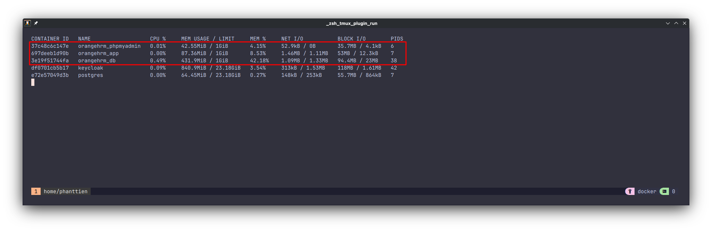
*Hình 1: Cấu hình giới hạn container 1 CPU / 1GB RAM.*

### 2.2. Client chạy Test

| Thành phần            | Thông tin                     |
| :-------------------- | :---------------------------- |
| **Operating System**  | Linux (Ubuntu/Debian)         |
| **Test Tool**         | Apache JMeter 5.6.3           |
| **Java Version**      | OpenJDK 21+                   |
| **Network**           | Localhost                     |
| **Memory Allocation** | JVM Heap: 2GB (-Xms2g -Xmx4g) |

## 3. Quy trình thực hiện kiểm thử

Chúng ta sẽ sử dụng JMeter GUI cho phần kiểm thử này. JMeter cũng hỗ trợ CLI, nhưng sử dụng GUI sẽ có phần report chi tiết và dễ xem hơn.

#### Bước 1: Import Test Plan

1. Clone repository về máy:
   ```bash
   git clone <repository-url>
   cd tien.pt/req6
   ```

2. Mở JMeter và import file `performance_test.jmx` bằng cách:
   - File → Open → Chọn `performance_test.jmx`

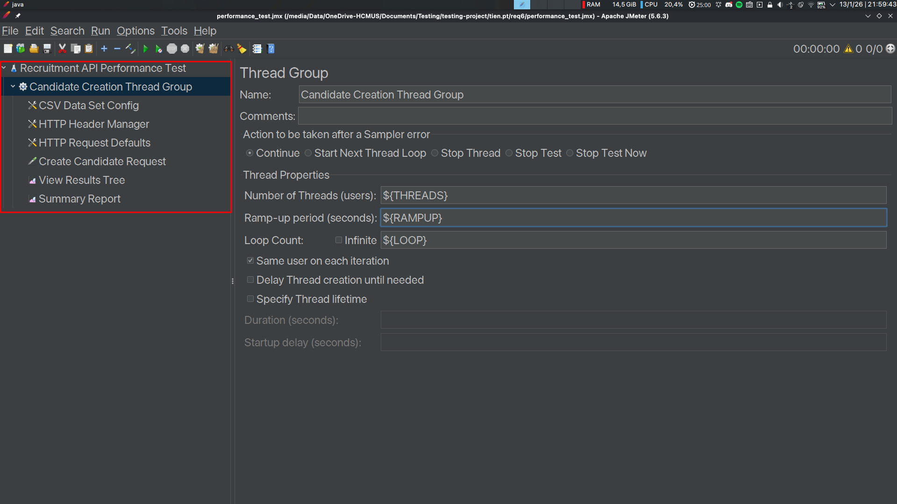

*Hình 2: Cấu trúc Test Plan với các thành phần: CSV Data Set Config, HTTP Header Manager, HTTP Request Defaults, Create Candidate Request, và Summary Report.*

#### Bước 2: Cấu hình Thread Group

Điều chỉnh các tham số trong Thread Group theo kịch bản test:

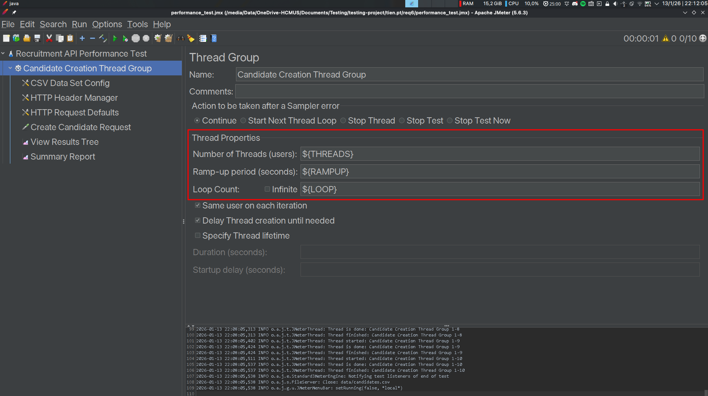

*Hình 3: Cấu hình Thread Group với các biến `${THREADS}`, `${RAMPUP}`, `${LOOP}` cho phép linh hoạt thay đổi.*

| Tham số             | Ý nghĩa                                     |
| :------------------ | :------------------------------------------ |
| `Number of Threads` | Số lượng virtual users đồng thời            |
| `Ramp-up Period`    | Thời gian để khởi tạo tất cả threads (giây) |
| `Loop Count`        | Số lần lặp cho mỗi thread                   |

#### Bước 3: Cấu hình Data-Driven Testing (CSV)

Dữ liệu ứng viên được tham số hóa thông qua file CSV để đảm bảo mỗi request tạo một ứng viên với thông tin khác nhau.

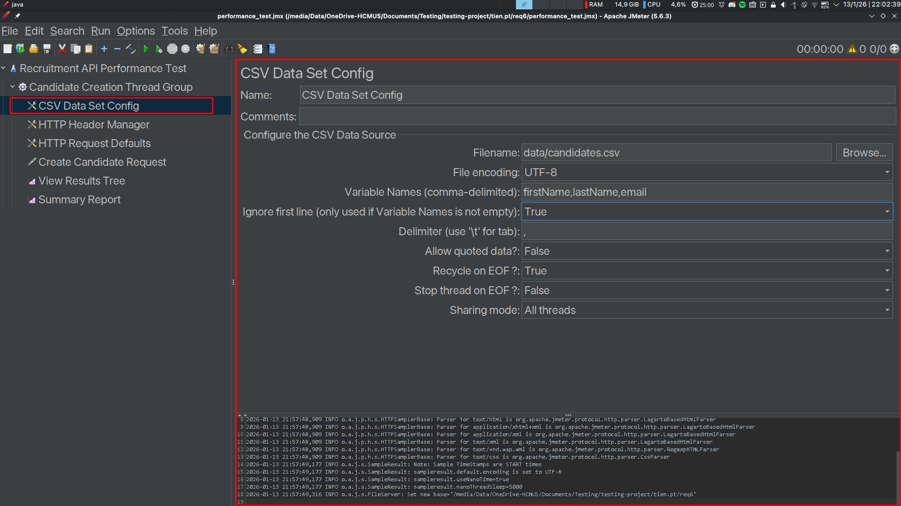

*Hình 4: Cấu hình CSV Data Set Config để đọc dữ liệu từ file `data/candidates.csv`.*

**Cấu trúc file `data/candidates.csv`:**
```csv
firstName,lastName,email
TestUser1,Perf1,test.user.1@perf.com
TestUser2,Perf2,test.user.2@perf.com
TestUser3,Perf3,test.user.3@perf.com
...
TestUser50,Perf50,test.user.50@perf.com
```

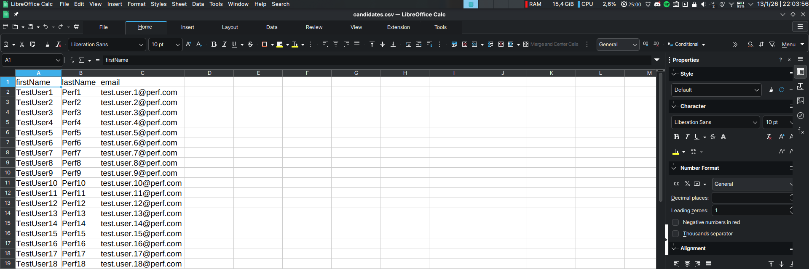
*Hình 5: Cấu hình HTTP Request Defaults (domain, port).*

#### Bước 4: Cấu hình Authentication Cookie

1. Lấy session cookie hợp lệ (Tham khảo Phụ lục B).
2. Cập nhật biến `COOKIE` trong User Defined Variables hoặc qua CLI parameter.

#### Bước 5: Chạy Test và Xem Kết Quả

Về kết quả chạy thực tế sẽ được nêu ở phần 4 bên dưới.

## 4. Test Results

### 4.1 Load test

- Cấu hình bộ test: 
    - Threads: 100
    - Rampup time: 2 seconds
    - Loop: 5

- Kết quả:
    - Hệ thống hoạt động ổn định dưới tải (100 concurrent users), không có dấu hiệu quá tải CPU/RAM. CPU không được sử dụng hết. **[Lưu ý: Số phần trăm hiển thị trên công cụ là của tổng 8 CPU -> 1 core sử dụng tối đa 12.5%]**

    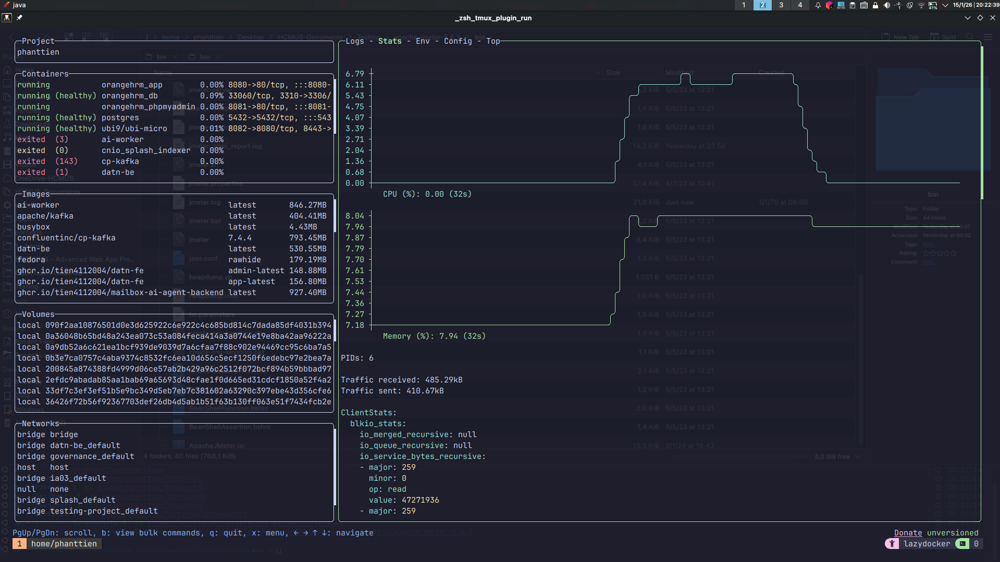
    *Hình 6: Sử dụng tài nguyên hệ thống ổn định.*
    - Summary report: Quan sát thấy các thông tin sau:
        - Số lượng request: 800
        - Thời gian phản hồi trung bình (Avg Response Time): **2,499 ms** (~2.5s)
        - Thời gian phản hồi tối đa (Max Response Time): **6,322 ms** (~6.3s)
        - Tỷ lệ lỗi (Error Rate): **0.00%**
        - Thông lượng (Throughput): **30.5 req/sec**

        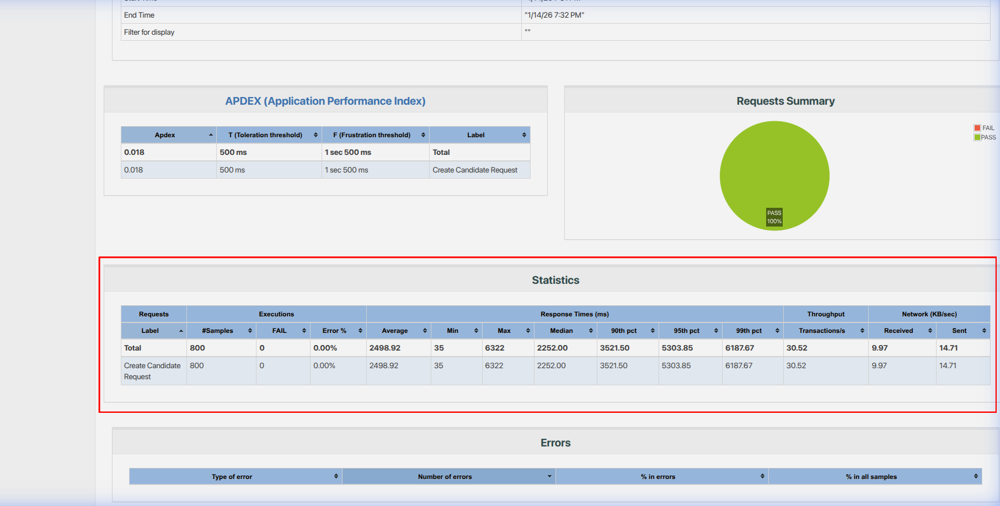
        *Hình 7: Dashboard Summary - Load Test Results.*
    - Quan sát danh sách các lỗi, ta thấy danh sách lỗi rỗng, cho thấy hệ thống xử lý tốt ở mức tải này.
    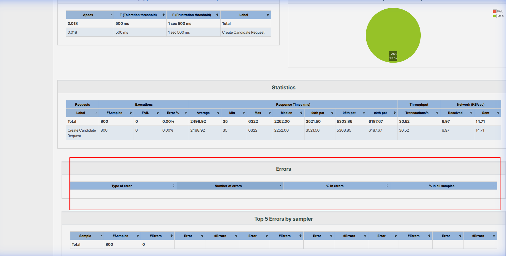
    *Hình 8: Danh sách lỗi Load Test (0%).*

    - Graph (Chi tiết vui lòng xem report tương ứng ở link đính kèm)
        - Response time: Response time dao động quanh mức trung bình 2.8s, không có sự tăng đột biến nào đáng kể.
        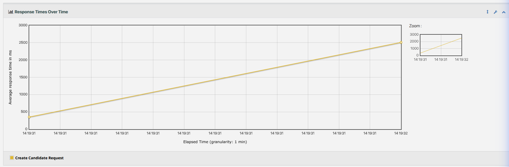
        *Hình 9: Biểu đồ Response Time theo thời gian (Load Test).*

        - Response time percentile: Các đường P90, P95, P99 nằm khá gần nhau và gần với mức trung bình, chứng tỏ độ ổn định cao.
        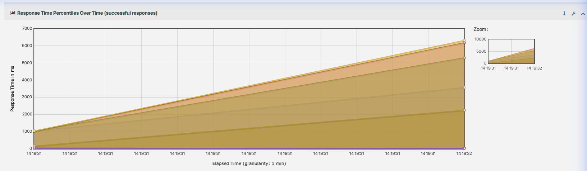
        *Hình 10: Biểu đồ Percentiles (Load Test).*

        - Latency: Latency duy trì ở mức thấp và ổn định trong suốt quá trình test.
        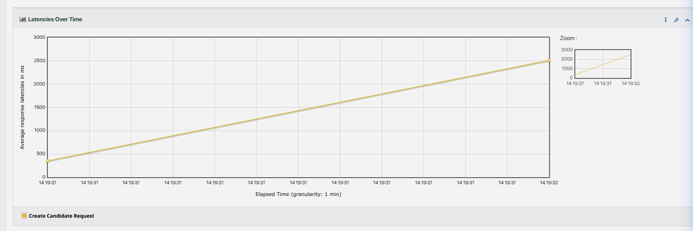
        *Hình 11: Biểu đồ Latency (Load Test).*

### 4.2. Stress test

- Cấu hình bộ test: 
    - Threads: 1000
    - Rampup time: 2 seconds
    - Loop: 20

    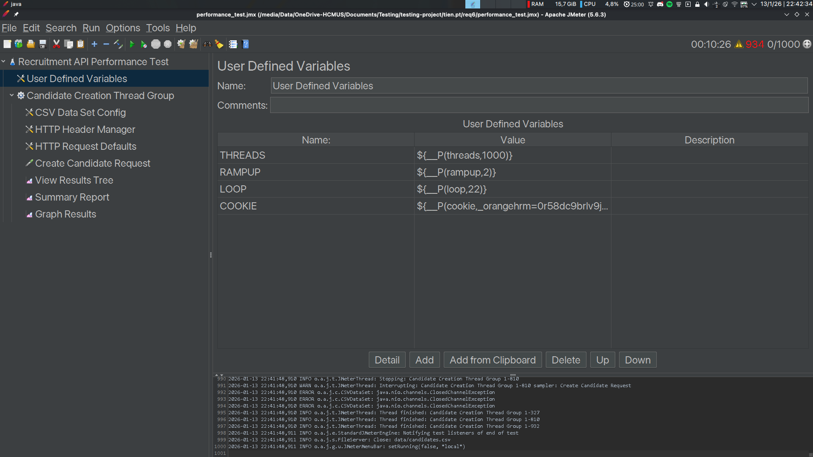
    *Hình 12: Thực thi Stress Test.*

- Kết quả:
    - Quan sát rằng, khi thực thi, hệ thống bị đẩy đến mức sử dụng tối đa CPU (100% ~ 1 core, là giới hạn đã set cho docker container). RAM chiếm hơn 60% trong suốt quá trình test. 
    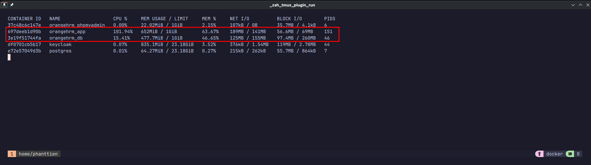
    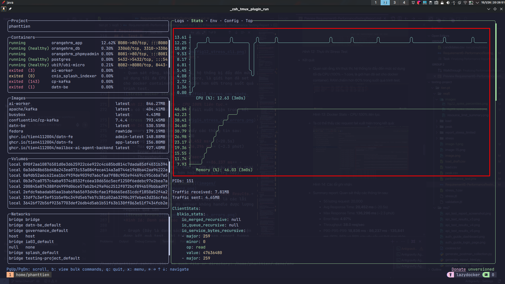
    *Hình 13: Docker Stats - CPU 100% liên tục.*
    - Ta có thể thấy các request fail xuất hiện trong kết quả: 
    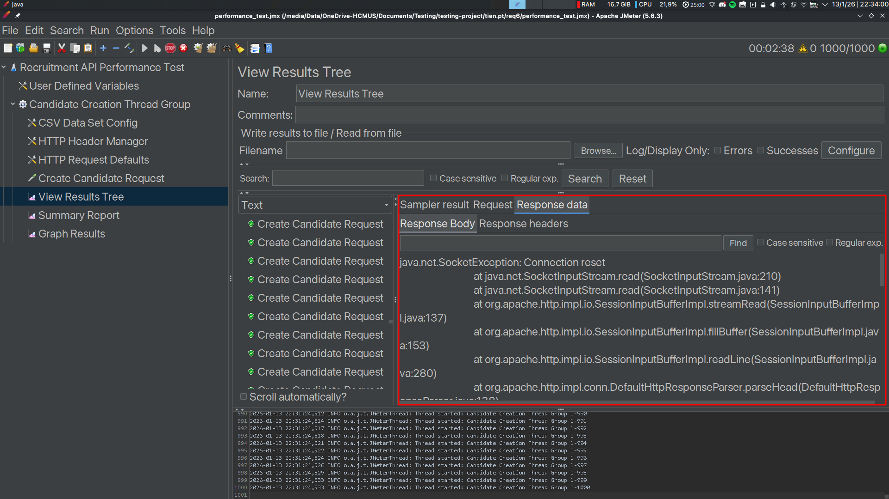
    *Hình 14: Các lỗi ghi nhận.*
    - Summary report: Quan sát thấy các thông tin sau:
        - Số lượng request: 20,000
        - Avg Response Time: **20,452 ms** (~20.5s)
        - Max Response Time: **136,296 ms** (~2.3 phút)
        - Error Rate: **4.97%**
        - Throughput: **38.0 req/sec**
        - P90-P95-P99: **18,836 ms** - **86,237 ms** - **135,841 ms** (90%, 95% và 99% các yêu cầu có thời gian phản hồi thấp hơn hoặc bằng giá trị này).

        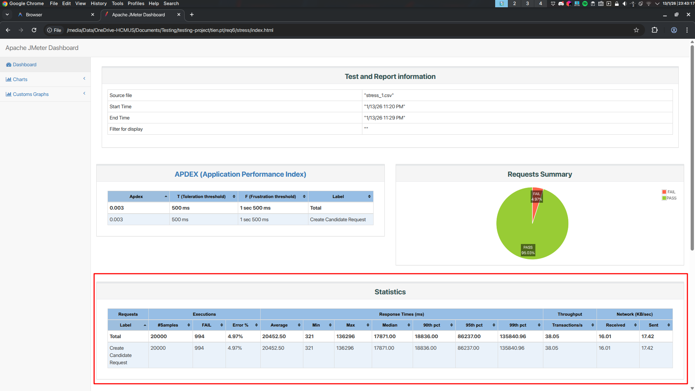
        *Hình 15: Dashboard Summary - Stress Test Results.*
    - Quan sát danh sách các lỗi, ta thấy đây là các lỗi connection, xuất hiện do server không handle được lượng request quá lớn
    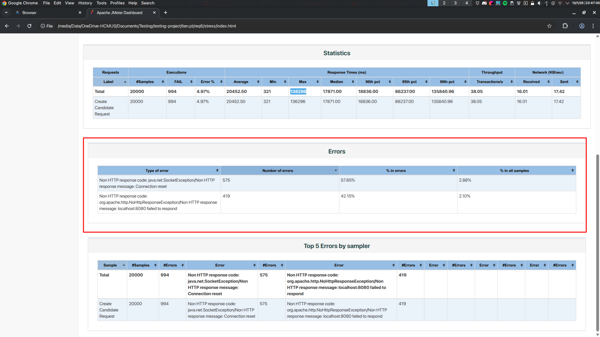
    *Hình 16: Danh sách các lỗi*

    - Graph (Đây là danh sách 3 biểu đồ điển hình thể hiện được kết quả test. Chi tiết vui lòng xem report tương ứng ở link đính kèm)
        - Response time: Response time tăng cao ở thời điểm giữa, là thời điểm server đã chịu tải nặng một thời gian tương đối để khiến server quá tải. Sau thời điểm đỉnh, khi các request đã fail hoặc được giải quyết phần nào, ta thấy response time giảm đáng kế.
        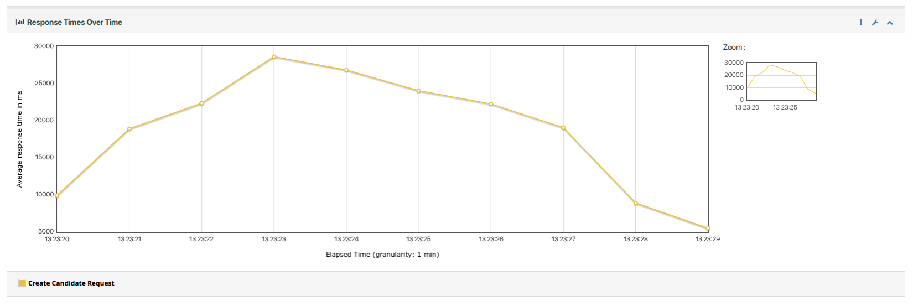
        *Hình 17: Biểu đồ Response Time (Stress Test).*

        - Response time percentile: Quan sát thấy P90, P95 và P99 lệch rất đáng kể. Điều này cho thấy khi server quá tải sẽ gây ảnh hưởng lớn đến response time. 
        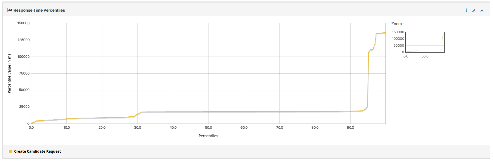
        *Hình 18: Biểu đồ Percentiles phân tách rõ rệt khi quá tải.*

        - Latency: Quan sát thấy latency từ thấp ở thời điểm bắt đầu, tăng mạnh lên khi server bắt đầu quá tải, và giảm dần khi các request được giải quyết.
        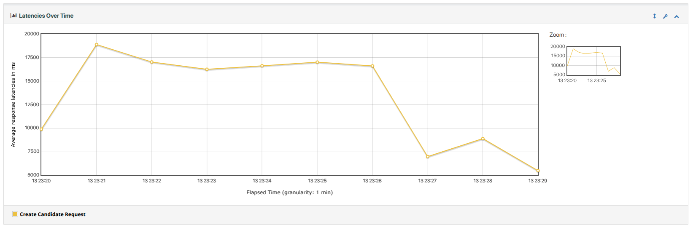
        *Hình 19: Biểu đồ Latency tăng mạnh (Stress Test).*

### 4.3. Spike Test

- Cấu hình bộ test:
    - Threads: 1500 
    - Rampup time: 1 second (1500 user cùng đổ vào hệ thống trong 1s)
    - Loop: 1

- Quan sát chart dưới, dễ dàng thấy rằng lượng request tăng cao ở thời gian đầu mô phỏng cho trường hợp người dùng đổ dồn vào hệ thống trong thời gian ngắn. (Gần 800 thread ở thời gian đầu, giảm dần khi các request được xử lý).

    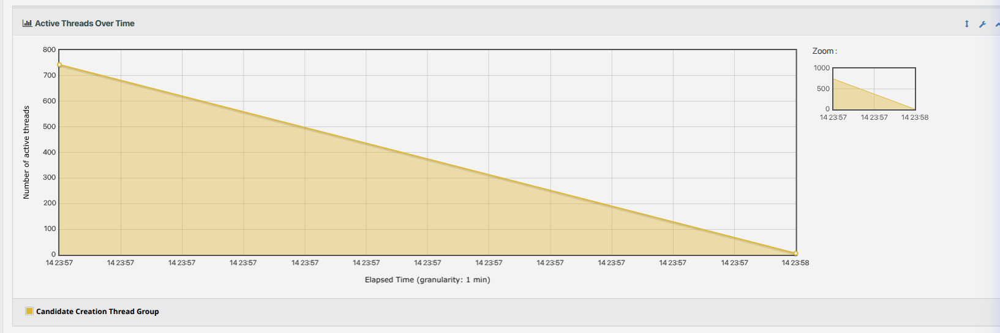
    *Hình 20: Lượng user (Active Threads) tăng dựng đứng trong 1s.*

- Tài nguyên hệ thống sử dụng:
  - CPU liên tục ở mức 100% (1 core).
  - RAM sử dụng ổn định ở mức ~600MB (trong giới hạn 1GB).
  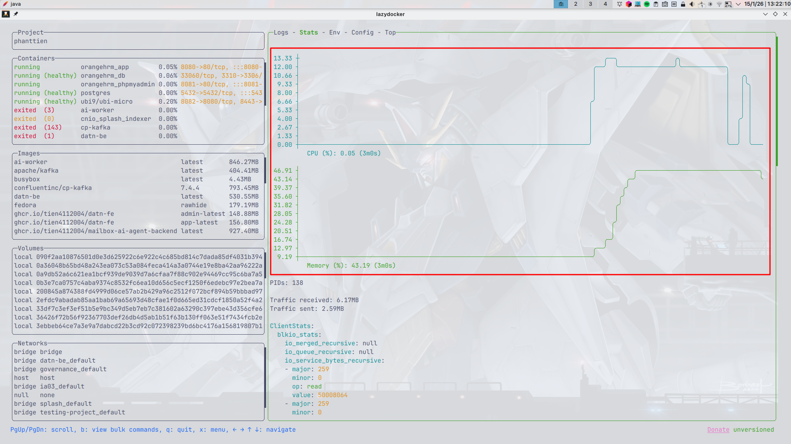

- Kết quả:
    - Hệ thống vẫn duy trì được hoạt động và xử lý toàn bộ request mà **không có lỗi** (0% Error Rate).
    - Tuy nhiên, thời gian phản hồi bị ảnh hưởng nghiêm trọng do số lượng request đến cùng lúc quá lớn. Độ chênh lệch giữa request nhanh nhất và chậm nhất là rất đáng kể, nhanh nhất là 298ms, trong khi chậm nhất 54251ms, khoảng hơn 54s.
      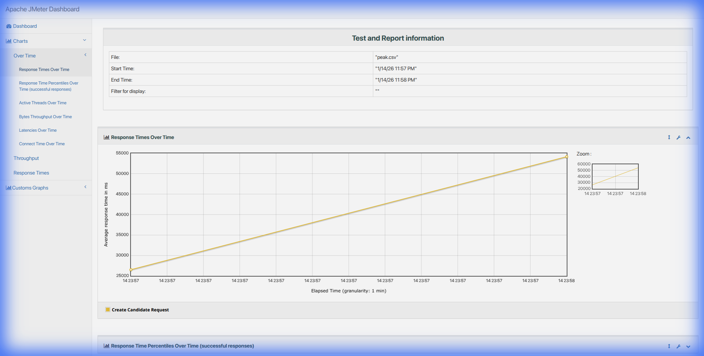
      *Hình 21: Response Time tăng vọt tương ứng với Spike.*    

    - Response time percentile: Các đường P90, P95, P99 tăng vọt và phân tách rõ rệt, chứng tỏ người dùng ở nhóm tail (nhóm chậm nhất) chịu độ trễ cực lớn (lên tới 45s-50s) trong thời điểm spike.
    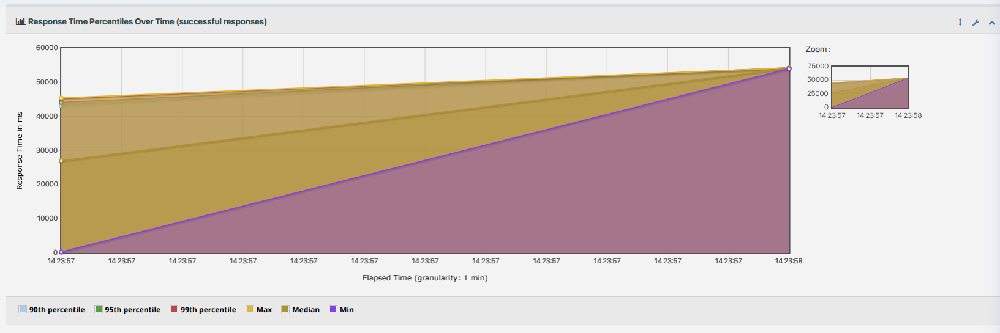
    *Hình 22: Percentiles Graph - P99 chạm ngưỡng ~50s.*

    - Summary report: Quan sát thấy các thông tin sau:
        - Số lượng request: 1500
        - Thời gian phản hồi trung bình (Avg Response Time): **26,720 ms** (~26.7s)
        - Thời gian phản hồi tối đa (Max Response Time): **54,251 ms** (~54.3s)
        - Tỷ lệ lỗi (Error Rate): **0.00%**
        - Thông lượng (Throughput): **26.9 req/sec**

        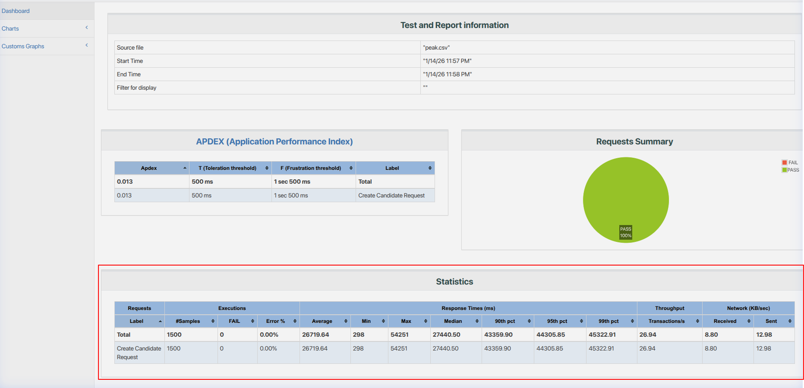
        *Hình 23: Dashboard Summary - Spike Test Results.*

## Phụ lục A: Hướng dẫn cài đặt Apache JMeter

### Yêu cầu hệ thống

- Java JDK 11 hoặc cao hơn
- Cấu hình cho JVM:
```bash
# Chỉnh sửa file jmeter (hoặc jmeter.bat trên Windows)
# Tăng heap size cho JVM
HEAP="-Xms2g -Xmx4g -XX:MaxMetaspaceSize=512m"
```

### Cài đặt trên Linux

```bash
# 1. Cài đặt Java (nếu chưa có)
sudo apt update
sudo apt install openjdk-11-jdk -y

# 2. Kiểm tra Java version
java -version

# 3. Tải Apache JMeter
wget https://downloads.apache.org/jmeter/binaries/apache-jmeter-5.6.3.tgz

# 4. Giải nén
tar -xzf apache-jmeter-5.6.3.tgz

# 5. Thêm vào PATH (tùy chọn)
echo 'export PATH=$PATH:~/apache-jmeter-5.6.3/bin' >> ~/.bashrc
source ~/.bashrc

# 6. Chạy JMeter GUI
jmeter

# 7. Hoặc chạy Non-GUI mode
jmeter -n -t test.jmx -l results.jtl
```

## Phụ lục B: Hướng dẫn lấy Session Cookie (Authentication)

Do hệ thống OrangeHRM sử dụng **HttpOnly Cookie** (`_orangehrm`) để bảo mật, việc lấy cookie này thông qua JavaScript console (`document.cookie`) là không thể. Dưới đây là 2 cách để lấy giá trị này.

### Cách 1: Sử dụng Script Python

Script Python đã được phát triển để tự động login và lấy session cookie một cách nhanh chóng. Để sử dụng, chạy lệnh sau:

```bash
# Chạy script
python3 ../req7/get_auth_cookie.py

# Output mẫu
# VALID_COOKIE: abc123xyz...
```

Sau đó sử dụng cookie trong lệnh JMeter:
```bash
jmeter -n -t performance_test.jmx -Jcookie="orangehrm=abc123xyz..." -l results.jtl
```

### Cách 2: Lấy thủ công qua Developer Tools (F12)

1. Mở trang Login OrangeHRM và mở DevTools (F12), chuyển sang tab **Network**.
2. Thực hiện đăng nhập thành công.
3. Trong danh sách Network, tìm request có tên `validate` (Method POST) hoặc `index`.
4. Click vào request, chọn tab **Headers**.
5. Tìm phần **Response Headers** → Copy giá trị của `_orangehrm` (bỏ phần `; path=/...`).

### Lưu ý quan trọng về Cookie

- Session cookie có TTL 30 phút nếu không hoạt động.
- Cần lấy cookie mới trước mỗi lần chạy test nếu session đã hết hạn.
- Kiểm tra response code `401 Unauthorized` để biết cookie đã hết hạn.
