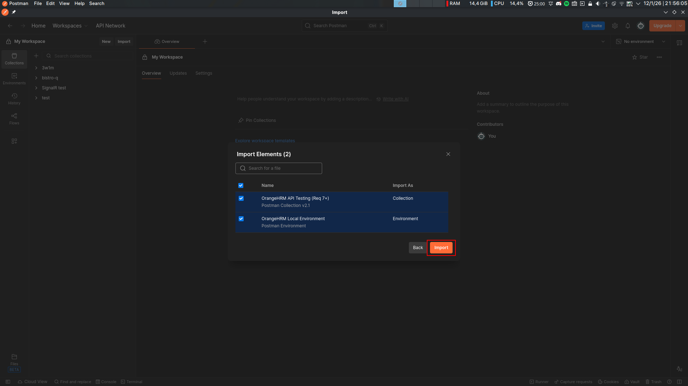
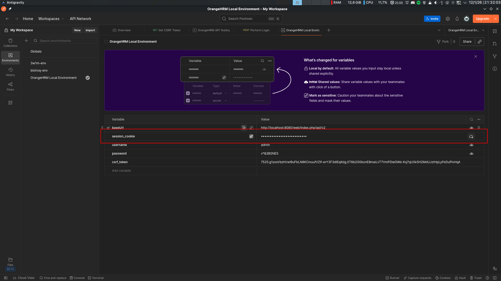
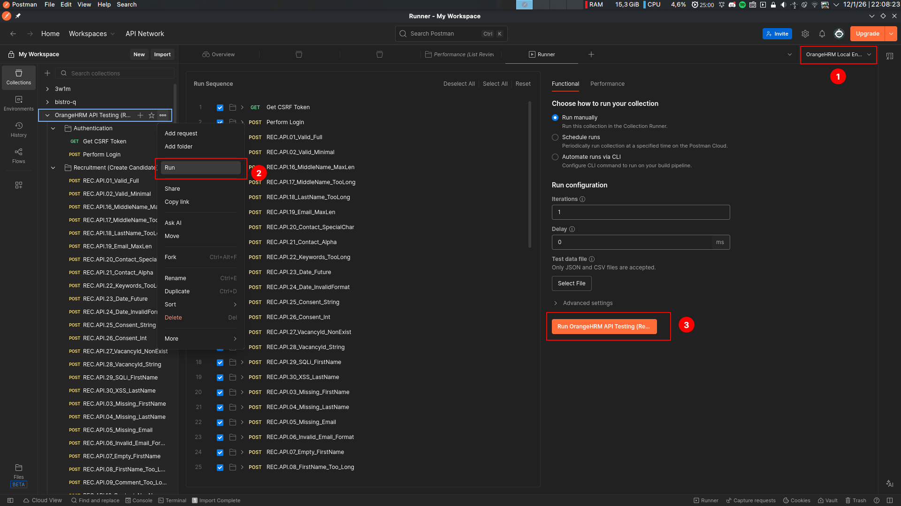
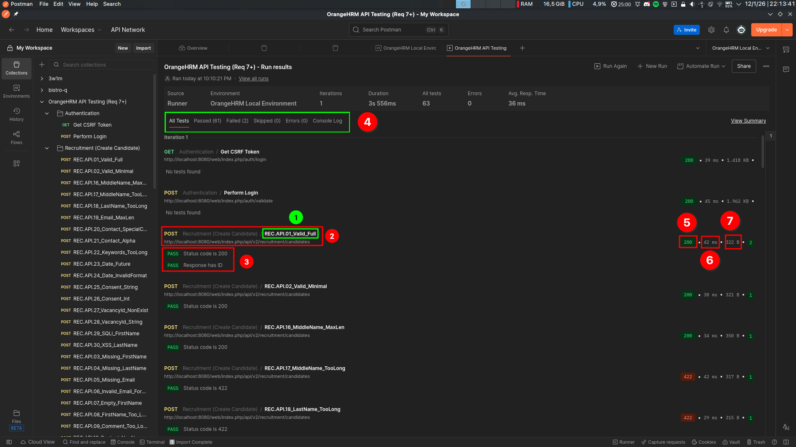
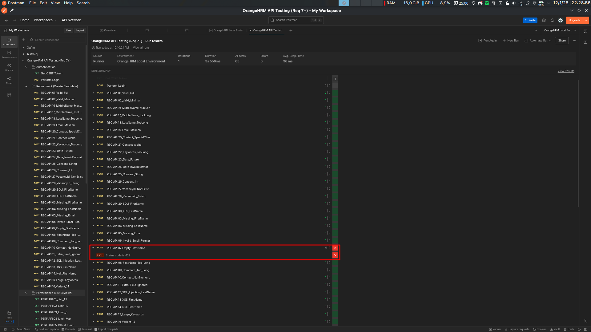
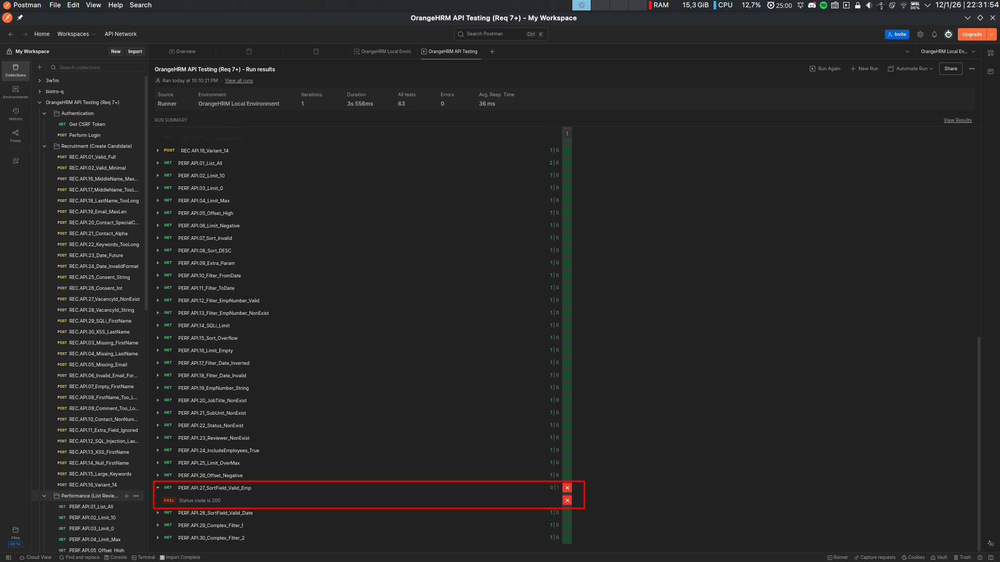
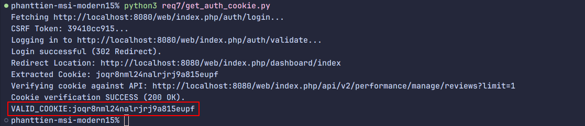
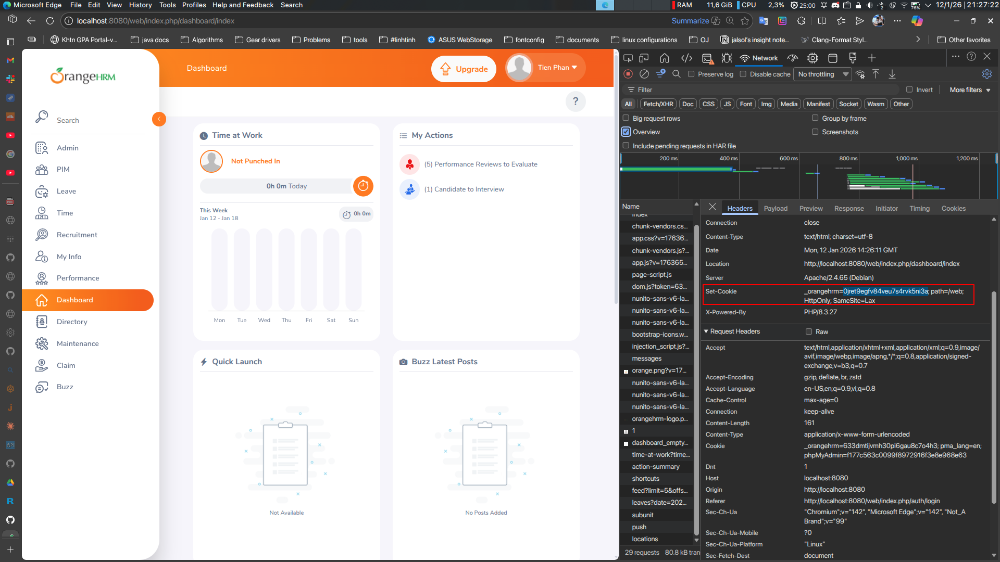

# Requirement 7 - API Testing Report

## Mục lục

- [Requirement 7 - API Testing Report](#requirement-7---api-testing-report)
  - [Mục lục](#mục-lục)
  - [Thông tin cá nhân \& nhóm](#thông-tin-cá-nhân--nhóm)
    - [Thông tin nhóm 11](#thông-tin-nhóm-11)
  - [1. Tổng quan](#1-tổng-quan)
    - [1.1. Các kỹ thuật thiết kế Test Case](#11-các-kỹ-thuật-thiết-kế-test-case)
    - [1.2. API Recruitment: Create candidate](#12-api-recruitment-create-candidate)
    - [1.3. API Performance: List reviews](#13-api-performance-list-reviews)
  - [2. Quy trình chung kiểm thử API](#2-quy-trình-chung-kiểm-thử-api)
    - [2.1. Cách 1: Sử dụng Postman GUI](#21-cách-1-sử-dụng-postman-gui)
    - [2.2. Cách 2: Sử dụng Newman (Automation CLI)](#22-cách-2-sử-dụng-newman-automation-cli)
  - [3. Test Results](#3-test-results)
    - [3.1. Summary](#31-summary)
    - [3.2. Các bug tìm thấy](#32-các-bug-tìm-thấy)
    - [3.3. Test Execution Screenshot](#33-test-execution-screenshot)
  - [Phụ lục: Hướng dẫn lấy Session Cookie (Authentication)](#phụ-lục-hướng-dẫn-lấy-session-cookie-authentication)
    - [Cách 1: Sử dụng Script tự động (Khuyên dùng)](#cách-1-sử-dụng-script-tự-động-khuyên-dùng)
    - [Cách 2: Lấy thủ công qua Developer Tools (F12)](#cách-2-lấy-thủ-công-qua-developer-tools-f12)


## Thông tin cá nhân & nhóm

- Họ tên: Phan Thanh Tiến
- MSSV: 22120368
- Nhóm 11.

### Thông tin nhóm 11

- Thông tin thành viên: 
  - Giang Đức Nhật - 22120252
  - Phan Thanh Tiến - 22120368
  - Nguyễn Bùi Vương Tiễn - 22120370
  - Lý Trọng Tín - 222120371

- Bảng phân công nhóm:
 
| Tính năng                   | Mô tả                                                             | Thành viên            |
| :-------------------------- | :---------------------------------------------------------------- | :-------------------- |
| HR Administration           | Quản trị hệ thống, cấu trúc tổ chức, user                         | Giang Đức Nhật        |
| Employee Self-Service (ESS) | Cổng thông tin nhân viên tự phục vụ                               | Giang Đức Nhật        |
| **Recruitment**             | **Tuyển dụng, theo dõi ứng viên**                                 | **Phan Thanh Tiến**   |
| **Performance Management**  | **Đánh giá KPI, đề nghị xem xét, lưu lịch sử performance review** | **Phan Thanh Tiến**   |
| Reporting & Analytics       | Báo cáo tùy chỉnh, xuất dữ liệu                                   | Nguyễn Bùi Vương Tiễn |
| Time and Attendance         | Chấm công, Timesheets                                             | Nguyễn Bùi Vương Tiễn |
| Employee Management (PIM)   | Quản lý hồ sơ nhân viên, báo cáo                                  | Lý Trọng Tín          |
| Leave Management            | Quản lý ngày nghỉ, quy tắc nghỉ phép                              | Lý Trọng Tín          |

- Các tính năng được phân công kiểm thử API là: 
  - Recruitment (Create Candidate)
  - Performance Management (Create Performance Review)

## 1. Tổng quan

Trong yêu cầu 7, ta tập trung kiểm thử API trên 2 endpoints chính. Ở đây, 2 API được chọn để kiểm thử là:
1. **Recruitment: Create a candidate**: `POST /api/v2/recruitment/candidates` (https://api-starter-orangehrm.readme.io/reference/create-a-candidate) 
2. **Performance: List all performance reviews**: `GET /api/v2/performance/manage/reviews` (https://api-starter-orangehrm.readme.io/reference/list-all-performance-reviews)

### 1.1. Các kỹ thuật thiết kế Test Case

1.  Equivalence Partitioning
    
    Kỹ thuật này chia dữ liệu đầu vào thành các lớp tương đương, nơi hệ thống dự kiến sẽ xử lý giống nhau. Thay vì test tất cả giá trị, ta chỉ chọn đại diện từ mỗi lớp.

    *   Giả sử xem xét field `limit` (Int) - khoảng giá trị [1, 50]:
        1.  Phân tích yêu cầu input của API (kiểu dữ liệu, khoảng giá trị).
            *   `limit` chấp nhận số nguyên, min = 1, max = 50.
        2.  Xác định các lớp hợp lệ (Valid partitions) mà hệ thống nên chấp nhận.
            *   Khoảng [1, 50]. Chọn giá trị đại diện `limit = 10`.
        3.  Xác định các lớp không hợp lệ (Invalid partitions) mà hệ thống nên từ chối.
            *   Khoảng nhỏ hơn 1: Chọn `limit = -1`.
            *   Khoảng lớn hơn 50: Chọn `limit = 51`.
            *   Sai kiểu dữ liệu: Chọn `limit = "abc"`.

2.  Boundary Value Analysis
    
    Lỗi thường xuất hiện tại các biên của miền giá trị input. Kỹ thuật này tập trung kiểm thử tại các điểm biên đó (giá trị nhỏ nhất, lớn nhất, cận dưới, cận trên).

    *   Giả sử xem xét field `firstName` (String) - bắt buộc, tối đa 30 ký tự:
        1.  Xác định các biên của miền giá trị hợp lệ (Min, Max).
            *   Độ dài ngắn nhất = 1 (do bắt buộc), Độ dài dài nhất = 30.
        2.  Tạo test case cho giá trị ngay tại biên (Boundary).
            *   `firstName` có độ dài 30 ký tự (Max).
        3.  Tạo test case cho giá trị ngay sát biên (ngay ngoài khoảng hợp lệ).
            *   `firstName` có độ dài 31 ký tự (Max + 1) -> Mong đợi lỗi.
        4.  Tạo test case cho biên đặc biệt (rỗng/null).
            *   `firstName` = "" (Empty) -> Mong đợi lỗi.

3.  Error Guessing
    
    Dựa trên kinh nghiệm và trực giác của tester để đoán các tình huống hệ thống dễ bị lỗi mà các kỹ thuật trên có thể bỏ sót.

    *   **Quy trình & Ví dụ minh họa**:
        1.  Liệt kê các tình huống lỗi tiềm năng thường gặp.
            *   Sai kiểu dữ liệu (Type mismatch), ký tự đặc biệt, giá trị Null.
        2.  Thiết kế test case để cố ý kích hoạt các lỗi này.
                - Sai kiểu: Gửi `consentToKeepData`="true" (String) thay vì Boolean.
                - Ký tự đặc biệt: Gửi `contactNumber` chứa `$`.
                - Null: Gửi `email` = null.

4.  Security Testing
    
    Kiểm tra các lỗ hổng bảo mật phổ biến để đảm bảo API không bị khai thác.

    *   **Quy trình & Ví dụ minh họa**:
        1.  Xác định các điểm nhập dữ liệu (input fields).
            *   Các trường text như `lastName`, `firstName`.
        2.  Lựa chọn payload tấn công (SQL Injection, XSS).
            *   Chuỗi SQL `' OR 1=1 --` hoặc thẻ `<script>alert(1)</script>`.
        3.  Gửi payload vào API và kiểm tra phản hồi.
                - Gửi `lastName` = `' OR 1=1 --`. Nếu API trả về dữ liệu database hoặc lỗi SQL -> Lỗi bảo mật.
                - Gửi `firstName` = `<script>...`. Nếu API lưu và trả về nguyên văn script -> Lỗi XSS.


### 1.2. API Recruitment: Create candidate

**Đặc tả API:**
- **Endpoint**: `POST /api/v2/recruitment/candidates`
- **Fields**:
  - `firstName` (Required, String, Max 30): Tên ứng viên.
  - `lastName` (Required, String): Họ ứng viên.
  - `email` (Required, String): Email hợp lệ.
  - `contactNumber` (Optional, String): Số điện thoại.
  - `keywords` (Optional, String): Từ khóa (Max 250).
  - `dateOfApplication` (Optional, Date YYYY-MM-DD): Ngày ứng tuyển.
  - `consentToKeepData` (Optional, Boolean): Đồng ý lưu dữ liệu.
- **Expected Response**: JSON Object chứa thông tin ứng viên vừa tạo, status `200 OK`.

| ID         | Field Tested      | Description / Scenario                                                                                                         |
| :--------- | :---------------- | :----------------------------------------------------------------------------------------------------------------------------- |
| REC.API.01 | All               | Kiểm chứng việc tạo candidate mới thành công khi gửi payload đầy đủ và hợp lệ lên server.                                      |
| REC.API.02 | Mandatory         | Kiểm chứng việc tạo thành công khi chỉ cung cấp các trường mandatory (firstname, lastname, email), bỏ qua các trường optional. |
| REC.API.03 | firstName         | Đảm bảo API từ chối request với lỗi 422 khi trường mandatory 'firstName' bị thiếu hoàn toàn trong payload.                     |
| REC.API.04 | lastName          | Đảm bảo API từ chối request với lỗi 422 khi trường mandatory 'lastName' bị thiếu hoàn toàn trong payload.                      |
| REC.API.05 | email             | Đảm bảo API từ chối request với lỗi 422 khi trường mandatory 'email' bị thiếu hoàn toàn trong payload.                         |
| REC.API.06 | email             | Kiểm chứng hệ thống validate format của email và trả về lỗi 422 nếu chuỗi email không hợp lệ.                                  |
| REC.API.07 | firstName         | Kiểm tra hành vi khi 'firstName' là chuỗi rỗng (""); mong đợi 422, nhưng hiện đang nhận 200 (Potential Bug).                   |
| REC.API.08 | firstName         | Kiểm chứng validation độ dài 'firstName' vượt quá 30 ký tự; mong đợi lỗi 422 để ngăn chặn lỗi database truncation/overflow.    |
| REC.API.09 | comment           | Kiểm chứng validation độ dài 'comment' vượt quá giới hạn (250 ký tự); mong đợi lỗi 422 để đảm bảo tính toàn vẹn dữ liệu.       |
| REC.API.10 | contactNumber     | Kiểm chứng API từ chối request nếu 'contactNumber' chứa ký tự non-numeric (mong đợi strict validation).                        |
| REC.API.11 | extraField        | Kiểm tra API chấp nhận hay từ chối payload có trường lạ (extra fields); API strict nên trả về 422 (đã quan sát thấy).          |
| REC.API.12 | lastName          | Thử nghiệm SQL Injection trong trường 'lastName' để kiểm chứng input được sanitize và không thực thi mã SQL độc hại.           |
| REC.API.13 | firstName         | Thử nghiệm Cross-Site Scripting (XSS) trong trường 'firstName' để đảm bảo script được vô hiệu hóa và không bị lưu/thực thi.    |
| REC.API.14 | firstName         | Kiểm chứng phản hồi khi 'firstName' được set giá trị Null; mong đợi lỗi 422 vì đây là trường mandatory.                        |
| REC.API.15 | keywords          | Test điều kiện biên với chuỗi 'keywords' cực lớn để đảm bảo hệ thống xử lý overflow một cách an toàn (422).                    |
| REC.API.16 | -                 | Base variant case để kiểm chứng độ ổn định của API dưới tải bình thường với dữ liệu valid chuẩn.                               |
| REC.API.17 | middleName        | Kiểm chứng 'middleName' chấp nhận chính xác độ dài tối đa cho phép (30 ký tự) mà không có lỗi.                                 |
| REC.API.18 | middleName        | Kiểm chứng 'middleName' từ chối input vượt quá độ dài tối đa (31 ký tự) với lỗi 422.                                           |
| REC.API.19 | lastName          | Kiểm chứng 'lastName' từ chối input vượt quá độ dài tối đa (31 ký tự) với lỗi 422.                                             |
| REC.API.20 | email             | Test trường email với độ dài tối đa có thể để đảm bảo database xử lý chính xác.                                                |
| REC.API.21 | contactNumber     | Kiểm chứng hệ thống xử lý các ký tự đặc biệt hợp lệ (ví dụ: +, -) trong số điện thoại; mong đợi thành công (200).              |
| REC.API.22 | contactNumber     | Kiểm chứng các ký tự chữ cái trong 'contactNumber' sẽ kích hoạt lỗi validation (422) nếu strict typing được áp dụng.           |
| REC.API.23 | keywords          | Kiểm chứng validation cho trường 'keywords' vượt quá giới hạn ký tự (255) trả về lỗi unprocessable entity.                     |
| REC.API.24 | dateOfApplication | Kiểm tra hệ thống chấp nhận ngày tương lai cho application; thường cho phép nhưng test logic validation.                       |
| REC.API.25 | dateOfApplication | Kiểm chứng định dạng ngày không hợp lệ (ví dụ: DD-MM-YYYY) kích hoạt lỗi 422 thay vì parse sai.                                |
| REC.API.26 | consentToKeepData | Kiểm chứng strict type checking bằng cách gửi string "true" thay vì boolean true; mong đợi lỗi strict 422.                     |
| REC.API.27 | consentToKeepData | Kiểm chứng strict type checking bằng cách gửi integer 1 thay vì boolean true; mong đợi lỗi strict 422.                         |
| REC.API.28 | vacancyId         | Đảm bảo tham chiếu đến 'vacancyId' không tồn tại sẽ trả về lỗi 422 (foreign key constraint validation).                        |
| REC.API.29 | vacancyId         | Kiểm chứng cung cấp data type không hợp lệ (string) cho 'vacancyId' dẫn đến lỗi type validation 422.                           |
| REC.API.30 | firstName         | Test SQL Injection thứ cấp để đảm bảo sanitize mạnh mẽ chống lại các mẫu tấn công phổ biến.                                    |
| REC.API.31 | lastName          | Test XSS Injection thứ cấp để đảm bảo bảo vệ mạnh mẽ chống lại thẻ script trong text fields.                                   |

### 1.3. API Performance: List reviews

**API Specifications:**
- **Endpoint**: `GET /api/v2/performance/manage/reviews`
- **Parameters**:
  - `limit` (Int): Số lượng record tối đa (Pagination).
  - `offset` (Int): Vị trí bắt đầu (Pagination).
  - `sortField` (String): Trường để sắp xếp (e.g. `date`).
  - `fromDate`, `toDate` (Date YYYY-MM-DD): Khoảng thời gian review.
  - `empNumber`, `reviewerId` (Int): Filter theo nhân viên/reviewer.
- **Expected Response**: JSON Object chứa mảng `data` (List Reviews) và `meta` (Pagination info), status `200 OK`.

| ID          | Field/Param      | Description / Scenario                                                                                                  |
| :---------- | :--------------- | :---------------------------------------------------------------------------------------------------------------------- |
| PERF.API.01 | -                | Kiểm chứng API trả về danh sách tất cả performance reviews với status 200 OK khi không có filter.                       |
| PERF.API.02 | limit, offset    | Kiểm chứng hành vi pagination chính xác khi cung cấp tham số 'limit' và 'offset' hợp lệ (trả về 200 OK).                |
| PERF.API.03 | limit            | Kiểm chứng hệ thống xử lý 'limit=0' an toàn; thường trả về default set hoặc danh sách rỗng tùy implementation (200 OK). |
| PERF.API.04 | limit            | Kiểm chứng phản hồi hệ thống khi 'limit' được set giá trị tối đa tiêu chuẩn (ví dụ: 50), mong đợi 200 OK.               |
| PERF.API.05 | offset           | Kiểm chứng request với 'offset' lớn hơn tổng dataset sẽ trả về mảng data rỗng với 200 OK.                               |
| PERF.API.06 | limit            | Kiểm chứng giá trị 'limit' âm sẽ kích hoạt lỗi validation (422) thay vì lỗi server 500.                                 |
| PERF.API.07 | sortField        | Kiểm tra strict validation: cung cấp tên cột không hợp lệ cho 'sortField' sẽ trả về lỗi 422.                            |
| PERF.API.08 | sortOrder        | Kiểm chứng danh sách có thể được sắp xếp theo thứ tự Giảm dần (DESC) thành công qua tham số 'sortOrder'.                |
| PERF.API.09 | extra            | Kiểm chứng "Strict Mode": cung cấp query parameter lạ ('extra') sẽ bị từ chối với lỗi 422 theo thiết kế API.            |
| PERF.API.10 | fromDate         | Kiểm chứng lọc theo 'fromDate' trả về các bản ghi bắt đầu từ ngày chỉ định (200 OK).                                    |
| PERF.API.11 | toDate           | Kiểm chứng lọc theo 'toDate' trả về các bản ghi kết thúc trước hoặc vào ngày chỉ định (200 OK).                         |
| PERF.API.12 | empNumber        | Kiểm chứng lọc theo 'empNumber' hợp lệ trả về các reviews thuộc về nhân viên đó (200 OK).                               |
| PERF.API.13 | empNumber        | Kiểm chứng cung cấp 'empNumber' không tồn tại sẽ kích hoạt lỗi 422 (Strict Validation) thay vì danh sách rỗng.          |
| PERF.API.14 | limit            | Thử nghiệm SQL Injection trong tham số 'limit' (ví dụ: '; DROP') để đảm bảo input được sanitize và an toàn.             |
| PERF.API.15 | sortField        | Test input buffer overflow bằng cách gửi chuỗi cực dài trong 'sortField'; mong đợi xử lý 422.                           |
| PERF.API.16 | limit            | Kiểm chứng hành vi khi tham số 'limit' được cung cấp nhưng bỏ trống; mong đợi 422 do lỗi parse integer.                 |
| PERF.API.17 | fromDate, toDate | Kiểm tra logic validation: 'fromDate' lớn hơn 'toDate'. Nên trả về 200 OK (Empty List) hoặc 422.                        |
| PERF.API.18 | fromDate         | Kiểm chứng định dạng ngày không hợp lệ trong tham số filter kích hoạt lỗi 422 ngay lập tức.                             |
| PERF.API.19 | empNumber        | Kiểm chứng strict type validation bằng cách cung cấp giá trị chuỗi cho trường integer 'empNumber'.                      |
| PERF.API.20 | jobTitleId       | Kiểm chứng lọc theo Foreign Key 'jobTitleId' không tồn tại trả về 200 OK valid (Empty List) hoặc 422.                   |
| PERF.API.21 | subUnitId        | Kiểm chứng lọc theo Foreign Key 'subUnitId' không tồn tại trả về lỗi 422 (Strict Validation).                           |
| PERF.API.22 | statusId         | Kiểm chứng lọc theo Foreign Key 'statusId' không tồn tại trả về lỗi 422 (Strict Validation).                            |
| PERF.API.23 | reviewerId       | Kiểm chứng lọc theo Foreign Key 'reviewerId' không tồn tại trả về lỗi 422 (Strict Validation).                          |
| PERF.API.24 | includeEmployees | Kiểm chứng check type query parameter (Boolean vs String); mong đợi 422 hoặc 200 tùy độ linh hoạt framework.            |
| PERF.API.25 | limit            | Kiểm tra xử lý max limit: cung cấp limit quá lớn (1M); hệ thống nên cap lại hoặc trả về tối đa cho phép (200).          |
| PERF.API.26 | offset           | Kiểm chứng giá trị 'offset' âm kích hoạt lỗi validation (422) ngăn chặn truy vấn DB không hợp lệ.                       |
| PERF.API.27 | sortField        | Kiểm chứng sắp xếp theo tên trường hợp lệ nhưng khác biệt ('employeeName') hoạt động chính xác (200 OK).                |
| PERF.API.28 | sortField        | Kiểm chứng sắp xếp theo trường ngày ('reviewPeriodStart') hoạt động chính xác không gây lỗi server nội bộ.              |
| PERF.API.29 | limit, offset    | Kiểm chứng sự kết hợp của nhiều tham số pagination hợp lệ hoạt động chính xác cùng nhau.                                |
| PERF.API.30 | fromDate, limit  | Kiểm chứng sự kết hợp của Date filters và tham số Pagination hoạt động chính xác cùng nhau.                             |

## 2. Quy trình chung kiểm thử API

Để thực hiện kiểm thử, ta có thể sử dụng công cụ Postman hoặc Newman.

### 2.1. Cách 1: Sử dụng Postman GUI 

- Sử dụng Postman collection và environment ở link sau: [wait for link]
- Import `postman_collection.json` và `postman_environment.json` vào Postman.


Hình 1: Import API collection vào Postman

- Thực hiện Login để lấy Token (Tham khảo Phần 5).

- Thay token vào environment trên Postman để sẵn sàng chạy bộ test.



Hình 2: Thay token vào environment trên Postman

- Chạy Collection Runner cho thư mục "Recruitment" và "Performance", sử dụng environment đã cấu hình (1), click các bước (2) và Run (3).



Hình 3: Chạy Collection Runner trên Postman.

- Kiểm tra kết quả Pass/Fail trực quan trên giao diện. Như hình ảnh dưới đây ở vị trí (4), ta thấy có tổng 63 test cases, trong đó 61 test passed và 2 test failed.



Hình 4: Kết quả chạy test trên Postman GUI.

Nhìn chi tiết hơn hình ảnh này, ở mỗi test case, có các thông tin đáng chú ý sau: 
  - Số (1) màu xanh: Tên test case
  - Số (2): HTTP Method, API endpoint
  - Số (3): Danh sách các assertions đã thực hiện
  - Số (4): HTTP code trả về
  - Số (5): Thời gian phản hồi
  - Số (6): Kích thước dữ liệu trả về

### 2.2. Cách 2: Sử dụng Newman (Automation CLI)

- Newman là công cụ dòng lệnh cho phép chạy Postman Collection. Việc chạy trên CLI giúp tích hợp vào CI pipeline dễ dàng hơn so với sử dụng Postman GUI. 

- Lệnh thực thi:
  ```bash
  newman run req7/postman_collection.json -e req7/postman_environment.json
  ```
- Kết quả được xuất ra console hoặc report dạng HTML/JSON.

## 3. Test Results

### 3.1. Summary

- Total Tests: 63 (Functional Tests) + 2 (Auth Setup) = 65
- Passed: 63
- Failed: 2 
- Execution Environment: Localhost (Admin user), Authentication bằng login script.

### 3.2. Các bug tìm thấy
1.  **Recruitment API**:
    -   `REC.API.07_Empty_FirstName`: **FAIL (BUG)**.
        -   **Description**: Trường `firstName` là bắt buộc nhưng khi gửi giá trị rỗng (""), API vẫn trả về `200 OK`.
        -   **Expected**: `422 Unprocessable Content`.
    -   `REC.API.29_SQLi_FirstName` & `REC.API.30_XSS_LastName`: Trả về `200 OK` (Accepted). Cần xác minh thêm liệu hệ thống có Sanitize dữ liệu trước khi lưu xuống DB hay không.

2.  **Performance API**:
    -   `PERF.API.27_SortField_Valid_Emp`: **FAIL (BUG)**.
        -   Tham số `sortField=employeeName` (trường hợp lệ) bị API từ chối với lỗi `422 Unprocessable Content` ("Invalid Parameter").
        -   **Expected**: `200 OK` và danh sách được sắp xếp theo tên nhân viên.

### 3.3. Test Execution Screenshot
Hình ảnh dưới đây minh họa kết quả chạy thực tế của toàn bộ 63 requests (V5 Optimized Suite):




Hình 5: Tổng quan kết quả test (Test summary)

## Phụ lục: Hướng dẫn lấy Session Cookie (Authentication)

Do hệ thống sử dụng **HttpOnly Cookie** (`_orangehrm`) để bảo mật, việc lấy cookie này thông qua Javascript console (`document.cookie`) là không thể. Dưới đây là 2 cách để lấy giá trị này cho Postman.

### Cách 1: Sử dụng Script tự động (Khuyên dùng)

Để lấy được cookie hợp lệ, script python đã được phát triển, sử dụng thư viện HTTP của Python. Để chạy được script, thực hiện các bước như sau:

- Bước 1: Chạy lệnh trên terminal:
  ```bash
  python3 req7/get_auth_cookie.py
  ```
- Bước 2: Quan sát output: `VALID_COOKIE: <giá_trị_cookie>`.
- Bước 3: Copy giá trị này vào biến `session_cookie` trong Postman Environment.



Hình 6: Lấy cookie thông qua script Python

### Cách 2: Lấy thủ công qua Developer Tools (F12)

Việc lấy trực tiếp cookies từ Postman là không khả thi do OrangeHRM không cho phép login nếu không bật JavaScript (Postman không đáp ứng yêu cầu). Chính vì vậy, nếu không sử dụng script `python` như cách 1, ta có thể lấy trực tiếp từ trình duyệt (Chrome/Edge). 

Để lấy được cookies đặt vào env, ta thực hiện các bước như sau:

1.  Mở trang Login và mở DevTools, chuyển sang tab Network.
2.  Thực hiện đăng nhập thành công.
3.  Trong danh sách Network, tìm request có tên `validate` (Method POST) hoặc `index` (ngay sau khi login).
4.  Click vào request, chọn tab **Headers**.
5.  Tìm phần **Response Headers** (hoặc Request Headers của các request sau đó).
6.  Copy giá trị của `_orangehrm` (bỏ phần `; path=/...`).



Hình 7: Cookie trong tab Network
