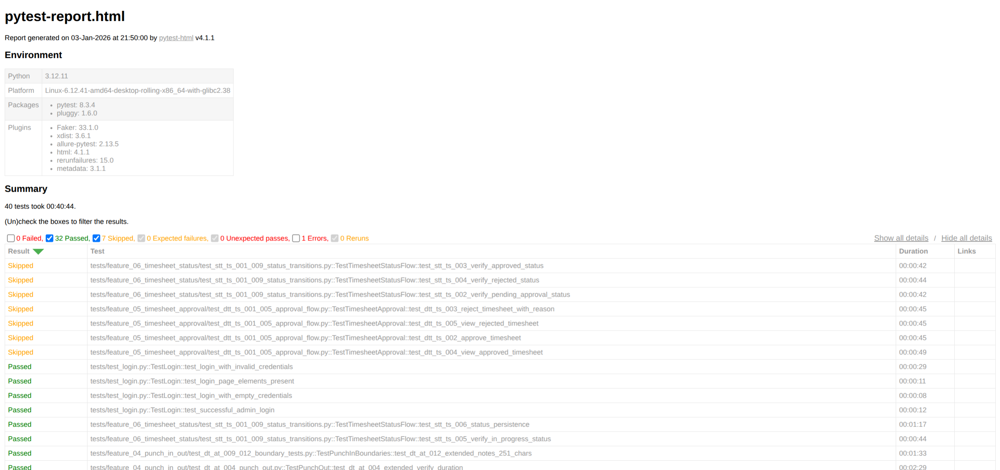

# BÁO CÁO KIỂM THỬ TỰ ĐỘNG HÓA (FUNCTIONAL TESTING REPORT)

**Dự án**: Kiểm thử tự động hóa hệ thống OrangeHRM
**Phiên bản**: OrangeHRM 5.8
**Người thực hiện**: Nguyễn Bùi Vương Tiến
**Ngày**: 03/01/2026

---

## PHÂN CÔNG

| Tính năng                   | Thành viên phụ trách  |
| --------------------------- | --------------------- |
| Recruitment                 | Phan Thanh Tiến       |
| Performance Review          | Phan Thanh Tiến       |
| HR Administration           | Giang Đức Nhật        |
| Employee Management (PIM)   | Giang Đức Nhật        |
| Leave Management            | Lý Trọng Tín          |
| Tme and Attendance          | Lý Trọng Tín          |
| Reporting and Analytics     | Nguyễn Bùi Vương Tiễn |
| Employee Self-Service (ESS) | Nguyễn Bùi Vương Tiễn |


---

## MỤC LỤC

1. [Tổng quan](#1-tổng-quan)
2. [Chiến lược Tự động hóa](#2-chiến-lược-tự-động-hóa)
3. [Kết quả thực thi](#3-kết-quả-thực-thi)
4. [Báo cáo lỗi](#4-báo-cáo-lỗi)
5. [Kết luận](#5-kết-luận)

---

## 1. TỔNG QUAN

### 1.1. Mục tiêu kiểm thử

Dự án kiểm thử tự động hóa nhằm xác minh chức năng của hệ thống quản lý nhân sự OrangeHRM, tập trung vào module **Time and Attendance**, bao gồm:

- **Punch In/Out**: Chấm công vào/ra
- **Timesheet Entry**: Nhập liệu giờ làm việc
- **Timesheet Approval**: Phê duyệt timesheet
- **Timesheet Status Flow**: Quản lý luồng trạng thái
- **Reports & Analytics**: Báo cáo và phân tích (đang phát triển)

### 1.2. Phạm vi kiểm thử

| Loại kiểm thử | Mô tả |
|---------------|-------|
| **Functional Testing** | Kiểm tra các chức năng nghiệp vụ cốt lõi |
| **State Transition Testing** | Kiểm tra chuyển đổi trạng thái (In Progress → Pending Approval → Approved/Rejected) |
| **Boundary Value Testing** | Kiểm tra giá trị biên (ngày, giờ, ký tự) |
| **Data-Driven Testing** | Sử dụng dữ liệu từ file JSON để test nhiều kịch bản |
| **Cross-Browser Testing** | Chrome, Firefox (với hỗ trợ system driver) |
| **Parallel Execution** | Chạy song song với pytest-xdist |

### 1.3. Công nghệ sử dụng

| Công nghệ | Phiên bản | Mục đích |
|-----------|-----------|----------|
| **Python** | 3.11+ | Ngôn ngữ lập trình |
| **Selenium WebDriver** | 4.27.1 | Automation tool |
| **pytest** | 8.3.4 | Test framework |
| **pytest-xdist** | 3.6.1 | Parallel execution |
| **Allure** | 2.13.5 | Reporting framework |
| **webdriver-manager** | 4.0.2 | Auto driver management |

### 1.4. Target Application

- **URL**: https://opensource-demo.orangehrmlive.com/
- **Version**: OrangeHRM 5.8
- **Credentials**:
  - Admin Username: `Admin`
  - Admin Password: `admin123`

---

## 2. CHIẾN LƯỢC TỰ ĐỘNG HÓA (AUTOMATION STRATEGY)

### 2.1. Kiến trúc Page Object Model (POM)

Framework được tổ chức theo mô hình **Page Object Model (POM)** để tách biệt logic kiểm thử và tương tác UI, giúp code dễ bảo trì và đọc hiểu.

```
testing-45/
├── config/                      # Configuration
│   ├── config.py               # Environment config loader
│   └── test_data.py            # Test data constants
│
├── pages/                       # Page Object Model
│   ├── base_page.py            # Base page với common methods
│   ├── login_page.py           # Login page object
│   └── time/                   # Time module pages
│       ├── punch_in_out_page.py
│       ├── my_timesheet_page.py
│       ├── timesheet_approval_page.py
│       └── timesheet_status_page.py
│
├── pages/locators/              # Locators
│   ├── login_locators.py
│   └── time_locators.py
│
├── tests/                       # Test cases
│   ├── test_login.py           # Smoke tests
│   ├── feature_04_punch_in_out/
│   ├── feature_05_timesheet_approval/
│   ├── feature_06_timesheet_status/
│   ├── feature_07_reports/     # (Pending)
│   └── feature_08_timesheet_entry/
│
├── utils/                       # Utilities
│   ├── driver_factory.py       # WebDriver factory
│   ├── logger.py               # Logging
│   ├── date_utils.py           # Date helpers
│   └── screenshot_utils.py     # Screenshot utilities
│
└── test_data/                   # Test data
    ├── projects.json
    └── activities.json
```

**Ưu điểm của POM:**
- Tách biệt UI logic và test logic
- Dễ maintain khi UI thay đổi
- Tái sử dụng code cao
- Dễ đọc, dễ hiểu

**Ví dụ Page Object:**

```python
# pages/time/punch_in_out_page.py
class PunchInOutPage(BasePage):
    """Page Object for Punch In/Out functionality"""

    def __init__(self, driver):
        super().__init__(driver)
        self.locators = TimeLocators()

    @allure.step("Click Punch In button")
    def click_punch_in(self):
        """Click the Punch In button"""
        self.wait_and_click(self.locators.PUNCH_IN_BUTTON)
        logger.info("Clicked Punch In button")

    @allure.step("Enter punch in time: {hour}:{minute}")
    def enter_punch_time(self, hour, minute):
        """Enter punch in time"""
        time_input = self.wait_for_element(self.locators.TIME_INPUT)
        time_str = f"{hour:02d}:{minute:02d}"
        time_input.clear()
        time_input.send_keys(time_str)
        logger.info(f"Entered punch time: {time_str}")
```

### 2.2. Data-Driven Testing

**Nguồn dữ liệu**: Test data được lưu trữ trong file JSON để dễ quản lý và mở rộng.

**File test_data/projects.json:**
```json
{
  "projects": [
    {
      "name": "Project A",
      "activities": ["Development", "Testing", "Meeting"]
    },
    {
      "name": "Project B",
      "activities": ["Development", "Testing", "Meeting"]
    },
    {
      "name": "Project C",
      "activities": ["Development", "Testing", "Meeting"]
    }
  ]
}
```

**Minh họa Code đọc dữ liệu:**

```python
# config/test_data.py
import json
from pathlib import Path

class TestData:
    """Centralized test data management"""

    @staticmethod
    def load_json(filename):
        """Load JSON test data file"""
        file_path = Path(__file__).parent.parent / "test_data" / filename
        with open(file_path, 'r', encoding='utf-8') as f:
            return json.load(f)

    @staticmethod
    def get_projects():
        """Get projects test data"""
        data = TestData.load_json("projects.json")
        return data.get("projects", [])
```

**Sử dụng trong test:**

```python
# tests/feature_08_timesheet_entry/test_apt_ts_001_009_add_entries.py
@pytest.mark.parametrize("project,activity,hours,day", [
    ("Project A", "Development", "0", "Monday"),
    ("Project A", "Testing", "3", "Wednesday"),
    ("Project B", "Meeting", "12", "Wednesday"),
])
def test_add_timesheet_entry(driver, login, project, activity, hours, day):
    """Data-driven test for adding timesheet entries"""
    timesheet_page = MyTimesheetPage(driver)
    success = timesheet_page.add_timesheet_entry(project, activity, hours, day)
    assert success
```

### 2.3. Kỹ thuật Cross-Browser Testing

Sử dụng **Factory Pattern** để khởi tạo driver dựa trên cấu hình, đảm bảo test chạy ổn định trên nhiều trình duyệt.

**Driver Factory Implementation:**

```python
# utils/driver_factory.py
import shutil
from selenium import webdriver
from selenium.webdriver.chrome.service import Service as ChromeService
from selenium.webdriver.firefox.service import Service as FirefoxService
from webdriver_manager.chrome import ChromeDriverManager
from webdriver_manager.firefox import GeckoDriverManager

class DriverFactory:
    """Factory class for creating WebDriver instances"""

    @staticmethod
    def get_driver(browser_name, headless=False):
        """
        Create and return WebDriver instance

        Args:
            browser_name (str): Browser name ('chrome', 'firefox')
            headless (bool): Run in headless mode

        Returns:
            WebDriver: Configured WebDriver instance
        """
        if browser_name.lower() == "chrome":
            return DriverFactory._create_chrome_driver(headless)
        elif browser_name.lower() == "firefox":
            return DriverFactory._create_firefox_driver(headless)
        else:
            raise ValueError(f"Unsupported browser: {browser_name}")

    @staticmethod
    def _create_chrome_driver(headless):
        """Create Chrome WebDriver with options"""
        options = webdriver.ChromeOptions()

        if headless:
            options.add_argument("--headless=new")

        options.add_argument("--no-sandbox")
        options.add_argument("--disable-dev-shm-usage")
        options.add_argument("--disable-gpu")

        # Try system ChromeDriver first (avoids GitHub API rate limits)
        system_chromedriver = shutil.which('chromedriver')

        if system_chromedriver:
            logger.info(f"Using system ChromeDriver: {system_chromedriver}")
            service = ChromeService(system_chromedriver)
        else:
            logger.info("Using webdriver-manager to download ChromeDriver")
            service = ChromeService(ChromeDriverManager().install())

        driver = webdriver.Chrome(service=service, options=options)
        return driver

    @staticmethod
    def _create_firefox_driver(headless):
        """Create Firefox WebDriver with options"""
        options = webdriver.FirefoxOptions()

        if headless:
            options.add_argument("--headless")

        # Try system GeckoDriver first (avoids GitHub API rate limits)
        system_geckodriver = shutil.which('geckodriver')

        if system_geckodriver:
            logger.info(f"Using system GeckoDriver: {system_geckodriver}")
            service = FirefoxService(system_geckodriver)
        else:
            logger.info("Using webdriver-manager to download GeckoDriver")
            service = FirefoxService(GeckoDriverManager().install())

        driver = webdriver.Firefox(service=service, options=options)
        return driver
```

## 3. KẾT QUẢ THỰC THI (TEST RESULTS)


