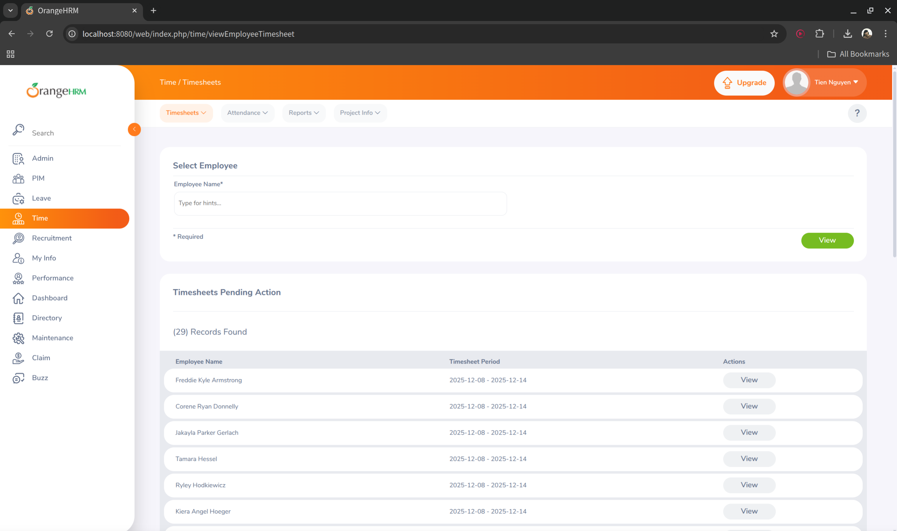
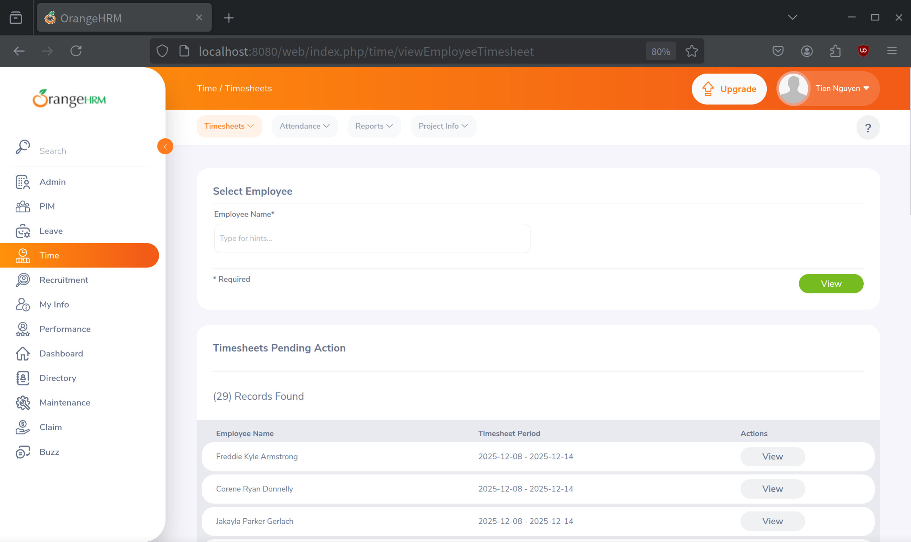
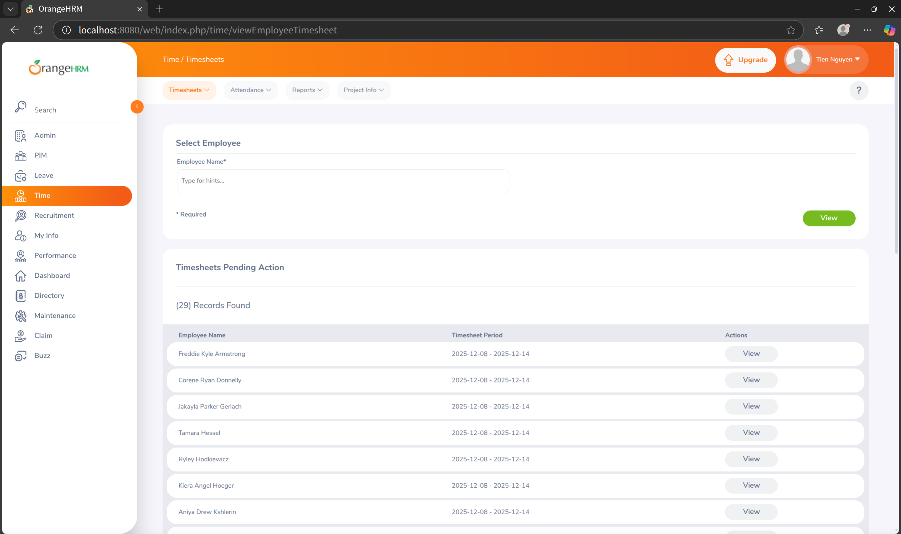

# BÁO CÁO KIỂM THỬ GIAO DIỆN – ORANGEHRM

- Thông tin thành viên: 
  - Giang Đức Nhật - 22120252
  - Phan Thanh Tiến - 22120368
  - Nguyễn Bùi Vương Tiễn - 22120370
  - Lý Trọng Tín - 222120371

- Bảng phân công nhóm:
 
| Tính năng                   | Thành viên phụ trách  |
| --------------------------- | --------------------- |
| Recruitment                 | Phan Thanh Tiến       |
| Performance Review          | Phan Thanh Tiến       |
| HR Administration           | Giang Đức Nhật        |
| Employee Management (PIM)   | Giang Đức Nhật        |
| Leave Management            | Lý Trọng Tín          |
| Tme and Attendance          | Lý Trọng Tín          |
| Reporting and Analytics     | Nguyễn Bùi Vương Tiễn |
| Employee Self-Service (ESS) | Nguyễn Bùi Vương Tiễn |

- Tính năng: Time & Attendance và My Info

# PHẦN 1: TIME & ATTENDANCE MODULE

## 1. GIAO DIỆN NGƯỜI DÙNG

### 1.1 LIÊN KẾT

#### Checklist 1.1.1: Kiểm tra xem liên kết có đưa bạn đến trang mà nó đã nói không?

**Mục tiêu kiểm thử:** Đảm bảo các liên kết trong menu Time & Attendance điều hướng đúng chức năng.

**Các bước kiểm thử:**
1. Đăng nhập vào OrangeHRM và chọn menu **Time**
2. Click lần lượt vào các submenu: Timesheets, Attendance, Reports, Project Info
3. Xác nhận mỗi liên kết điều hướng đến đúng trang tương ứng và URL phản ánh đúng chức năng

**Kết quả mong đợi:**
- Mỗi liên kết điều hướng đến đúng trang
- URL và nội dung trang khớp với tên menu

#### Checklist 1.1.2: Đảm bảo không có trang mồ côi

**Mục tiêu kiểm thử:** Đảm bảo mọi trang trong module Time & Attendance có thể truy cập qua navigation.

**Các bước kiểm thử:**
1. Liệt kê tất cả các trang trong module Time (Timesheets, Attendance, Reports, Project Info)
2. Từ Dashboard, điều hướng đến từng trang thông qua menu
3. Kiểm tra các trang chi tiết có thể truy cập qua liên kết từ trang danh sách
4. Xác nhận breadcrumb navigation đầy đủ

**Kết quả mong đợi:**
- Không có trang nào chỉ truy cập được qua URL trực tiếp
- Mọi trang có ít nhất một liên kết từ menu hoặc trang khác

#### Checklist 1.1.3: Đảm bảo không có trang Dead-End

**Mục tiêu kiểm thử:** Đảm bảo người dùng luôn có cách điều hướng ra khỏi trang hiện tại.

**Các bước kiểm thử:**
1. Truy cập trang **My Timesheet**
2. Kiểm tra logo OrangeHRM, sidebar menu, và button Cancel/Back đều khả dụng
3. Thử các modal/popup có nút Close hoặc Cancel
4. Xác nhận có thể điều hướng sang module khác

**Kết quả mong đợi:**
- Logo luôn clickable về Dashboard
- Menu điều hướng luôn khả dụng
- Form/modal có nút Cancel/Close

#### Checklist 1.1.4: Kiểm tra liên kết external mở trong cửa sổ mới

**Mục tiêu kiểm thử:** Kiểm tra external links hoạt động đúng và mở trong tab mới.

**Các bước kiểm thử:**
1. Tìm các icon Help (?), Documentation, hoặc external links trong module Time
2. Click vào link và quan sát có mở tab mới không
3. Xác nhận tab cũ vẫn giữ nguyên và link không bị lỗi 404

**Kết quả mong đợi:**
- External links mở trong tab mới
- Có thuộc tính target="_blank" và rel="noopener noreferrer"

#### Checklist 1.1.5: Kiểm tra trang 404 tùy chỉnh

**Mục tiêu kiểm thử:** Kiểm tra xử lý URL không tồn tại thân thiện với người dùng.

**Các bước kiểm thử:**
1. Copy URL hợp lệ (ví dụ: /time/viewMyTimesheet)
2. Chỉnh sửa thành URL không tồn tại (ví dụ: /time/invalidpage123)
3. Nhấn Enter và quan sát trang hiển thị

**Kết quả mong đợi:**
- Hiển thị trang 404 tùy chỉnh rõ ràng
- Có link dẫn về Dashboard/trang chủ

### 1.2 MÀU SẮC

#### Checklist 1.2.1: Màu giữa các phần có sự khác biệt rõ ràng

**Mục tiêu kiểm thử:** Kiểm tra sự phân biệt màu sắc giữa các khu vực.

**Các bước kiểm thử:**
1. Truy cập trang **Attendance Records**
2. Quan sát màu nền của header, sidebar, content area, và bảng dữ liệu
3. Đánh giá sự tương phản và phân biệt giữa các khu vực

**Kết quả mong đợi:**
- Các khu vực có màu phân biệt rõ ràng
- Header đậm hơn content, sidebar khác content area

#### Checklist 1.2.2: Màu chữ nội dung đồng nhất

**Mục tiêu kiểm thử:** Kiểm tra tính nhất quán của màu chữ.

**Các bước kiểm thử:**
1. Truy cập các trang **My Timesheet**, **Attendance Records**
2. Quan sát và so sánh màu chữ trong bảng, label, dropdown
3. Xác nhận không có sự khác biệt ngẫu nhiên

**Kết quả mong đợi:**
- Màu chữ nhất quán (đen hoặc xám đậm)
- Tỷ lệ tương phản đủ dễ đọc (WCAG AA)

#### Checklist 1.2.3: Màu chữ khi hover vào liên kết có đổi

**Mục tiêu kiểm thử:** Kiểm tra phản hồi trực quan khi hover.

**Các bước kiểm thử:**
1. Truy cập trang **Attendance Records**
2. Di chuột vào các liên kết (tên nhân viên, mã timesheet)
3. Quan sát màu có thay đổi hoặc xuất hiện gạch chân

**Kết quả mong đợi:**
- Màu liên kết thay đổi khi hover
- Cursor đổi thành pointer

#### Checklist 1.2.4: Màu nền button đồng nhất

**Mục tiêu kiểm thử:** Kiểm tra màu nền button cùng loại nhất quán.

**Các bước kiểm thử:**
1. Quan sát button primary (Apply, Save) trên các trang khác nhau
2. Quan sát button secondary (Cancel, Reset)
3. So sánh màu button cùng chức năng trên mọi trang

**Kết quả mong đợi:**
- Button primary cùng màu (xanh/cam)
- Button secondary cùng màu (xám/trắng viền)
- Button nguy hiểm màu đỏ

#### Checklist 1.2.5: Màu chữ trên button đồng nhất

**Mục tiêu kiểm thử:** Kiểm tra màu chữ button nhất quán và dễ đọc.

**Các bước kiểm thử:**
1. Quan sát màu chữ trên button Apply, Cancel trên nhiều trang
2. Kiểm tra tương phản màu chữ với màu nền
3. Xác nhận đồng nhất trên tất cả button cùng loại

**Kết quả mong đợi:**
- Button primary: text trắng
- Button secondary: text xám đậm
- Tương phản ≥ 4.5:1

### 1.3 NỘI DUNG

#### Checklist 1.3.1: Font nhất quán theo từng thành phần

**Mục tiêu kiểm thử:** Kiểm tra tính nhất quán của font chữ.

**Các bước kiểm thử:**
1. Mở Developer Tools (F12)
2. Inspect tiêu đề, button, textbox, nội dung bảng
3. Kiểm tra font-family trong tab Computed và so sánh

**Kết quả mong đợi:**
- Font-family nhất quán trên tất cả thành phần
- Sử dụng 1-2 font chính

#### Checklist 1.3.2: Kích thước font nội dung đúng chuẩn

**Mục tiêu kiểm thử:** Kiểm tra font size dễ đọc.

**Các bước kiểm thử:**
1. Inspect nội dung trong bảng, kiểm tra font-size
2. Thử đọc nội dung ở khoảng cách 50-70cm
3. Xác nhận kích thước từ 14-16px

**Kết quả mong đợi:**
- Font size: 14-16px
- Dễ đọc, không gây khó khăn

#### Checklist 1.3.3: Font tiêu đề nổi bật hơn nội dung

**Mục tiêu kiểm thử:** Kiểm tra phân cấp rõ ràng giữa tiêu đề và nội dung.

**Các bước kiểm thử:**
1. Quan sát tiêu đề trang "Attendance Records" (H1)
2. Inspect và kiểm tra font-size (20-28px)
3. So sánh với font-size nội dung (14-16px)

**Kết quả mong đợi:**
- Tiêu đề lớn hơn rõ rệt (ít nhất 1.5x)
- Có phân cấp: H1 > H2 > H3 > Body

#### Checklist 1.3.4: Logo ở góc trên trái

**Mục tiêu kiểm thử:** Kiểm tra vị trí logo theo chuẩn UX.

**Các bước kiểm thử:**
1. Quan sát góc trên trái trên các trang Time & Attendance
2. Click vào logo và xác nhận về Dashboard
3. Kiểm tra vị trí cố định trên mọi trang

**Kết quả mong đợi:**
- Logo ở top-left corner
- Clickable về trang chủ

#### Checklist 1.3.5: Nội dung canh lề đúng

**Mục tiêu kiểm thử:** Kiểm tra alignment của text.

**Các bước kiểm thử:**
1. Quan sát alignment các cột trong bảng Attendance Records
2. Kiểm tra label trong form My Timesheet
3. Xác nhận không có text lệch lạc

**Kết quả mong đợi:**
- Text canh trái, số canh phải
- Không có lỗi alignment

#### Checklist 1.3.6: Bố cục rõ ràng, hợp lý

**Mục tiêu kiểm thử:** Đánh giá layout tổng thể.

**Các bước kiểm thử:**
1. Quan sát cấu trúc: Header - Sidebar - Content - Footer
2. Kiểm tra khoảng cách (spacing) giữa các thành phần
3. Thu nhỏ trình duyệt và xem responsive

**Kết quả mong đợi:**
- Bố cục tuân theo cấu trúc chuẩn
- White space hợp lý, responsive tốt

#### Checklist 1.3.7: Mỗi trang có tiêu đề rõ ràng

**Mục tiêu kiểm thử:** Kiểm tra tiêu đề phản ánh đúng nội dung.

**Các bước kiểm thử:**
1. Truy cập các trang My Timesheet, Attendance Records, Project Info
2. Xác nhận mỗi trang có tiêu đề H1 và browser tab title
3. Kiểm tra tiêu đề mô tả đúng nội dung

**Kết quả mong đợi:**
- Mỗi trang có tiêu đề H1 rõ ràng
- Browser tab title phản ánh đúng

#### Checklist 1.3.8: Phần tìm kiếm hiển thị nổi bật

**Mục tiêu kiểm thử:** Kiểm tra search/filter dễ tìm.

**Các bước kiểm thử:**
1. Truy cập trang **Attendance Records**
2. Tìm khu vực Filter/Search ở đầu bảng
3. Kiểm tra label, placeholder, button Search rõ ràng

**Kết quả mong đợi:**
- Khu vực search ở vị trí nổi bật
- Label và button rõ ràng

#### Checklist 1.3.9: Thông báo lỗi đúng chính tả

**Mục tiêu kiểm thử:** Kiểm tra error messages không có lỗi chính tả.

**Các bước kiểm thử:**
1. Để trống trường bắt buộc trong form My Timesheet và submit
2. Nhập sai định dạng (From Date > To Date)
3. Đọc kỹ các message và kiểm tra chính tả

**Kết quả mong đợi:**
- Không có lỗi chính tả
- Message rõ ràng và hữu ích

#### Checklist 1.3.10: Tooltip cho trường nhập liệu & button

**Mục tiêu kiểm thử:** Kiểm tra tooltip hiển thị khi hover.

**Các bước kiểm thử:**
1. Di chuột vào icon "?" hoặc "i" bên cạnh label
2. Di chuột vào các button
3. Xác nhận tooltip xuất hiện và biến mất mượt mà

**Kết quả mong đợi:**
- Tooltip xuất hiện khi hover
- Nội dung rõ ràng và hữu ích

### 1.4 RESPONSIVE & HIỂN THỊ

#### Checklist 1.4.1: Giao diện responsive trên nhiều độ phân giải

**Mục tiêu kiểm thử:** Kiểm tra responsive design.

**Các bước kiểm thử:**
1. Mở trang **Attendance Records** trên desktop (1920x1080)
2. Mở DevTools, chọn Responsive Mode
3. Test trên iPad (768x1024) và iPhone 12 (390x844)
4. Xác nhận không bị vỡ layout

**Kết quả mong đợi:**
- Layout responsive tốt
- Menu chuyển hamburger trên mobile

#### Checklist 1.4.2: Không bị che khuất khi thu nhỏ trình duyệt

**Mục tiêu kiểm thử:** Kiểm tra không có overflow.

**Các bước kiểm thử:**
1. Mở trang **My Timesheet** full screen
2. Thu nhỏ width và height từ từ
3. Quan sát sidebar, button, form không bị overflow

**Kết quả mong đợi:**
- Không có element bị che khuất
- Scrollbar xuất hiện khi cần

#### Checklist 1.4.3: Không có horizontal scroll không mong muốn

**Mục tiêu kiểm thử:** Kiểm tra không có thanh cuộn ngang.

**Các bước kiểm thử:**
1. Truy cập trang **Attendance Records**, quan sát scrollbar
2. Thu nhỏ xuống 768px width
3. Xác nhận không có horizontal scroll ở page level

**Kết quả mong đợi:**
- Không có horizontal scroll
- Bảng có thể có scroll riêng nếu cần

#### Checklist 1.4.4: Nội dung quan trọng ưu tiên hiển thị trên mobile

**Mục tiêu kiểm thử:** Kiểm tra mobile-first approach.

**Các bước kiểm thử:**
1. Mở trang **My Timesheet** trên mobile view (375px)
2. Xác nhận form hiển thị đầy đủ, button rõ ràng
3. Kiểm tra sidebar ẩn, nội dung chính chiếm phần lớn

**Kết quả mong đợi:**
- Nội dung quan trọng hiển thị trước
- Sidebar ẩn để tập trung vào nội dung

### 1.5 FORM

#### 1.5.1 HÌNH THỨC

##### Checklist 1.5.1.1: Thông báo trường bắt buộc và tùy chọn

**Mục tiêu kiểm thử:** Kiểm tra người dùng biết trường nào bắt buộc.

**Các bước kiểm thử:**
1. Truy cập trang **My Timesheet**
2. Quan sát trường có dấu "*" màu đỏ
3. Để trống trường bắt buộc và submit, xác nhận error message

**Kết quả mong đợi:**
- Trường bắt buộc có dấu "*"
- Error message rõ ràng

##### Checklist 1.5.1.2: Hướng dẫn nhập liệu cho trường phức tạp

**Mục tiêu kiểm thử:** Kiểm tra instruction cho trường phức tạp.

**Các bước kiểm thử:**
1. Quan sát trường "Duration", "Hours Worked"
2. Kiểm tra có text hướng dẫn hoặc tooltip
3. Thử nhập sai và xác nhận có message gợi ý

**Kết quả mong đợi:**
- Có instruction text hoặc tooltip
- Validation message khi nhập sai

##### Checklist 1.5.1.3: Chỉ chọn 1 radio button

**Mục tiêu kiểm thử:** Kiểm tra radio button hoạt động đúng.

**Các bước kiểm thử:**
1. Tìm nhóm radio button (ví dụ: Duration - Full Day/Half Day)
2. Click vào từng radio và xác nhận chỉ 1 được chọn
3. Kiểm tra visual profileback rõ ràng

**Kết quả mong đợi:**
- Chỉ một radio selected
- Khi chọn radio khác, cái cũ tự động bỏ chọn

##### Checklist 1.5.1.4: Chọn nhiều checkbox

**Mục tiêu kiểm thử:** Kiểm tra checkbox cho phép multiple selection.

**Các bước kiểm thử:**
1. Tìm checkbox trong Time (settings/filter)
2. Click nhiều checkbox và xác nhận cả hai đều ticked
3. Click lại để bỏ chọn

**Kết quả mong đợi:**
- Có thể chọn nhiều checkbox
- Checkbox độc lập nhau

#### 1.5.3 KIỂM TRA TRƯỜNG DỮ LIỆU

##### Checklist 1.5.3.1: Kiểm tra format email

**Mục tiêu kiểm thử:** Kiểm tra email validation.

**Các bước kiểm thử:**
1. **Lưu ý:** Time & Attendance không có email field, test ở module khác (Admin)
2. Nhập email sai format và xác nhận error
3. Nhập email đúng và xác nhận không lỗi

**Kết quả thực tế:** Không áp dụng cho Time module

##### Checklist 1.5.3.2: Password field ẩn thông tin

**Mục tiêu kiểm thử:** Kiểm tra password field masking.

**Các bước kiểm thử:**
1. **Lưu ý:** Time & Attendance không có password field, test ở Login
2. Nhập password và xác nhận hiển thị dấu chấm/sao
3. Click icon "eye" để toggle show/hide

**Kết quả thực tế:** Không áp dụng cho Time module

## 2. USABILITY

### 2.1 TÍNH ĐIỀU HƯỚNG

#### Checklist 2.1.1: Liên kết đến trang chủ trên mọi trang

**Mục tiêu kiểm thử:** Đảm bảo luôn có cách về trang chủ.

**Các bước kiểm thử:**
1. Truy cập các trang My Timesheet, Attendance Records
2. Click logo OrangeHRM ở top-left
3. Xác nhận về Dashboard

**Kết quả mong đợi:**
- Logo clickable về Dashboard
- Hiển thị rõ ở góc trên trái

#### Checklist 2.1.2: Thứ tự Tab logic từ trên-trái xuống dưới-phải

**Mục tiêu kiểm thử:** Kiểm tra tab order hợp lý.

**Các bước kiểm thử:**
1. Truy cập trang **My Timesheet**
2. Click vào trường đầu tiên, nhấn Tab nhiều lần
3. Quan sát focus di chuyển: Project → Date → Duration → Comments → Save → Cancel

**Kết quả mong đợi:**
- Tab order logic (top-left → bottom-right)
- Focus rõ ràng

---

# PHẦN 2: MY INFO MODULE

## 1. GIAO DIỆN NGƯỜI DÙNG

### 1.1 LIÊN KẾT

#### Checklist 1.1.1: Liên kết điều hướng đúng

**Mục tiêu kiểm thử:** Đảm bảo liên kết trong My Info điều hướng đúng.

**Các bước kiểm thử:**
1. Click menu **My Info**, xác nhận vào My Info page
2. Click tên người dùng, hashtag, external link trong personal information
3. Xác nhận điều hướng đúng hoặc filter đúng

**Kết quả mong đợi:**
- Menu My Info dẫn đến profile
- Username link dẫn đến profile/filter information sections
- External link hoạt động đúng

#### Checklist 1.1.2: Không có trang mồ côi

**Mục tiêu kiểm thử:** Đảm bảo mọi trang My Info truy cập được qua navigation.

**Các bước kiểm thử:**
1. Từ Dashboard, click menu My Info
2. Tìm button "Save" hoặc "Upload Document"
3. Xác nhận mọi sub-page có điểm truy cập từ menu/action

**Kết quả mong đợi:**
- My Info Page accessible từ menu
- Create Save accessible từ button

#### Checklist 1.1.3: Không có trang Dead-End

**Mục tiêu kiểm thử:** Đảm bảo luôn có cách điều hướng ra ngoài.

**Các bước kiểm thử:**
1. Truy cập My Info Page
2. Kiểm tra logo, sidebar menu khả dụng
3. Mở modal "Create Save", xác nhận có nút Close/Cancel

**Kết quả mong đợi:**
- Logo clickable về Dashboard
- Modal có nút Close/Cancel

#### Checklist 1.1.4: External links mở tab mới

**Mục tiêu kiểm thử:** Kiểm tra external links trong information sections.

**Các bước kiểm thử:**
1. Tìm personal information có URL (ví dụ: https://www.orangehrm.com)
2. Click link, xác nhận mở tab mới
3. Kiểm tra tab cũ vẫn giữ nguyên

**Kết quả mong đợi:**
- External links mở tab mới
- Có thuộc tính rel="noopener noreferrer"

#### Checklist 1.1.5: Trang 404 tùy chỉnh

**Mục tiêu kiểm thử:** Kiểm tra xử lý URL không tồn tại.

**Các bước kiểm thử:**
1. Copy URL My Info page, chỉnh sửa thành URL không tồn tại
2. Nhấn Enter và quan sát
3. Xác nhận hiển thị trang 404 có link về Dashboard

**Kết quả mong đợi:**
- Trang 404 tùy chỉnh hiển thị
- Có link quay về Dashboard

### 1.2 MÀU SẮC

#### Checklist 1.2.1: Màu giữa các phần khác biệt rõ ràng

**Mục tiêu kiểm thử:** Kiểm tra phân biệt màu sắc.

**Các bước kiểm thử:**
1. Quan sát màu header, sidebar, profile area, personal information cards
2. Đánh giá tương phản và sự phân biệt

**Kết quả mong đợi:**
- Header đậm, sidebar sáng
- Save cards trắng tạo contrast

#### Checklist 1.2.2: Màu chữ nội dung đồng nhất

**Mục tiêu kiểm thử:** Kiểm tra consistency màu chữ.

**Các bước kiểm thử:**
1. Quan sát màu chữ trong information sections và notes
2. So sánh và xác nhận đồng nhất

**Kết quả mong đợi:**
- Màu chữ nhất quán (#333 hoặc #555)

#### Checklist 1.2.3: Màu liên kết đổi khi hover

**Mục tiêu kiểm thử:** Kiểm tra hover effect.

**Các bước kiểm thử:**
1. Di chuột vào username, hashtag, URL trong personal information
2. Quan sát màu thay đổi hoặc underline

**Kết quả mong đợi:**
- Link thay đổi màu khi hover
- Cursor đổi pointer

#### Checklist 1.2.4: Màu button đồng nhất

**Mục tiêu kiểm thử:** Kiểm tra button color consistency.

**Các bước kiểm thử:**
1. Quan sát button Save, Share, Cancel, Delete
2. So sánh màu button cùng loại

**Kết quả mong đợi:**
- Primary buttons cùng màu
- Secondary buttons cùng màu
- Destructive buttons màu đỏ

#### Checklist 1.2.5: Màu chữ button đồng nhất

**Mục tiêu kiểm thử:** Kiểm tra button text color.

**Các bước kiểm thử:**
1. Quan sát màu chữ trên button Save, Share, Cancel
2. Kiểm tra tương phản

**Kết quả mong đợi:**
- Primary: text trắng
- Secondary: text xám đậm
- Tương phản ≥ 4.5:1

### 1.3 NỘI DUNG

#### Checklist 1.3.1: Font nhất quán

**Mục tiêu kiểm thử:** Kiểm tra font consistency.

**Các bước kiểm thử:**
1. Inspect tiêu đề, nội dung personal information, button, username
2. Kiểm tra font-family

**Kết quả mong đợi:**
- Cùng font-family cho tất cả elements

#### Checklist 1.3.2: Font size nội dung đúng chuẩn

**Mục tiêu kiểm thử:** Kiểm tra body text font size.

**Các bước kiểm thử:**
1. Inspect nội dung personal information, kiểm tra font-size
2. Xác nhận 14-16px

**Kết quả mong đợi:**
- Body text: 14-16px

#### Checklist 1.3.3: Font tiêu đề nổi bật

**Mục tiêu kiểm thử:** Kiểm tra heading hierarchy.

**Các bước kiểm thử:**
1. Inspect tiêu đề "My Info", username, body text
2. So sánh font-size

**Kết quả mong đợi:**
- Page title: 20-28px
- Username: 16-18px bold
- Hierarchy rõ ràng

#### Checklist 1.3.4: Logo ở góc trên trái

**Mục tiêu kiểm thử:** Kiểm tra vị trí logo.

**Các bước kiểm thử:**
1. Quan sát góc trên trái
2. Click logo, xác nhận về Dashboard

**Kết quả mong đợi:**
- Logo ở top-left corner

#### Checklist 1.3.5: Nội dung canh lề đúng

**Mục tiêu kiểm thử:** Kiểm tra text alignment.

**Các bước kiểm thử:**
1. Quan sát information sections, username, timestamp, notes
2. Xác nhận canh trái, không lệch lạc

**Kết quả mong đợi:**
- Save content: left-aligned

#### Checklist 1.3.6: Bố cục rõ ràng

**Mục tiêu kiểm thử:** Đánh giá layout.

**Các bước kiểm thử:**
1. Quan sát: Header - Sidebar - Feed Area
2. Kiểm tra white space và responsive

**Kết quả mong đợi:**
- Layout rõ ràng, white space hợp lý

#### Checklist 1.3.7: Mỗi trang có tiêu đề rõ ràng

**Mục tiêu kiểm thử:** Kiểm tra page title.

**Các bước kiểm thử:**
1. Quan sát tiêu đề trang "My Info"
2. Kiểm tra browser tab title

**Kết quả mong đợi:**
- Page có tiêu đề H1 rõ ràng

#### Checklist 1.3.8: Phần tìm kiếm nổi bật

**Mục tiêu kiểm thử:** Kiểm tra search functionality.

**Các bước kiểm thử:**
1. Tìm search box trong My Info
2. Kiểm tra vị trí, placeholder, icon

**Kết quả mong đợi:**
- Search box ở vị trí nổi bật (nếu có)

#### Checklist 1.3.9: Error messages đúng chính tả

**Mục tiêu kiểm thử:** Kiểm tra error messages.

**Các bước kiểm thử:**
1. Để trống personal information content và submit
2. Upload ảnh quá dung lượng
3. Đọc message và kiểm tra chính tả

**Kết quả mong đợi:**
- Error messages đúng chính tả

#### Checklist 1.3.10: Tooltip cho button

**Mục tiêu kiểm thử:** Kiểm tra tooltips.

**Các bước kiểm thử:**
1. Di chuột vào button Upload Document, icon Like, Comment
2. Xác nhận tooltip xuất hiện

**Kết quả mong đợi:**
- Tooltip xuất hiện khi hover

### 1.4 RESPONSIVE & HIỂN THỊ

#### Checklist 1.4.1: Responsive trên nhiều độ phân giải

**Mục tiêu kiểm thử:** Kiểm tra responsive design.

**Các bước kiểm thử:**
1. Mở My Info Page trên desktop
2. Test trên iPad, iPhone 12 qua DevTools
3. Xác nhận không vỡ layout

**Kết quả mong đợi:**
- Layout responsive, menu chuyển hamburger trên mobile

#### Checklist 1.4.2: Không bị overflow khi resize

**Mục tiêu kiểm thử:** Kiểm tra overflow issues.

**Các bước kiểm thử:**
1. Thu nhỏ width và height
2. Quan sát sidebar, information sections, button

**Kết quả mong đợi:**
- Không có overflow, scrollbar khi cần

#### Checklist 1.4.3: Không có horizontal scroll

**Mục tiêu kiểm thử:** Kiểm tra thanh cuộn ngang.

**Các bước kiểm thử:**
1. Thu nhỏ xuống 768px
2. Xác nhận không có horizontal scroll

**Kết quả mong đợi:**
- Không có horizontal scroll ở page level

#### Checklist 1.4.4: Nội dung quan trọng ưu tiên trên mobile

**Mục tiêu kiểm thử:** Kiểm tra mobile-first.

**Các bước kiểm thử:**
1. Chuyển mobile view (375px)
2. Xác nhận profile chiếm phần lớn, sidebar ẩn

**Kết quả mong đợi:**
- Feed ưu tiên hiển thị, sidebar ẩn

### 1.5 FORM

#### 1.5.1 HÌNH THỨC

##### Checklist 1.5.1.1: Thông báo trường bắt buộc

**Mục tiêu kiểm thử:** Kiểm tra required field indicators.

**Các bước kiểm thử:**
1. Mở form "Save"
2. Để trống personal information content, submit
3. Xác nhận error message

**Kết quả mong đợi:**
- Trường bắt buộc có indicator (*)

##### Checklist 1.5.1.2: Hướng dẫn cho trường phức tạp

**Mục tiêu kiểm thử:** Kiểm tra instruction text.

**Các bước kiểm thử:**
1. Mở form "Upload Document"
2. Kiểm tra có text "Max file size: 5MB"
3. Upload file sai format

**Kết quả mong đợi:**
- Có instruction text, error message hướng dẫn

##### Checklist 1.5.1.3: Chỉ chọn 1 radio button

**Mục tiêu kiểm thử:** Kiểm tra radio button.

**Các bước kiểm thử:**
1. Tìm radio (ví dụ: Save Visibility - Public/Private)
2. Click từng radio, xác nhận chỉ 1 selected

**Kết quả thực tế:** My Info có thể không có radio button

##### Checklist 1.5.1.4: Chọn nhiều checkbox

**Mục tiêu kiểm thử:** Kiểm tra checkbox.

**Các bước kiểm thử:**
1. Tìm checkbox (ví dụ: Notify settings)
2. Check nhiều, xác nhận cả hai ticked

**Kết quả thực tế:** Feature tùy implementation

## 2. USABILITY

### 2.1 TÍNH ĐIỀU HƯỚNG

#### Checklist 2.1.1: Liên kết về trang chủ

**Mục tiêu kiểm thử:** Kiểm tra link về Dashboard.

**Các bước kiểm thử:**
1. Click logo ở top-left
2. Xác nhận về Dashboard

**Kết quả mong đợi:**
- Logo clickable về Dashboard

#### Checklist 2.1.2: Thứ tự Tab logic

**Mục tiêu kiểm thử:** Kiểm tra tab order.

**Các bước kiểm thử:**
1. Click vào personal information textarea
2. Nhấn Tab, quan sát focus: Textarea → Upload → Emoji → Save

**Kết quả mong đợi:**
- Tab order logic (top-left → bottom-right)

## Screenshots

Kết quả thu được trên các trình duyệt:

### Chrome

### Firefox

### Edge 

