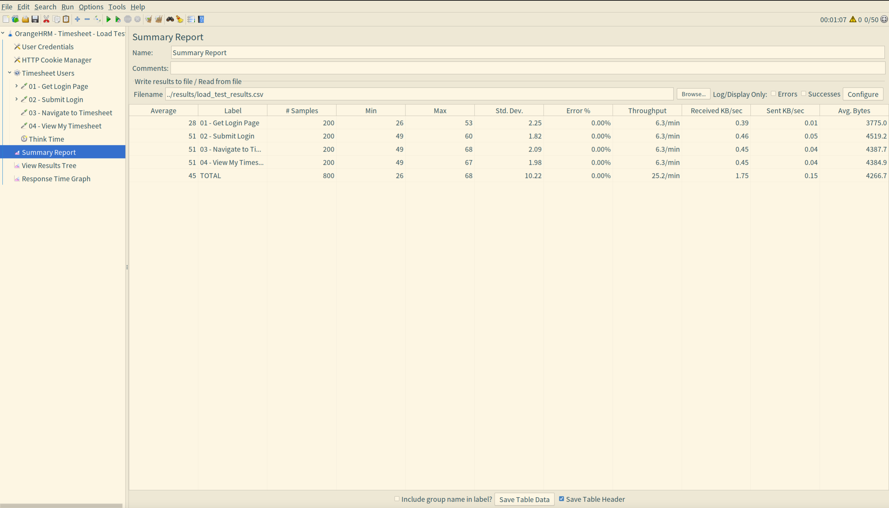
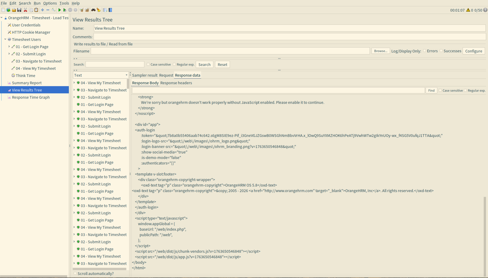
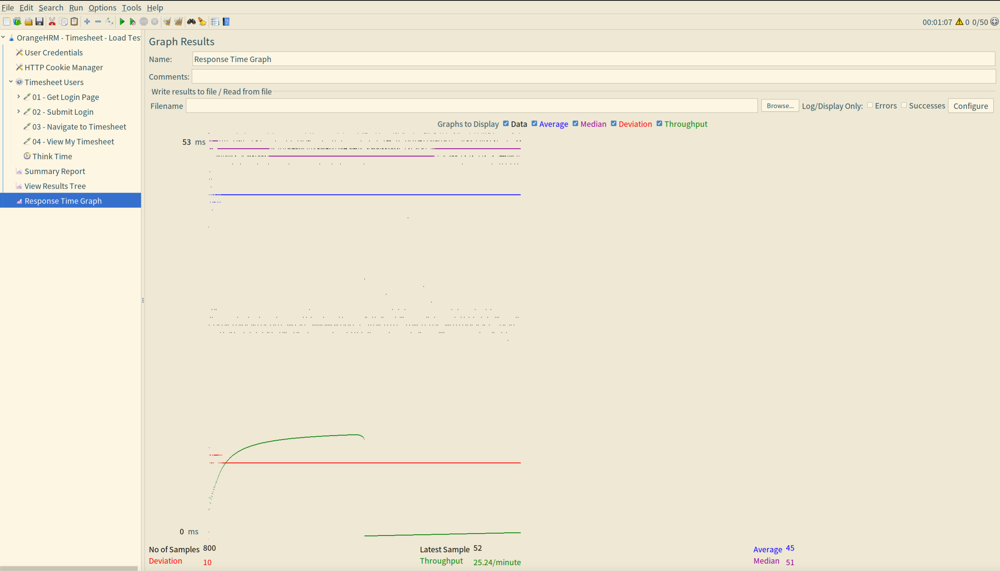
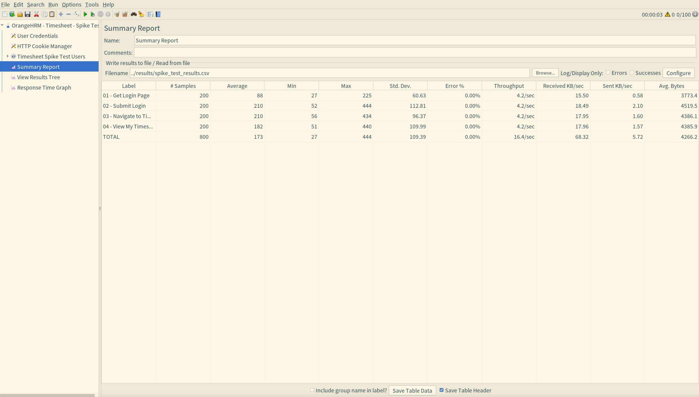
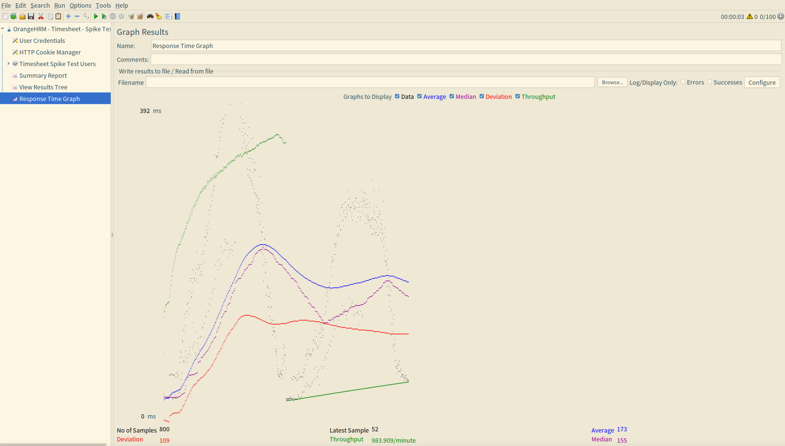
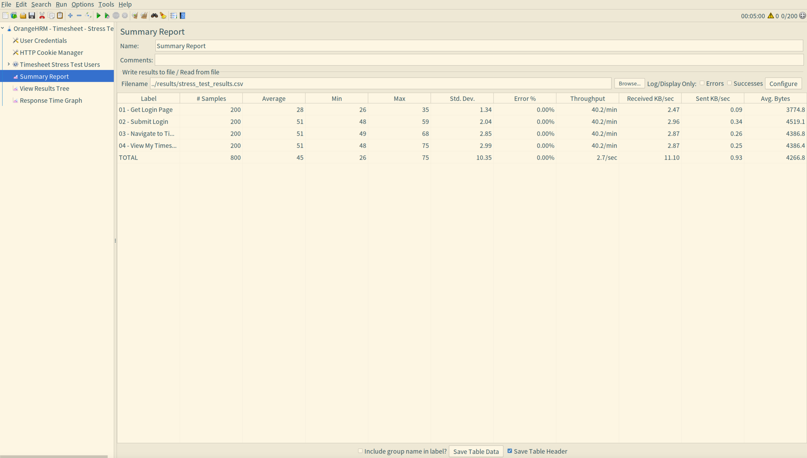
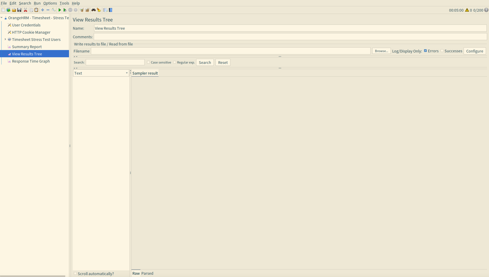
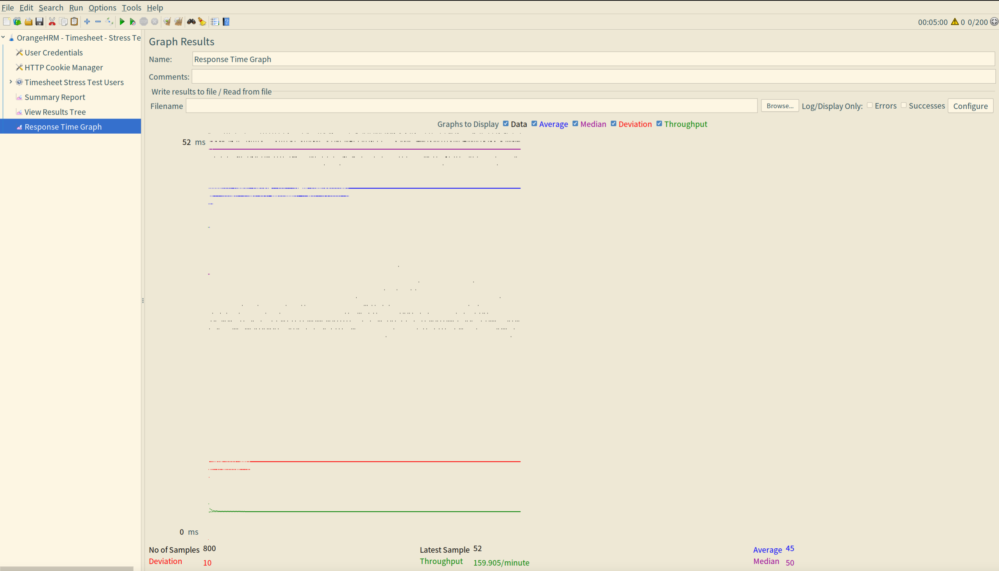

# BÁO CÁO KIỂM THỬ HIỆU NĂNG

## Thông tin cá nhân & nhóm

- Họ tên: Nguyễn Bùi Vương Tiễn
- MSSV: 22120370
- Nhóm 11.

### Thông tin nhóm 11

- Thông tin thành viên: 
  - Giang Đức Nhật - 22120252
  - Phan Thanh Tiến - 22120368
  - Nguyễn Bùi Vương Tiễn - 22120370
  - Lý Trọng Tín - 22120371

- Bảng phân công nhóm:
 
| Tính năng                   | Mô tả                                                             | Thành viên            |
| :-------------------------- | :---------------------------------------------------------------- | :-------------------- |
| HR Administration           | Quản trị hệ thống, cấu trúc tổ chức, user                         | Giang Đức Nhật        |
| Employee Self-Service (ESS) | Cổng thông tin nhân viên tự phục vụ                               | Giang Đức Nhật        |
| Recruitment             | Tuyển dụng, theo dõi ứng viên                                 | Phan Thanh Tiến   |
| Performance Management  | Đánh giá KPI, đề nghị xem xét, lưu lịch sử performance review | Phan Thanh Tiến   |
| **Reporting & Analytics**       | **Báo cáo tùy chỉnh, xuất dữ liệu**                                   | **Nguyễn Bùi Vương Tiễn** |
| **Time and Attendance**         | **Chấm công, Timesheets**                                             | **Nguyễn Bùi Vương Tiễn** |
| Employee Management (PIM)   | Quản lý hồ sơ nhân viên, báo cáo                                  | Lý Trọng Tín          |
| Leave Management            | Quản lý ngày nghỉ, quy tắc nghỉ phép                              | Lý Trọng Tín          |


<div style="page-break-after: always;"></div>

## MỤC LỤC

1. [Giới thiệu](#1-giới-thiệu)
2. [Cấu hình môi trường kiểm thử](#2-cấu-hình-môi-trường-kiểm-thử)
3. [Kỹ thuật kiểm thử hiệu năng](#3-kỹ-thuật-kiểm-thử-hiệu-năng)
4. [Kịch bản kiểm thử](#4-kịch-bản-kiểm-thử)
5. [Kỹ thuật Data-Driven Testing](#5-kỹ-thuật-data-driven-testing)
6. [Kết quả kiểm thử](#6-kết-quả-kiểm-thử)
7. [Hướng dẫn thực hiện kiểm thử](#7-hướng-dẫn-thực-hiện-kiểm-thử)


## 1. Giới thiệu

### 1.1 Mục đích
Báo cáo này trình bày kết quả kiểm thử hiệu năng hệ thống OrangeHRM, tập trung vào module **Timesheet** (Quản lý chấm công). Mục tiêu là đánh giá khả năng xử lý của hệ thống dưới các điều kiện tải khác nhau.

### 1.2 Phạm vi kiểm thử
- **Hệ thống được kiểm thử (SUT):** OrangeHRM v5.8
- **Module:** Timesheet (Chấm công)
- **Kịch bản nghiệp vụ:**
  - Đăng nhập hệ thống
  - Xem danh sách Timesheet của nhân viên
  - Xem Timesheet cá nhân

### 1.3 Công cụ sử dụng
| Công cụ | Phiên bản | Mục đích |
|---------|-----------|----------|
| Apache JMeter | 5.6.3 | Công cụ kiểm thử hiệu năng |
| Docker | - | Triển khai hệ thống |
| MySQL | 8.0 | Cơ sở dữ liệu |
| Node.js | - | Script tạo dữ liệu test |


## 2. Cấu hình môi trường kiểm thử

### 2.1 Cấu hình máy chủ/PC chạy website

| Thành phần | Thông số |
|------------|----------|
| **Hệ điều hành** | Linux 6.12.41-amd64-desktop-rolling |
| **Nền tảng** | Docker Container |
| **Web Server** | Apache (trong container OrangeHRM) |
| **Cơ sở dữ liệu** | MySQL 8.0 |
| **RAM được cấp phát** | Mặc định Docker |
| **CPU** | Chia sẻ với host |


## 3. Kỹ thuật kiểm thử hiệu năng

### 3.1 Load Testing (Kiểm thử tải)

**Định nghĩa:** Kiểm thử hệ thống dưới tải bình thường được mong đợi.

**Mục đích:**
- Xác định thời gian phản hồi trung bình
- Đo throughput (số request/giây)
- Xác minh hệ thống hoạt động ổn định với lưu lượng truy cập bình thường

**Cấu hình:**
- Số lượng người dùng: 50 concurrent users
- Thời gian ramp-up: 60 giây
- Số vòng lặp: 2

### 3.2 Stress Testing (Kiểm thử áp lực)

**Định nghĩa:** Kiểm thử để tìm điểm giới hạn (breaking point) của hệ thống.

**Mục đích:**
- Xác định ngưỡng chịu tải tối đa
- Phát hiện bottleneck (điểm nghẽn)
- Đánh giá hành vi hệ thống khi vượt quá khả năng xử lý

**Cấu hình:**
- Số lượng người dùng tối đa: 200 users
- Thời gian ramp-up: 300 giây (5 phút)
- Tăng dần người dùng theo thời gian

### 3.3 Spike Testing (Kiểm thử đột biến)

**Định nghĩa:** Kiểm thử khả năng xử lý khi có đột biến lưu lượng truy cập.

**Mục đích:**
- Đánh giá khả năng phục hồi
- Kiểm tra xử lý lỗi khi tải tăng đột ngột
- Mô phỏng tình huống thực tế (ví dụ: đầu giờ làm việc)

**Cấu hình:**
- Số lượng người dùng: 100 users
- Thời gian ramp-up: 2 giây (tăng đột ngột)
- Mô phỏng spike traffic


## 4. Kịch bản kiểm thử

### 4.1 Workflow được kiểm thử

Kịch bản mô phỏng người dùng thực hiện các bước sau:

1. Truy cập trang đăng nhập
2. Đăng nhập hệ thống
3. Xem danh sách timesheet
4. Xem My Timesheet

### 4.2 Chi tiết các HTTP Request

| Bước | Tên Request | Method | Endpoint | Mô tả |
|------|-------------|--------|----------|-------|
| 01 | Get Login Page | GET | `/web/index.php/auth/login` | Lấy trang đăng nhập |
| 02 | Submit Login | POST | `/web/index.php/auth/validate` | Gửi thông tin đăng nhập |
| 03 | Navigate to Timesheet | GET | `/web/index.php/time/viewEmployeeTimesheet` | Xem Timesheet nhân viên |
| 04 | View My Timesheet | GET | `/web/index.php/time/viewMyTimesheet` | Xem Timesheet cá nhân |

### 4.3 Assertions (Điều kiện kiểm tra)

| Assertion | Điều kiện | Áp dụng cho |
|-----------|-----------|-------------|
| Response Code | HTTP 200 | Get Login Page |
| Duration Assertion | < 2000ms | Submit Login |

## 5. Kỹ thuật Data-Driven Testing

### 5.1 Mô tả

Tất cả các test script đều sử dụng **kỹ thuật Data-Driven** thông qua **CSV Data Set Config** của JMeter. Điều này cho phép:

- Sử dụng nhiều tài khoản người dùng khác nhau
- Mô phỏng thực tế hơn (không phải tất cả request đều dùng 1 account)
- Dễ dàng mở rộng dữ liệu test

### 5.2 Cấu hình CSV Data Set

```xml
<CSVDataSet>
    <stringProp name="filename">../test-data/users.csv</stringProp>
    <stringProp name="delimiter">,</stringProp>
    <stringProp name="fileEncoding">UTF-8</stringProp>
    <boolProp name="ignoreFirstLine">true</boolProp>
    <stringProp name="variableNames">username,password</stringProp>
    <boolProp name="recycle">true</boolProp>
    <stringProp name="shareMode">shareMode.all</stringProp>
</CSVDataSet>
```

### 5.3 Cấu trúc file dữ liệu

**File:** `test-data/users.csv`

```csv
username,password
james.wilson,Str0ng@Pass#2024
emma.johnson,Secure$Key!9876
michael.brown,P@ssw0rd#Strong1
olivia.davis,MyP@ss!2024Xyz
...
```

**Tổng số tài khoản test:** 300 users

## 6. Kết quả kiểm thử

### 6.1. Load Test 

Summary: 



Result tree:



Response time graph:



### 6.2. Spike Test

Summary:


Result tree:



Response time graph:



### 6.3. Stress Test

Summary:



Result tree:



Response time graph:



## 7. Hướng dẫn thực hiện kiểm thử

### 7.1 Yêu cầu hệ thống

1. **Java JDK 7+** (bắt buộc cho JMeter)
2. **Apache JMeter 5.6.3**
3. **Docker & Docker Compose** (cho OrangeHRM)
4. **Node.js** (cho script tạo dữ liệu)

### 7.2 Bước 1: Cài đặt JMeter

```bash
# Sử dụng script tự động download
cd performance-testing
./run-tests.sh download

# Hoặc download thủ công
wget https://dlcdn.apache.org/jmeter/binaries/apache-jmeter-5.6.3.tgz
tar -xzf apache-jmeter-5.6.3.tgz
mv apache-jmeter-5.6.3 jmeter
```

### 7.3 Bước 2: Khởi động OrangeHRM

```bash
# Di chuyển đến thư mục Docker
cd ../database-testing-presentation

# Khởi động containers
docker-compose up -d

# Kiểm tra trạng thái
docker ps | grep orangehrm

# Xác minh website hoạt động
curl -I http://localhost:8080
```

### 7.4 Bước 3: Chuẩn bị dữ liệu test

```bash
# Import users vào database
cd performance-testing/scripts
npm install
node add-users.js ../test-data/import-users.csv
```

### 7.5 Bước 4: Chạy kiểm thử

#### Phương pháp 1: GUI Mode (khuyến nghị cho người mới)

```bash
# Load Test
./run-tests.sh check   # Kiểm tra prerequisites
./jmeter/bin/jmeter -t jmeter-scripts/leave_application_load.jmx

# Trong GUI: Click nút Start (▶) để chạy test
```

#### Phương pháp 2: Command-Line Mode (khuyến nghị cho production)

```bash
# Chạy tất cả tests
./run-tests.sh all

# Hoặc chạy từng loại test
./run-tests.sh load    # Load test
./run-tests.sh stress  # Stress test
./run-tests.sh spike   # Spike test
```

### 7.6 Bước 5: Xem kết quả

```bash
# Mở HTML Dashboard
xdg-open results/load_*/dashboard/index.html
xdg-open results/stress_*/dashboard/index.html
xdg-open results/spike_*/dashboard/index.html
```

### 7.7 Tổng hợp lệnh

| Lệnh | Mô tả |
|------|-------|
| `./run-tests.sh download` | Tải và cài đặt JMeter |
| `./run-tests.sh check` | Kiểm tra môi trường |
| `./run-tests.sh load` | Chạy Load Test |
| `./run-tests.sh stress` | Chạy Stress Test |
| `./run-tests.sh spike` | Chạy Spike Test |
| `./run-tests.sh all` | Chạy tất cả tests |
