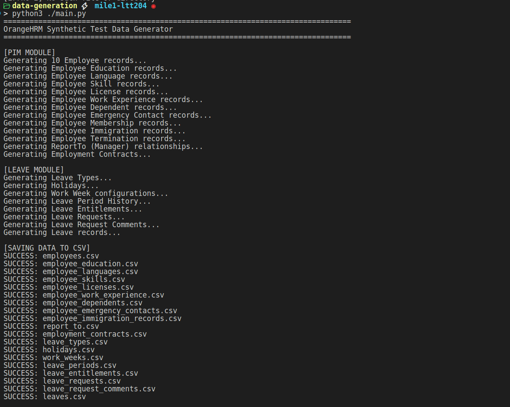
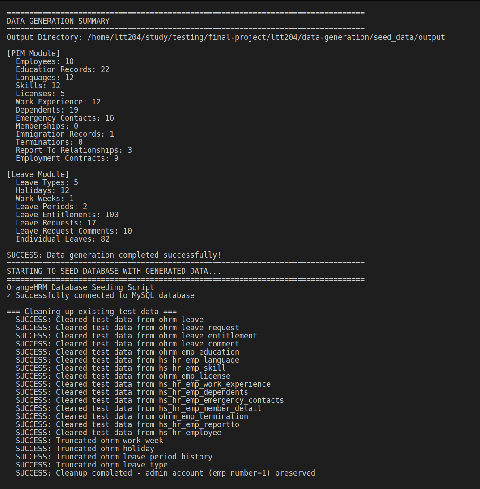
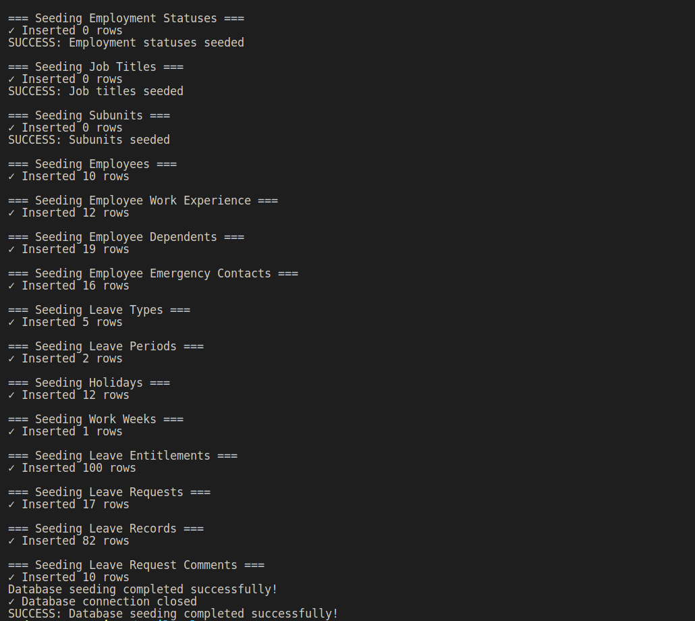
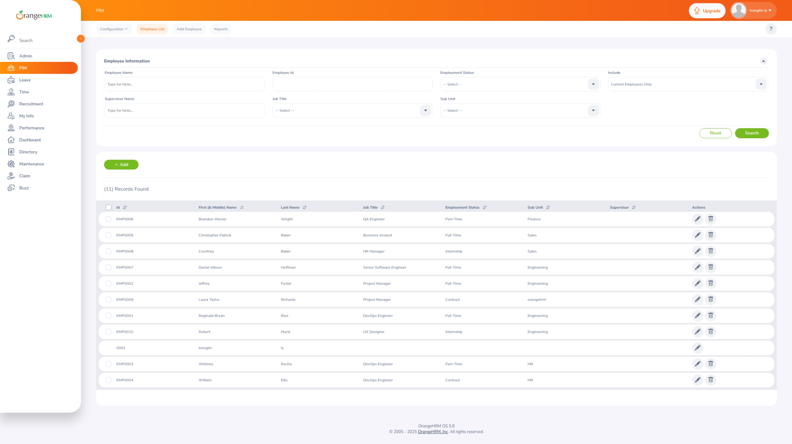
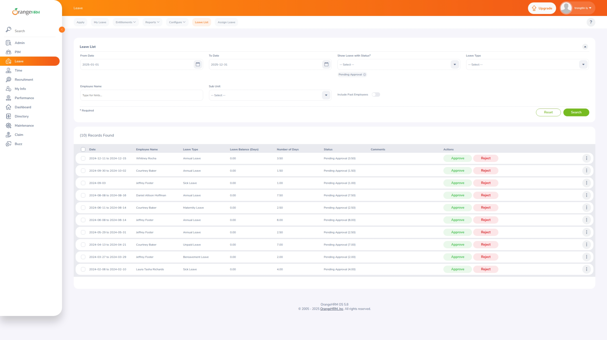

# BÁO CÁO SINH DỮ LIỆU KIỂM THỬ (TEST DATA GENERATION REPORT)

**Môn học:** Kiểm thử phần mềm (Software Testing)  
**Dự án:** Case-study OrangeHRM  
**Họ và tên:** Lý Trọng Tín 
**MSSV:** 22120371  
**Ngày thực hiện:** 18/12/2025  

---

## 1. Giới thiệu (Introduction)

Báo cáo này mô tả quy trình sinh dữ liệu giả lập (synthetic data) phục vụ cho việc kiểm thử các chức năng của hệ thống OrangeHRM. Việc sinh dữ liệu tự động giúp đảm bảo tính đa dạng, khối lượng lớn và tiết kiệm thời gian so với nhập liệu thủ công, đồng thời đảm bảo tính toàn vẹn dữ liệu thông qua các ràng buộc (constraints) đã được định nghĩa.

Các chức năng được chọn để sinh dữ liệu:

*   **Quản lý nhân viên (PIM Module)**: Bao gồm thông tin cá nhân, liên hệ, trình độ học vấn, kỹ năng, và lịch sử làm việc.
*   **Quản lý ngày nghỉ (Leave Module)**: Bao gồm loại nghỉ phép, ngày lễ, cấu hình tuần làm việc, hạn mức nghỉ phép (entitlements) và yêu cầu nghỉ phép (requests).

## 2. Công cụ thực hiện (Tools Used)

Để thực hiện yêu cầu sinh dữ liệu, tôi đã sử dụng công cụ tự phát triển (Custom-built tool) với các công nghệ sau:

*   **Ngôn ngữ lập trình:** Python 3.x
*   **Thư viện chính:**
    *   `Faker`: Để tạo dữ liệu giả lập có ý nghĩa (tên người, địa chỉ, email, số điện thoại...).
    *   `Pandas`: Để xử lý dữ liệu dạng bảng và xuất ra định dạng CSV chuẩn.
    *   `NumPy`: Hỗ trợ sinh số ngẫu nhiên và xử lý mảng.

## 3. Đặc tả dữ liệu (Data Categories & Ranges)

Dưới đây là danh sách các trường dữ liệu chính và phạm vi giá trị ngẫu nhiên được sử dụng:

### 3.1. Dữ liệu Nhân viên (Employees)

| Tên trường (Field) | Kiểu dữ liệu | Phạm vi / Ràng buộc (Ranges/Constraints) |
| :--- | :--- | :--- |
| `emp_number` | Integer (Primary Key) | Bắt đầu từ 2 (1 dành cho admin), tăng tuần tự |
| `employee_id` | String | Unique, định dạng "EMP" + số (ví dụ: EMP001) |
| `emp_firstname` | String | Tên người thực (sử dụng Faker provider) |
| `emp_lastname` | String | Họ người thực (sử dụng Faker provider) |
| `emp_middle_name` | String | Tên lót (30% xác suất trống) |
| `emp_nick_name` | String | Biệt danh (70% xác suất trống) |
| `emp_birthday` | Date | Đảm bảo >= 18 tuổi tính đến hiện tại |
| `emp_gender` | Enum | Từ GENDERS config (1, 2, 3: Male, Female, Other) |
| `emp_marital_status` | Enum | Từ MARITAL_STATUSES config (Single, Married, Divorced, etc.) |
| `emp_status` | Integer (FK) | Tham chiếu ohrm_employment_status (từ EMPLOYMENT_STATUSES_MASTER) |
| `job_title_code` | Integer (FK) | Tham chiếu ohrm_job_title (từ JOB_TITLES config) |
| `work_station` | Integer (FK) | Tham chiếu ohrm_subunit (từ SUBUNITS config) |
| `joined_date` | Date | Từ 1980-01-01 đến hiện tại |
| `emp_work_email` | String | Email công việc, Unique |
| `emp_oth_email` | String | Email khác, Unique |
| `emp_street1` | String | Địa chỉ đường (sử dụng Faker) |
| `emp_street2` | String | Địa chỉ bổ sung (50% xác suất trống) |
| `city_code` | String | Thành phố (sử dụng Faker) |
| `provin_code` | String | Tỉnh/Bang (sử dụng Faker) |
| `emp_zipcode` | String | Mã bưu chính (sử dụng Faker) |
| `coun_code` | String | Mã quốc gia (sử dụng Faker) |
| `emp_hm_telephone` | String | Điện thoại nhà (30% xác suất trống) |
| `emp_mobile` | String | Điện thoại di động, luôn có |
| `emp_work_telephone` | String | Điện thoại công việc (50% xác suất trống) |
| `termination_id` | Integer (FK) | NULL cho nhân viên đang làm việc, giá trị cho nhân viên đã nghỉ (10% tổng) |

### 3.2. Dữ liệu Nghỉ phép (Leave Requests & Entitlements)

**Hạn mức Nghỉ phép (LeaveEntitlement):**

| Tên trường (Field) | Kiểu dữ liệu | Phạm vi / Ràng buộc |
| :--- | :--- | :--- |
| `id` | Integer (Primary Key) | Tăng tuần tự |
| `emp_number` | Integer (FK) | Tham chiếu hs_hr_employee (từ employees_df) |
| `leave_type_id` | Integer (FK) | Tham chiếu ohrm_leave_type |
| `no_of_days` | Decimal(19,15) | Annual: 15-30 ngày, Sick: 5-15 ngày, Other: 0-10 ngày |
| `days_used` | Decimal | Khởi tạo 0.0 |
| `from_date` | Date | 2024-01-01 hoặc 2025-01-01 (theo leave_period) |
| `to_date` | Date | 2024-12-31 hoặc 2025-12-31 (theo leave_period) |
| `credited_date` | Date | Bằng from_date |
| `entitlement_type` | Integer | Luôn 1 |
| `deleted` | Integer | Luôn 0 |

**Yêu cầu Nghỉ phép (LeaveRequest):**

| Tên trường (Field) | Kiểu dữ liệu | Phạm vi / Ràng buộc |
| :--- | :--- | :--- |
| `id` | Integer (Primary Key) | Tăng tuần tự |
| `emp_number` | Integer (FK) | Tham chiếu hs_hr_employee (40-50% nhân viên được lấy mẫu) |
| `leave_type_id` | Integer (FK) | Tham chiếu ohrm_leave_type (ngẫu nhiên từ leave_types_df) |
| `date_applied` | Date | Ngẫu nhiên trong khoảng leave_period của entitlement |
| `comments` | String | Câu ngẫu nhiên từ Faker (50% xác suất trống) |
| `number_of_days` | Decimal | 0.5-10 ngày, không vượt quá available_balance |

**Bản ghi Nghỉ phép (Leave):**

| Tên trường (Field) | Kiểu dữ liệu | Phạm vi / Ràng buộc |
| :--- | :--- | :--- |
| `id` | Integer (Primary Key) | Tăng tuần tự |
| `date` | Date | Từ from_date đến to_date của request (1 hàng per ngày) |
| `length_days` | Decimal | 0.5 (nửa ngày) hoặc 1.0 (full day) |
| `status` | Integer | -1 (PENDING), 0 (CANCELLED), 1 (APPROVED), 2 (REJECTED), 3 (TAKEN) |
| `leave_request_id` | Integer (FK) | Tham chiếu LeaveRequest |
| `leave_type_id` | Integer (FK) | Tham chiếu ohrm_leave_type |
| `emp_number` | Integer (FK) | Tham chiếu hs_hr_employee |
| `duration_type` | Integer | 0 (full day) hoặc 1-2 (half day variants) |

## 4. Giải thích mã nguồn (Source Code Explanation)

Phần này giải thích cách hoạt động của đoạn script Python được sử dụng để sinh dữ liệu. Cấu trúc dự án được chia thành các module: `main.py` (điều phối), `pim_generator.py` (sinh dữ liệu PIM), và `leave_generator.py` (sinh dữ liệu Leave).

Dưới đây là đoạn code chính để sinh dữ liệu nhân viên từ file `pim_generator.py`:

```python
def generate_employees(count: int) -> pd.DataFrame:
    """
    Generate Employee records.
    Primary entity - all other PIM entities depend on this.
    ~10% will be TERMINATED status.
    
    IMPORTANT: emp_number starts from 2 because emp_number=1 is RESERVED for the
    OrangeHRM admin account (created during installation).
    """
    print(f"Generating {count} Employee records...")

    # Sinh các ID và Email duy nhất trước để đảm bảo tính toàn vẹn
    employee_ids = generate_unique_employee_ids(count)
    used_emails = set()
    work_emails = generate_unique_emails(count, used_emails)
    other_emails = generate_unique_emails(count, used_emails)

    data = {
        # Start from emp_number=2 to avoid conflict with admin account (emp_number=1)
        'emp_number': list(range(2, count + 2)),
        'employee_id': employee_ids,
        'emp_firstname': [fake.first_name() for _ in range(count)],
        'emp_lastname': [fake.last_name() for _ in range(count)],
        'emp_middle_name': [fake.first_name() if random.random() > 0.3 else '' for _ in range(count)],
        'emp_birthday': [generate_date_of_birth() for _ in range(count)],
        'emp_gender': [random.choice(GENDERS) for _ in range(count)],
        'emp_marital_status': [random.choice(MARITAL_STATUSES) for _ in range(count)],
        'emp_status': [random.choice(EMPLOYMENT_STATUSES_MASTER)['id'] for _ in range(count)],
        'job_title_code': [random.choice(JOB_TITLES)['id'] for _ in range(count)],
        'work_station': [random.choice(SUBUNITS)['id'] for _ in range(count)],
        'joined_date': [generate_joined_date() for _ in range(count)],
        'emp_work_email': work_emails,
        'emp_oth_email': other_emails,
        'termination_id': [None for _ in range(count)],  # Will be set for TERMINATED employees
    }
    
    # Tạo DataFrame từ dictionary
    df = pd.DataFrame(data)
    # Add helper column for tracking active/terminated status (not in actual DB)
    df['employment_status'] = df['termination_id'].apply(lambda x: 'TERMINATED' if pd.notna(x) and x is not None else 'ACTIVE')
    return df
```

**Giải thích logic:**

1.  **Khởi tạo:** Hàm nhận vào số lượng nhân viên cần sinh (`count`).
2.  **Sinh dữ liệu duy nhất:** Sử dụng các hàm tiện ích để tạo danh sách `employee_id` và `email` không trùng lặp.
3.  **emp_number bắt đầu từ 2:** Vì `emp_number=1` được dự trữ cho tài khoản admin của OrangeHRM.
4.  **Faker & Random:** Sử dụng `fake.first_name()`, `fake.last_name()` để tạo tên thật. Sử dụng `random.choice` để chọn ngẫu nhiên giới tính, tình trạng hôn nhân từ danh sách định sẵn.
5.  **Ràng buộc nghiệp vụ:**
    *   `emp_birthday`: Đảm bảo tuổi >= 18 thông qua hàm `generate_date_of_birth()`.
    *   `employment_status`: Cột helper được tạo từ `termination_id` để phân biệt nhân viên đang hoạt động (ACTIVE) và đã nghỉ việc (TERMINATED).
6.  **Đóng gói:** Dữ liệu được đưa vào `pandas.DataFrame` để dễ dàng xử lý và xuất ra CSV.

**Hình ảnh quá trình Sinh dữ liệu và Seed Data vào CSDL**:





## 5. Quy trình thực hiện (Step-by-Step Execution)

Dưới đây là các bước chi tiết để chạy công cụ và tạo ra file dữ liệu:

1.  **Bước 1:** Cài đặt các thư viện cần thiết.
    *   Lệnh: `pip install -r requirements.txt`

2.  **Bước 2:** Chạy file script chính `main.py`.
    *   Lệnh: `python main.py`

3.  **Bước 3:** Kiểm tra thư mục `output/`. Các file CSV kết quả sẽ được sinh ra tại đây (ví dụ: `employees.csv`, `leave_requests.csv`, v.v.).

## 6. Kết quả sinh dữ liệu (Sample Data)

Dưới đây là mô tả mẫu dữ liệu đã được sinh ra thành công trong file `employees.csv`:

| emp_number | employee_id | emp_firstname | emp_lastname | emp_gender | employment_status | joined_date |
| :--- | :--- | :--- | :--- | :--- | :--- | :--- |
| 2 | EMP0001 | John | Smith | 1 | ACTIVE | 2020-05-15 |
| 3 | EMP0002 | Maria | Garcia | 2 | ACTIVE | 2021-08-20 |
| 4 | EMP0003 | Robert | Johnson | 1 | TERMINATED | 2019-03-10 |
| ... | ... | ... | ... | ... | ... | ... |

*(File thực tế chứa đầy đủ N hàng (tương ứng với count employees) và 25+ cột thông tin chi tiết hơn)*
*(emp_number bắt đầu từ 2 vì emp_number=1 được dành cho tài khoản admin của OrangeHRM)*
*(employee_id có định dạng "EMP" + số được padding 4 chữ số, ví dụ: EMP0001, EMP0002, ...)*

## 7. Kiểm chứng trên OrangeHRM (Verification)

- Hình ảnh sau khi Seed dữ liệu vào OrangeHRM thành công:
- Với Employee (PIM)

- Với Leave (Leave Module)


---

**Báo cáo được lập bởi:** Lý Trọng Tín \
**Ngày lập:** 18/12/2025  
**Phiên bản:** 1.0
