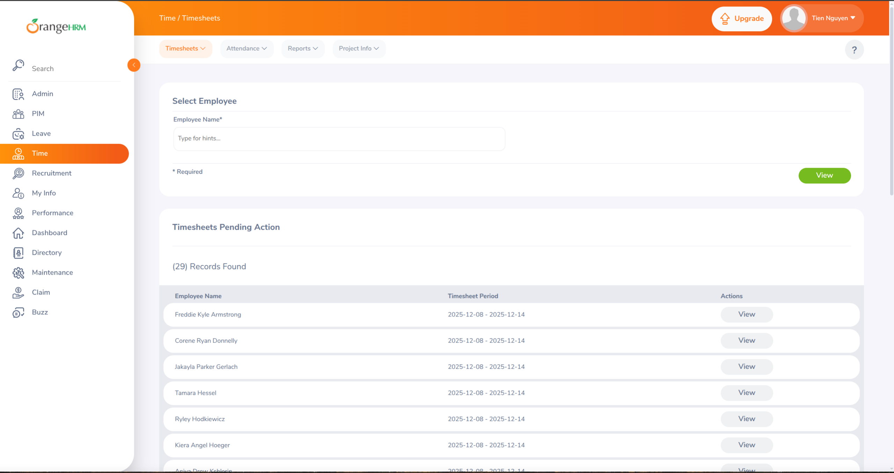
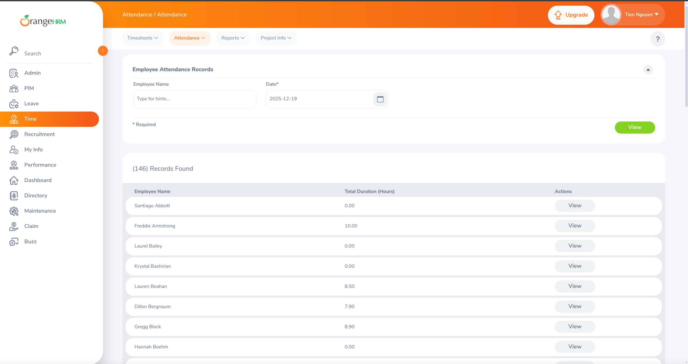
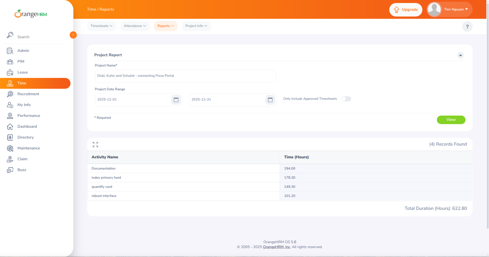
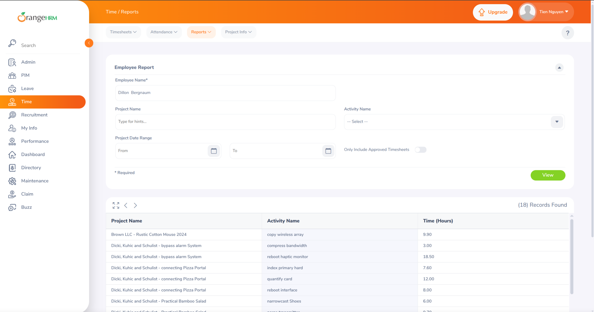
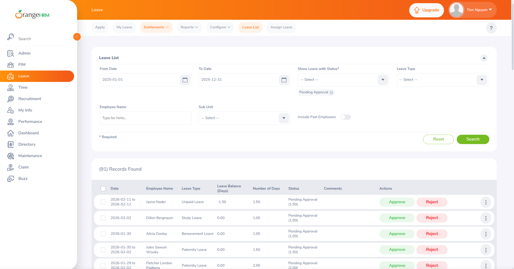
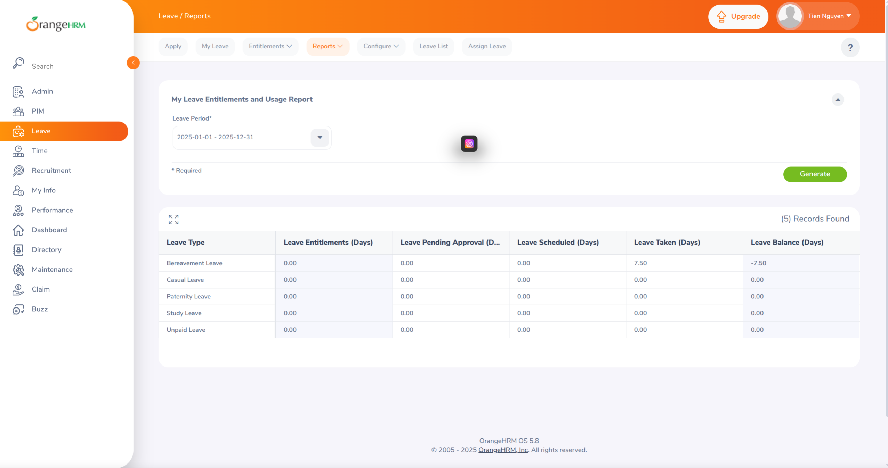

# Kiểm Thử Cơ Sở Dữ Liệu với OrangeHRM - Báo Cáo Kỹ Thuật

**Họ và tên:** Nguyễn Bùi Vương Tiễn \
**Ngày:** 20 tháng 12, 2024 \
**Môn học:** Kiểm thử cơ sở dữ liệu \
**Giảng viên:** Trần Duy Hoàng


## Mục lục
1. [Giới thiệu](#giới-thiệu)
2. [Tổng quan dự án](#tổng-quan-dự-án)
3. [Các loại dữ liệu và phạm vi ngẫu nhiên](#các-loại-dữ-liệu-và-phạm-vi-ngẫu-nhiên)
4. [Cài đặt và thiết lập](#cài-đặt-và-thiết-lập)
5. [Hướng dẫn sử dụng công cụ](#hướng-dẫn-sử-dụng-công-cụ)
6. [Giải thích mã nguồn](#giải-thích-mã-nguồn)
7. [Ảnh chụp màn hình dữ liệu mẫu](#ảnh-chụp-màn-hình-dữ-liệu-mẫu)
8. [Báo cáo kiểm thử](#báo-cáo-kiểm-thử)
9. [Kết luận](#kết-luận)

## Giới thiệu

Báo cáo này cung cấp hướng dẫn toàn diện về việc tạo dữ liệu kiểm thử thực tế cho kiểm thử ứng dụng OrangeHRM. Công cụ tạo dữ liệu tùy chỉnh sử dụng Node.js với thư viện Faker.js để tạo các bản ghi nhân viên ngẫu nhiên, theo dõi thời gian, quản lý nghỉ phép, thông tin nhân sự và dữ liệu tuyển dụng.

**Mục đích:** Đưa dữ liệu kiểm thử thực tế vào ứng dụng OrangeHRM để kiểm thử toàn diện các báo cáo và chức năng hệ thống.

**Công nghệ sử dụng:**
- Môi trường chạy Node.js
- Cơ sở dữ liệu MySQL
- Faker.js để tạo dữ liệu thực tế
- Hệ thống OrangeHRM 4.x/5.x

## Tổng quan dự án

### Kiến trúc hệ thống

Hệ thống tạo dữ liệu bao gồm nhiều script chuyên biệt hoạt động cùng nhau:

- Trình tạo dữ liệu nhân viên (Nền tảng)
- Trình tạo thời gian & chấm công
- Trình tạo quản lý nghỉ phép
- Trình tạo PIM (Thông tin nhân sự)
- Tiện ích dọn dẹp

### Luồng dữ liệu

1. **Dữ liệu nhân viên** (Nền tảng) → Tạo các bản ghi nhân viên cơ bản
2. **Thời gian & chấm công** → Tạo giờ làm việc, bảng chấm công, điểm danh
3. **Dữ liệu nghỉ phép** → Tạo yêu cầu nghỉ phép, quyền lợi, số dư
4. **Dữ liệu PIM** → Thêm thông tin cá nhân, bằng cấp, mối quan hệ
5. **Dữ liệu tuyển dụng** → Tạo vị trí tuyển dụng, ứng viên, phỏng vấn

## Các loại dữ liệu và phạm vi ngẫu nhiên

### 1. Dữ liệu nhân viên (`employee_data.js`)

**Cấu hình:**
```javascript
employeeCount: 20  // Số lượng nhân viên cần tạo
```

**Các trường được tạo:**

| Trường | Kiểu | Phạm vi/Logic ngẫu nhiên |
|-------|------|---------------------------|
| Mã nhân viên | String | Định dạng: EMP0001, EMP0002... (tuần tự) |
| Tên | String | Tên thực tế được tạo bởi Faker |
| Tên đệm | String | 50% xác suất có tên đệm |
| Họ | String | Họ thực tế được tạo bởi Faker |
| Biệt danh | String | 30% xác suất có biệt danh |
| Ngày sinh | Date | Độ tuổi: 22-65 tuổi |
| Giới tính | Integer | 1=Nam, 2=Nữ (phân bố 50/50) |
| Tình trạng hôn nhân | String | Độc thân, Đã kết hôn, Khác (ngẫu nhiên) |
| Email (Công việc) | String | Định dạng: ten.ho@congty.com |
| Email (Khác) | String | 30% có email cá nhân |
| Điện thoại nhà | String | Số điện thoại được tạo bởi Faker |
| Điện thoại di động | String | Số điện thoại được tạo bởi Faker |
| Điện thoại công ty | String | 40% có điện thoại công ty |
| Địa chỉ | String | Địa chỉ đầy đủ với đường, thành phố, tỉnh, mã bưu điện |
| Tình trạng làm việc | Integer | 90% Đang làm việc, 10% Đã nghỉ |
| Ngày vào làm | Date | 5 năm gần đây |
| Ngày nghỉ việc | Date | Giữa ngày vào làm và hôm nay (nếu đã nghỉ) |
| Tài khoản người dùng | Boolean | 60% nhân viên đang làm có tài khoản đăng nhập |

**Mẫu SQL Insert:**
```sql
INSERT INTO hs_hr_employee
(emp_number, employee_id, emp_firstname, emp_middle_name, emp_lastname,
 emp_nick_name, emp_birthday, emp_gender, emp_marital_status,
 joined_date, termination_id, emp_status)
VALUES (1, 'EMP0001', 'John', 'Michael', 'Smith', 'Johnny',
        '1985-03-15', 1, 'Married', '2020-01-10', NULL, NULL)
```

### 2. Dữ liệu thời gian & chấm công (`time_attendance.js`)

**Cấu hình:**
```javascript
generation: {
  customers: 5,                           // Số lượng khách hàng
  projectsPerCustomer: { min: 1, max: 3 }, // Dự án trên mỗi khách hàng
  activitiesPerProject: { min: 2, max: 5 }, // Hoạt động trên mỗi dự án
  timesheetWeeksBeforeToday: 5,           // Tuần liên tiếp
  itemsPerTimesheet: { min: 3, max: 10 }, // Mục trên mỗi bảng chấm công
  attendanceRecentDays: 14                // Ngày làm việc liên tiếp
}
```

**Dữ liệu được tạo:**

| Danh mục | Chi tiết ngẫu nhiên |
|----------|----------------------|
| **Khách hàng** | 5 công ty với tên thực tế (vd: "Tech Solutions Inc") |
| **Dự án** | 1-3 dự án trên mỗi khách hàng với tên mô tả |
| **Hoạt động** | 2-5 hoạt động trên mỗi dự án (vd: "Phát triển", "Kiểm thử") |
| **Bảng chấm công** | 5 tuần liên tiếp kết thúc trước tuần hiện tại |
| **Trạng thái bảng chấm** | Tuần gần: hỗn hợp ĐÃ GỬI/CHẤP THUẬN, Cũ hơn: CHẤP THUẬN |
| **Mục thời gian** | 3-10 mục mỗi bảng chấm, 0.5-10.0 giờ mỗi mục |
| **Bản ghi chấm công** | 14 ngày làm việc liên tiếp gần nhất (trừ cuối tuần) |
| **Giờ vào làm** | 7:00-9:30 sáng (đa dạng) |
| **Thời gian làm việc** | 7-10 giờ |
| **Trạng thái ra về** | 95% hoàn thành, 5% vẫn đang làm |

**Ví dụ logic bảng chấm công:**
```javascript
// Tính ngày bắt đầu của tuần hiện tại (Thứ Hai)
const today = new Date();
const currentDayOfWeek = today.getDay();
const daysToMonday = currentDayOfWeek === 0 ? 6 : currentDayOfWeek - 1;
const currentWeekStart = new Date(today);
currentWeekStart.setDate(today.getDate() - daysToMonday);

// Tạo 5 tuần trước tuần hiện tại
for (let weekOffset = 1; weekOffset <= 5; weekOffset++) {
  const startDate = new Date(currentWeekStart);
  startDate.setDate(currentWeekStart.getDate() - (weekOffset * 7));
  // ... tạo bảng chấm công
}
```

### 3. Dữ liệu nghỉ phép (`leave_data.js`)

**Cấu hình:**
```javascript
generation: {
  leaveTypesCount: 5,                      // Số loại nghỉ phép
  entitlementsPerEmployee: { min: 3, max: 5 }, // Số dư phép trên mỗi nhân viên
  leaveRequestsPerEmployee: { min: 8, max: 15 }, // Yêu cầu nghỉ trên mỗi nhân viên
  leavePeriodStartMonth: 1,                // Tháng Một
  leavePeriodStartDay: 1
}
```

**Dữ liệu được tạo:**

| Danh mục | Chi tiết |
|----------|---------|
| **Loại nghỉ phép** | Phép năm, Nghỉ ốm, Phép cá nhân, Nghỉ thai sản, Nghỉ hưu sản |
| **Quyền lợi** | 3-5 loại trên mỗi nhân viên, 5-30 ngày mỗi loại |
| **Ngày đã dùng** | 0 đến 50% số ngày được phân bổ |
| **Yêu cầu nghỉ phép** | 8-15 yêu cầu trên mỗi nhân viên |
| **Ngày yêu cầu** | 90 ngày gần nhất |
| **Thời gian nghỉ** | 1-5 ngày liên tiếp (trừ cuối tuần) |
| **Loại thời gian** | Cả ngày (80%), Nửa sáng (10%), Nửa chiều (10%) |

**Phân bổ trạng thái:**
```javascript
const statusWeights = [
  { status: 'CHỜ PHÊ DUYỆT', weight: 0.15 },    // 15%
  { status: 'ĐÃ LÊN LỊCH', weight: 0.20 },      // 20%
  { status: 'ĐÃ NGHỈ', weight: 0.50 },          // 50%
  { status: 'TỪ CHỐI', weight: 0.10 },          // 10%
  { status: 'ĐÃ HỦY', weight: 0.05 }            // 5%
];
```

**Triển khai quan trọng - Liên kết nghỉ phép với quyền lợi:**
```javascript
// Liên kết bản ghi nghỉ phép với quyền lợi (quan trọng cho theo dõi số dư)
const [entitlements] = await this.connection.execute(
  `SELECT id FROM ohrm_leave_entitlement
   WHERE emp_number = ? AND leave_type_id = ? AND deleted = 0
   LIMIT 1`,
  [employee.emp_number, leaveTypeId]
);

if (entitlements.length > 0) {
  await this.connection.execute(
    `INSERT INTO ohrm_leave_leave_entitlement (entitlement_id, leave_id, length_days)
     VALUES (?, ?, ?)`,
    [entitlements[0].id, leaveResult.insertId, lengthDays]
  );
}
```

### 4. Dữ liệu PIM (`pim_data.js`)

**Cấu hình:**
```javascript
generation: {
  skillsPerEmployee: { min: 2, max: 6 },
  educationPerEmployee: { min: 1, max: 3 },
  languagesPerEmployee: { min: 1, max: 4 },
  workExperiencePerEmployee: { min: 1, max: 4 },
  licensesPerEmployee: { min: 0, max: 3 },
  membershipsPerEmployee: { min: 0, max: 2 },
  emergencyContactsPerEmployee: { min: 1, max: 3 },
  dependentsPerEmployee: { min: 0, max: 3 },
  salaryRecordsPerEmployee: { min: 1, max: 2 },
  immigrationRecordsPerEmployee: { min: 0, max: 2 }
}
```

**Các danh mục dữ liệu được tạo:**

#### A. Kỹ năng
- **Tên kỹ năng:** JavaScript, Python, Java, Lãnh đạo, Giao tiếp, v.v.
- **Số năm kinh nghiệm:** 1-15 năm
- **Mức độ thành thạo:** Thang điểm 1-5

#### B. Học vấn
- **Trình độ:** Phổ thông, Cao đẳng, Đại học, Thạc sĩ, Tiến sĩ, Chứng chỉ
- **Cơ sở:** Tên trường đại học thực tế (vd: "Đại học Bách Khoa")
- **Ngành học:** Khoa học máy tính, Kinh doanh, Kỹ thuật, v.v.
- **Năm tốt nghiệp:** 30 năm gần đây
- **Điểm GPA:** Thang điểm 2.5-4.0

#### C. Ngôn ngữ
- **Mức độ thông thạo:** Cơ bản, Tốt, Thành thạo, Tiếng mẹ đẻ
- **Năng lực:** Đọc, Viết, Nói

#### D. Kinh nghiệm làm việc
- **Nhà tuyển dụng:** Tên công ty thực tế
- **Chức danh:** Chức danh công việc thực tế
- **Thời gian:** 6 tháng - 10 năm
- **Ngày bắt đầu/Kết thúc:** Lịch sử làm việc theo trình tự

#### E. Giấy phép & chứng chỉ
- **Loại:** Bằng lái xe, PMP, AWS, Scrum Master, CPA, v.v.
- **Ngày cấp:** 5 năm gần đây
- **Ngày hết hạn:** 5-10 năm từ ngày cấp

#### F. Thành viên
- **Tổ chức:** IEEE, ACM, PMI, Hiệp hội Luật sư, v.v.
- **Phí đăng ký:** $50-$500
- **Ngày bắt đầu/Gia hạn:** Gần đây

#### G. Liên hệ khẩn cấp
- **Mối quan hệ:** Vợ/Chồng, Cha mẹ, Anh chị em, Bạn bè
- **Chi tiết liên hệ:** Tên, số điện thoại nhà/di động/văn phòng

#### H. Người phụ thuộc
- **Mối quan hệ:** Con, Vợ/Chồng, Cha mẹ, Khác
- **Ngày sinh:** Độ tuổi thực tế

#### I. Hồ sơ lương
- **Số tiền:** $30,000 - $150,000
- **Tiền tệ:** USD
- **Kỳ trả lương:** Hàng tháng, Hàng tuần, Hai tuần một lần

#### J. Hồ sơ xuất nhập cảnh (MỚI)
- **Loại:** Hộ chiếu hoặc Visa
- **Số:** 9-12 ký tự chữ và số
- **Ngày cấp:** 5 năm gần đây
- **Ngày hết hạn:** Hiệu lực 5-10 năm
- **Trạng thái I-9:** Không yêu cầu, Đã xác minh, Chờ xử lý
- **Mã quốc gia:** Mã quốc gia 2 chữ cái

**Mẫu hồ sơ xuất nhập cảnh:**
```javascript
{
  passportNumber: 'A12345678',
  passportType: 1, // Hộ chiếu
  issuedDate: '2020-05-15',
  expireDate: '2030-05-14',
  i9Status: 'Đã xác minh',
  i9ReviewDate: '2024-11-20',
  countryCode: 'US'
}
```

## Cài đặt và thiết lập

### Yêu cầu tiên quyết

1. **Node.js** (v14 trở lên)
2. **MySQL Server** (v5.7 trở lên)
3. **OrangeHRM** (v4.x hoặc v5.x) đã cài đặt và cấu hình
4. **Git** (để clone repository)

### Bước 1: Cài đặt dependencies

```bash
npm install
```

Lệnh này cài đặt:
- `@faker-js/faker` - Thư viện tạo dữ liệu thực tế
- `mysql2` - Driver cơ sở dữ liệu MySQL cho Node.js

### Bước 2: Cấu hình kết nối cơ sở dữ liệu

Thiết lập biến môi trường:

```bash
export DB_HOST=localhost
export DB_PORT=3306
export DB_USER=root
export DB_PASS=mật_khẩu_của_bạn
export DB_NAME=orangehrm
```

Hoặc chỉnh sửa phần `CONFIG.db` trong mỗi script:

```javascript
const CONFIG = {
  db: {
    host: process.env.DB_HOST || "localhost",
    port: process.env.DB_PORT || 3306,
    user: process.env.DB_USER || "root",
    password: process.env.DB_PASS || "change_this_root_password",
    database: process.env.DB_NAME || "orangehrm",
  },
  // ...
};
```

## Hướng dẫn sử dụng công cụ

### Thứ tự thực thi (Quan trọng!)

**Luôn chạy theo đúng thứ tự sau:**

```bash
# Bước 1: Tạo bản ghi nhân viên cơ bản (BẮT BUỘC CHẠY TRƯỚC)
node src/employee_data.js

# Bước 2: Tạo dữ liệu thời gian và chấm công
node src/time_attendance.js

# Bước 3: Tạo dữ liệu quản lý nghỉ phép
node src/leave_data.js

# Bước 4: Tạo dữ liệu PIM (nhân sự)
node src/pim_data.js
```

### Thực thi từng bước

#### Bước 1: Tạo dữ liệu nhân viên

```bash
node src/employee_data.js
```

**Kết quả mong đợi:**
```
Connected to database successfully
Fetching reference data...
   Found 15 job titles.
   Found 3 employment statuses.
   Found 5 locations.
   Next employee number: 21

Generating Employees...
   Created 20 employees.

Generating Contact Details...
   Updated contact details for 18 employees.

Generating User Accounts...
   Created 12 user accounts.

Employee generation completed successfully!
   - Total employees created: 20
   - Active employees: 18
   - Terminated employees: 2

You can now run the other generators to populate data for these employees:
   1. node src/time_attendance.js
   2. node src/leave_data.js
   3. node src/pim_data.js

Disconnected from database
```

#### Bước 2: Tạo dữ liệu thời gian & chấm công

```bash
node src/time_attendance.js
```

**Kết quả mong đợi:**
```
Connected to database successfully
Fetching existing employees...
   Found 20 active employees.

Generating Customers...
   Created 5 customers.

Generating Projects...
   Created 12 projects.

Generating Project Activities...
   Created 48 project activities.

Generating Timesheets...
   Created 100 timesheets.

Generating Timesheet Items...
   Created 650 timesheet items.

Generating Attendance Records...
   Created 280 attendance records.

Time & Attendance data generation completed successfully!
   - Employees: 20
   - Customers: 5
   - Projects: 12
   - Timesheets: 100 (5 weeks per employee)
   - Attendance Records: 280 (14 days per employee)

Disconnected from database
```

#### Bước 3: Tạo dữ liệu nghỉ phép

```bash
node src/leave_data.js
```

**Kết quả mong đợi:**
```
Connected to database successfully
Fetching existing employees...
   Found 20 active employees.

Setting Up Leave Period...
   Leave period configured (1/1)

Generating Leave Types...
   Created 5 leave types.

Generating Leave Entitlements...
   Created 80 leave entitlements.

Generating Leave Requests & Records...
   Created 220 leave requests with 825 leave records.

Leave Data generation completed successfully!
   - Employees: 20
   - Leave Types: 5
   - Leave data ready for Leave Reports, Leave Entitlement Reports, etc.

Disconnected from database
```

#### Bước 4: Tạo dữ liệu PIM

```bash
node src/pim_data.js
```

**Kết quả mong đợi:**
```
Connected to database successfully
Fetching reference data...
   Found 10 skills.
   Found 6 education levels.
   Found 8 languages.
   Found 20 active employees.

Generating Employee Skills...
   Created 75 skill records.

Generating Education...
   Created 38 education records.

Generating Languages...
   Created 52 language records.

Generating Work Experience...
   Created 48 work experience records.

Generating Licenses...
   Created 22 license records.

Generating Memberships...
   Created 15 membership records.

Generating Emergency Contacts...
   Created 42 emergency contacts.

Generating Dependents...
   Created 28 dependent records.

Generating Salary Records...
   Created 30 salary records.

Generating Supervisor Relationships...
   Created 14 supervisor relationships.

Generating Immigration Records...
   Created 18 immigration records.

PIM Data generation completed successfully!
   - Employees: 20
   - Data ready for Employee Reports with configurable fields

Disconnected from database
```

#### Bước 5: Tạo dữ liệu tuyển dụng

```bash
node src/recruitment_data.js
```

**Kết quả mong đợi:**
```
Connected to database successfully
Fetching existing job titles...
   Found 15 job titles.
Fetching existing employees...
   Found 20 active employees.

Generating Job Vacancies...
   Created 10 job vacancies.

Generating Candidates & Applications...
   Created 95 candidates with 95 applications.

Generating Interviews...
   Created 142 interviews.

Recruitment data generation completed successfully!
   - Job Vacancies: 10
   - Candidates: 95
   - Applications: 95

Recruitment data ready for:
   - Job Vacancy Reports
   - Candidate Reports
   - Recruitment Analytics

Disconnected from database
```

### Tùy chọn: Dọn dẹp toàn bộ dữ liệu

Để xóa tất cả dữ liệu kiểm thử đã tạo (giữ lại nhân viên):

```bash
node src/cleanup.js
```

**Kết quả mong đợi:**
```
Connected to database successfully

Current Data Counts:
┌─────────────────────────────────────┬───────┐
│              (index)                │ count │
├─────────────────────────────────────┼───────┤
│     ohrm_attendance_record          │  280  │
│     ohrm_timesheet_item             │  650  │
│     ohrm_timesheet                  │  100  │
│     ohrm_leave                      │  825  │
│     ohrm_leave_request              │  220  │
│     hs_hr_emp_skill                 │   75  │
│     ohrm_job_candidate              │   95  │
└─────────────────────────────────────┴───────┘

Cleaning Time & Attendance Data...
   Deleted 280 Attendance Records
   Deleted 650 Timesheet Items
   Deleted 100 Timesheets
   Deleted 48 Project Activities
   Deleted 12 Projects
   Deleted 5 Customers

Cleaning Leave Data...
   Deleted 825 Leave Records
   Deleted 220 Leave Requests
   Deleted 80 Leave Entitlements
   Deleted 5 Leave Types

Cleaning PIM Data...
   Deleted 75 Employee Skills
   Deleted 38 Employee Education
   [... các xóa khác ...]

Cleaning Recruitment Data...
   Deleted 142 Interview Interviewers
   Deleted 142 Interviews
   Deleted 95 Candidate Applications
   Deleted 95 Candidates
   Deleted 10 Job Vacancies

Resetting Auto-Increment Values...
   Auto-increment values reset

Data Counts After Cleanup:
┌─────────────────────────────────────┬───────┐
│              (index)                │ count │
├─────────────────────────────────────┼───────┤
│     ohrm_attendance_record          │   0   │
│     ohrm_timesheet_item             │   0   │
│     ohrm_timesheet                  │   0   │
│     ohrm_leave                      │   0   │
└─────────────────────────────────────┴───────┘

Cleanup completed successfully!
   All generated test data has been removed.

Disconnected from database
```

## Giải thích mã nguồn

### Tổng quan kiến trúc

Công cụ tuân theo kiến trúc module với các script riêng biệt cho mỗi danh mục dữ liệu. Tất cả các script đều chia sẻ các mẫu chung:

1. **Phần cấu hình** - Kết nối cơ sở dữ liệu và tham số tạo dữ liệu
2. **Hàm trợ giúp** - Các hàm tiện ích để tạo dữ liệu
3. **Lớp Generator** - Lớp chính với quản lý kết nối và phương thức tạo dữ liệu
4. **Quản lý giao dịch** - Tất cả các thao tác được bao bọc trong giao dịch cơ sở dữ liệu
5. **Xử lý lỗi** - Xử lý lỗi một cách khéo léo với rollback khi thất bại

### Các mẫu code chung

#### Quản lý kết nối cơ sở dữ liệu

```javascript
async connect() {
  this.connection = await mysql.createConnection(this.config.db);
  console.log(`${colors.green}Connected to database successfully${colors.reset}`);
}

async disconnect() {
  if (this.connection) {
    await this.connection.end();
    console.log(`${colors.cyan}Disconnected from database${colors.reset}`);
  }
}
```

**Giải thích:**
- Tạo kết nối MySQL sử dụng cấu hình
- Sử dụng async/await cho các thao tác không chặn
- Cung cấp phản hồi console có màu
- Đảm bảo đóng kết nối sạch sẽ

---

#### Mẫu giao dịch

```javascript
async run() {
  try {
    await this.connect();

    // Fetch reference data BEFORE transaction
    await this.fetchEmployees();

    // Start transaction
    await this.connection.query("START TRANSACTION");

    await this.generateData1();
    await this.generateData2();
    // ... more data generation

    // Commit transaction
    await this.connection.query("COMMIT");

    console.log("Data generation completed successfully!");
  } catch (error) {
    // Rollback on error
    try {
      await this.connection.query("ROLLBACK");
      console.error("Transaction rolled back.");
    } catch (rollbackError) {
      console.error("Rollback failed:", rollbackError.message);
    }

    console.error(`Error: ${error.message}`);
    process.exit(1);
  } finally {
    await this.disconnect();
  }
}
```

**Giải thích:**
- Tất cả việc tạo dữ liệu diễn ra trong một giao dịch
- Nếu bất kỳ thao tác nào thất bại, tất cả thay đổi sẽ được rollback
- Đảm bảo tính nhất quán của dữ liệu
- Ngăn chặn chèn dữ liệu một phần
- Luôn ngắt kết nối khỏi cơ sở dữ liệu trong khối `finally`

### Các thành phần code chính

#### 1. Trình tạo dữ liệu nhân viên (`employee_data.js`)

**Cấu trúc lớp:**
```javascript
class OrangeHRMEmployeeGenerator {
  constructor(config) {
    this.config = config;
    this.connection = null;
    this.jobTitles = [];
    this.employmentStatuses = [];
    this.locations = [];
    this.generatedEmployees = [];
    this.nextEmpNumber = 1;
  }
}
```

**Tạo ID nhân viên:**
```javascript
generateEmployeeId(empNumber) {
  // Format: EMP + padded number (e.g., EMP0021, EMP0022)
  return `EMP${String(empNumber).padStart(4, '0')}`;
}
```

**Tạo thông tin cá nhân:**
```javascript
// Generate personal information
const birthday = faker.date.birthdate({ min: 22, max: 65, mode: 'age' });
const gender = faker.helpers.arrayElement([1, 2]); // 1=Male, 2=Female
const maritalStatus = faker.helpers.arrayElement(['Single', 'Married', 'Other']);
const nickname = faker.datatype.boolean({ probability: 0.3 })
  ? faker.person.firstName()
  : '';
```

**Tương thích schema:**
```javascript
// Try to insert employee with common columns
const sql = `
  INSERT INTO hs_hr_employee
  (emp_number, employee_id, emp_firstname, emp_middle_name, emp_lastname,
   emp_nick_name, emp_birthday, emp_gender, emp_marital_status,
   joined_date, termination_id, emp_status)
  VALUES (?, ?, ?, ?, ?, ?, ?, ?, ?, ?, ?, ?)
`;

try {
  await this.connection.execute(sql, [
    empNumber, employeeId, firstName, middleName, lastName, nickname,
    birthday.toISOString().split('T')[0], gender, maritalStatus,
    joinedDate.toISOString().split('T')[0], terminationDate, empStatus,
  ]);

  // Track generated employee
  this.generatedEmployees.push({
    empNumber, employeeId, firstName, lastName, isActive
  });
} catch (error) {
  console.warn(`WARNING: Could not create employee: ${error.message}`);
}
```

**Giải thích:**
- Sử dụng truy vấn tham số hóa để ngăn chặn SQL injection
- Chuyển đổi ngày sang định dạng ISO cho tương thích MySQL
- Lưu trữ nhân viên đã tạo để tham chiếu sau bởi các trình tạo khác
- Xử lý lỗi một cách khéo léo mà không dừng toàn bộ quá trình

#### 2. Trình tạo thời gian & chấm công (`time_attendance.js`)

**Tính toán tuần liên tiếp:**
```javascript
async generateTimesheets() {
  // Calculate the start of the current week (Monday)
  const today = new Date();
  const currentDayOfWeek = today.getDay();
  const daysToMonday = currentDayOfWeek === 0 ? 6 : currentDayOfWeek - 1;

  const currentWeekStart = new Date(today);
  currentWeekStart.setDate(today.getDate() - daysToMonday);
  currentWeekStart.setHours(0, 0, 0, 0);

  for (const employee of this.employees) {
    // Generate timesheets for consecutive weeks before the current week
    for (let weekOffset = 1; weekOffset <= this.config.generation.timesheetWeeksBeforeToday; weekOffset++) {
      const startDate = new Date(currentWeekStart);
      startDate.setDate(currentWeekStart.getDate() - (weekOffset * 7));

      const endDate = new Date(startDate);
      endDate.setDate(startDate.getDate() + 6);

      // Realistic states based on week age
      let state;
      if (weekOffset === 1) {
        state = faker.helpers.arrayElement(["SUBMITTED", "SUBMITTED", "APPROVED", "APPROVED", "APPROVED"]);
      } else if (weekOffset === 2) {
        state = faker.helpers.arrayElement(["APPROVED", "APPROVED", "APPROVED", "SUBMITTED"]);
      } else {
        state = "APPROVED";
      }

      // Insert timesheet...
    }
  }
}
```

**Giải thích:**
- Tính thứ Hai của tuần hiện tại (bảng chấm công chạy từ Thứ Hai-Chủ Nhật)
- Tạo chính xác 5 tuần liên tiếp trước tuần hiện tại
- Các tuần gần đây có hỗn hợp SUBMITTED/APPROVED (quy trình làm việc thực tế)
- Các tuần cũ hơn đều là APPROVED (hoàn thành thực tế)
- Đảm bảo dữ liệu nhất quán, có thể kiểm thử

**Bản ghi chấm công với loại trừ cuối tuần:**
```javascript
async generateAttendanceRecords() {
  for (const employee of this.employees) {
    const today = new Date();
    today.setHours(0, 0, 0, 0);

    // Generate attendance for consecutive days (excluding today and weekends)
    for (let daysAgo = 1; daysAgo <= this.config.generation.attendanceRecentDays; daysAgo++) {
      const attendanceDate = new Date(today);
      attendanceDate.setDate(today.getDate() - daysAgo);

      // Skip weekends
      const dayOfWeek = attendanceDate.getDay();
      if (dayOfWeek === 0 || dayOfWeek === 6) continue;

      // Random punch-in time between 7:00-9:30 AM
      const punchInHour = faker.number.int({ min: 7, max: 9 });
      const punchInMinute = faker.helpers.arrayElement([0, 15, 30, 45]);

      const punchInDateTime = new Date(attendanceDate);
      punchInDateTime.setHours(punchInHour, punchInMinute, 0);

      // Work duration: 7-10 hours
      const workHours = faker.number.float({ min: 7, max: 10, fractionDigits: 2 });

      const punchOutDateTime = new Date(punchInDateTime);
      punchOutDateTime.setHours(punchInDateTime.getHours() + Math.floor(workHours));
      punchOutDateTime.setMinutes(punchInDateTime.getMinutes() + ((workHours % 1) * 60));

      // 95% complete punch-out, 5% still punched in
      const punchOutTime = faker.datatype.boolean({ probability: 0.95 })
        ? punchOutDateTime
        : null;

      // Insert attendance record...
    }
  }
}
```

**Giải thích:**
- Loại trừ ngày hôm nay (dữ liệu không hoàn chỉnh)
- Bỏ qua cuối tuần (lịch làm việc thực tế)
- Thời gian vào làm đa dạng (hành vi nhân viên thực tế)
- Hầu hết bản ghi hoàn tất, một số vẫn "đang làm" (trạng thái thực tế)

#### 3. Trình tạo dữ liệu nghỉ phép (`leave_data.js`)

**Liên kết nghỉ phép-quyền lợi quan trọng:**
```javascript
async generateLeaveRequestsAndRecords() {
  for (const employee of this.employees) {
    for (let i = 0; i < numRequests; i++) {
      // ... create leave request ...

      const [requestResult] = await this.connection.execute(requestSql, [
        leaveTypeId, dateApplied, employee.emp_number, comment
      ]);

      const leaveRequestId = requestResult.insertId;

      // Create leave records for each day
      for (let day = 0; day < numLeaveDays; day++) {
        const leaveDate = new Date(leaveStartDate);
        leaveDate.setDate(leaveStartDate.getDate() + day);

        // Skip weekends
        if (leaveDate.getDay() === 0 || leaveDate.getDay() === 6) {
          continue;
        }

        // Insert leave record
        const [leaveResult] = await this.connection.execute(leaveSql, [
          leaveDate, lengthHours, lengthDays, selectedStatus,
          leaveRequestId, leaveTypeId, employee.emp_number,
          durationType, startTime, endTime
        ]);

        // CRITICAL: Link leave record to entitlement
        try {
          const [entitlements] = await this.connection.execute(
            `SELECT id FROM ohrm_leave_entitlement
             WHERE emp_number = ? AND leave_type_id = ? AND deleted = 0
             LIMIT 1`,
            [employee.emp_number, leaveTypeId]
          );

          if (entitlements.length > 0) {
            // Link leave to entitlement (required for balance tracking)
            await this.connection.execute(
              `INSERT INTO ohrm_leave_leave_entitlement (entitlement_id, leave_id, length_days)
               VALUES (?, ?, ?)`,
              [entitlements[0].id, leaveResult.insertId, lengthDays]
            );
          }
        } catch (linkError) {
          // Table might not exist in older versions, silently skip
        }
      }
    }
  }
}
```

**Giải thích:**
- Tạo yêu cầu nghỉ phép trước (bản ghi cha)
- Tạo các bản ghi ngày nghỉ riêng lẻ (bản ghi con)
- **Quan trọng:** Liên kết mỗi ngày nghỉ với quyền lợi của nhân viên
- Liên kết này cho phép:
  - Tính toán số dư nghỉ phép
  - Theo dõi sử dụng quyền lợi
  - Báo cáo nghỉ phép hiển thị số dư chính xác
- Xử lý khéo léo các biến thể schema (phiên bản OrangeHRM cũ hơn)

**Xử lý loại thời gian:**
```javascript
// Leave duration (full day, half day, etc.)
const durationType = faker.helpers.arrayElement([0, 0, 0, 1, 2]); // Mostly full days
const lengthDays = durationType === 0 ? 1.0000 : 0.5000;
const lengthHours = lengthDays * 8; // 8 hours per day

// Generate start and end times for the leave
const startTime = durationType === 0 ? null : (durationType === 1 ? '09:00:00' : '13:00:00');
const endTime = durationType === 0 ? null : (durationType === 1 ? '13:00:00' : '17:00:00');
```

**Giải thích:**
- `durationType` 0 = Cả ngày (thời gian bắt đầu/kết thúc NULL)
- `durationType` 1 = Nửa sáng (09:00-13:00)
- `durationType` 2 = Nửa chiều (13:00-17:00)
- Mảng có trọng số đảm bảo chủ yếu là cả ngày (thực tế)
- Thời gian bắt đầu/kết thúc bắt buộc cho nghỉ nửa ngày

---

#### 4. Trình tạo dữ liệu PIM (`pim_data.js`)

**Tạo hồ sơ xuất nhập cảnh:**
```javascript
async generateImmigrationRecords() {
  for (const employee of this.employees) {
    const numRecords = faker.number.int(this.config.generation.immigrationRecordsPerEmployee);

    for (let i = 0; i < numRecords; i++) {
      const passportType = faker.helpers.arrayElement([1, 2]); // 1=Passport, 2=Visa
      const passportNumber = passportType === 1
        ? faker.string.alphanumeric({ length: 9, casing: 'upper' })
        : faker.string.alphanumeric({ length: 12, casing: 'upper' });

      const issuedDate = faker.date.past({ years: 5 });
      const expireDate = new Date(issuedDate);
      expireDate.setFullYear(expireDate.getFullYear() + faker.number.int({ min: 5, max: 10 }));

      const i9Status = faker.helpers.arrayElement(['', 'Not Required', 'Verified', 'Pending']);
      const i9ReviewDate = i9Status === 'Verified'
        ? faker.date.recent({ days: 180 })
        : null;

      const countryCode = faker.location.countryCode();

      const sql = `
        INSERT INTO hs_hr_emp_passport
        (emp_number, ep_seqno, ep_passport_num, ep_passportissueddate, ep_passportexpiredate,
         ep_comments, ep_passport_type_flg, ep_i9_status, ep_i9_review_date, cou_code)
        VALUES (?, ?, ?, ?, ?, ?, ?, ?, ?, ?)
      `;

      await this.connection.execute(sql, [
        employee.emp_number, i + 1, passportNumber,
        issuedDate.toISOString().slice(0, 19).replace('T', ' '),
        expireDate.toISOString().slice(0, 19).replace('T', ' '),
        comments, passportType, i9Status, i9ReviewDate, countryCode
      ]);
    }
  }
}
```

**Giải thích:**
- Số hộ chiếu có 9 ký tự, số Visa có 12 ký tự
- Thời hạn hiệu lực thực tế (5-10 năm)
- Ngày xem xét I-9 chỉ được đặt khi trạng thái là "Verified"
- Số thứ tự (`ep_seqno`) cho phép nhiều hộ chiếu cho mỗi nhân viên
- Định dạng DateTime yêu cầu bởi OrangeHRM: 'YYYY-MM-DD HH:MM:SS'

**Logic mối quan hệ giám sát:**
```javascript
async generateSupervisorRelationships() {
  // Create supervisor relationships for a subset of employees
  const subordinates = this.employees.slice(0, Math.floor(this.employees.length * 0.7));
  const supervisors = this.employees.slice(Math.floor(this.employees.length * 0.3));

  for (const subordinate of subordinates) {
    if (faker.datatype.boolean({ probability: 0.8 })) {
      const supervisor = faker.helpers.arrayElement(supervisors);

      // Don't make someone their own supervisor
      if (supervisor.emp_number === subordinate.emp_number) continue;

      const sql = `
        INSERT INTO hs_hr_emp_reportto (erep_sup_emp_number, erep_sub_emp_number, erep_reporting_mode)
        VALUES (?, ?, ?)
      `;

      await this.connection.execute(sql, [
        supervisor.emp_number,
        subordinate.emp_number,
        1 // Direct reporting
      ]);
    }
  }
}
```

**Giải thích:**
- Sử dụng 70% nhân viên đầu tiên làm cấp dưới tiềm năng
- Sử dụng 30% nhân viên cuối làm giám sát viên tiềm năng
- 80% cấp dưới được gán giám sát viên (cơ cấu tổ chức thực tế)
- Ngăn chặn tự giám sát (kiểm tra xác thực)
- `erep_reporting_mode` 1 = Trực tiếp, 2 = Gián tiếp

#### 5. Tiện ích dọn dẹp (`cleanup.js`)

**Thứ tự xóa bảng (khóa ngoại):**
```javascript
async cleanPIMData() {
  const deletions = [
    { name: "Employee Skills", sql: "DELETE FROM hs_hr_emp_skill" },
    { name: "Employee Education", sql: "DELETE FROM ohrm_emp_education" },
    { name: "Employee Languages", sql: "DELETE FROM hs_hr_emp_language" },
    { name: "Work Experience", sql: "DELETE FROM hs_hr_emp_work_experience" },
    { name: "Employee Licenses", sql: "DELETE FROM ohrm_emp_license" },
    { name: "Employee Memberships", sql: "DELETE FROM hs_hr_emp_member_detail" },
    { name: "Emergency Contacts", sql: "DELETE FROM hs_hr_emp_emergency_contacts" },
    { name: "Employee Dependents", sql: "DELETE FROM hs_hr_emp_dependents" },
    { name: "Salary Records", sql: "DELETE FROM hs_hr_emp_basicsalary" },
    { name: "Supervisor Relationships", sql: "DELETE FROM hs_hr_emp_reportto" },
    { name: "Immigration Records", sql: "DELETE FROM hs_hr_emp_passport" },
  ];

  for (const { name, sql } of deletions) {
    try {
      const [result] = await this.connection.execute(sql);
      console.log(`Deleted ${result.affectedRows} ${name}`);
    } catch (error) {
      console.warn(`WARNING: Could not delete ${name}: ${error.message}`);
    }
  }
}
```

**Giải thích:**
- Xóa bảng theo thứ tự tôn trọng ràng buộc khóa ngoại
- Bảng con được xóa trước bảng cha
- Tiếp tục thực thi ngay cả khi một số bảng thất bại (biến thể schema)
- Báo cáo số hàng đã xóa để xác minh

**Đặt lại Auto-Increment:**
```javascript
async resetAutoIncrementValues() {
  const resetCommands = [
    "ALTER TABLE ohrm_leave AUTO_INCREMENT = 1",
    "ALTER TABLE ohrm_leave_request AUTO_INCREMENT = 1",
    "ALTER TABLE ohrm_job_candidate AUTO_INCREMENT = 1",
    // ... more tables ...
  ];

  for (const sql of resetCommands) {
    try {
      await this.connection.execute(sql);
    } catch (error) {
      // Silently skip errors (table might be empty)
    }
  }
}
```

**Giải thích:**
- Đặt lại bộ đếm auto-increment về 1
- Đảm bảo ID mới khi tạo dữ liệu lần sau
- Ngăn chặn khoảng trống ID và giữ dữ liệu sạch
- Thất bại im lặng là chấp nhận được (bảng trống)

## Ảnh chụp màn hình dữ liệu

### Time and Attendance





### Reports










## Phụ lục

### A. Tham chiếu bảng cơ sở dữ liệu

**Bảng nhân viên:**
- `hs_hr_employee` - Bản ghi nhân viên cốt lõi
- `ohrm_user` - Tài khoản đăng nhập người dùng
- `hs_hr_emp_passport` - Hồ sơ xuất nhập cảnh
- `hs_hr_emp_skill` - Kỹ năng
- `ohrm_emp_education` - Học vấn
- `hs_hr_emp_language` - Ngôn ngữ
- `hs_hr_emp_work_experience` - Lịch sử làm việc
- `ohrm_emp_license` - Giấy phép
- `hs_hr_emp_member_detail` - Thành viên
- `hs_hr_emp_emergency_contacts` - Liên hệ khẩn cấp
- `hs_hr_emp_dependents` - Người phụ thuộc
- `hs_hr_emp_basicsalary` - Lương
- `hs_hr_emp_reportto` - Mối quan hệ giám sát

**Bảng thời gian & chấm công:**
- `ohrm_customer` - Khách hàng
- `ohrm_project` - Dự án
- `ohrm_project_activity` - Hoạt động
- `ohrm_timesheet` - Bảng chấm công
- `ohrm_timesheet_item` - Mục thời gian
- `ohrm_attendance_record` - Chấm công

**Bảng nghỉ phép:**
- `ohrm_leave_type` - Loại nghỉ phép
- `ohrm_leave_entitlement` - Số dư nghỉ phép
- `ohrm_leave_request` - Đơn xin nghỉ phép
- `ohrm_leave` - Bản ghi ngày nghỉ
- `ohrm_leave_leave_entitlement` - Liên kết nghỉ phép-quyền lợi
- `ohrm_leave_period_history` - Cấu hình kỳ nghỉ phép
