# CASE STUDY PROJECT REPORT
## OrangeHRM Testing

**Lecturer:** Dr. Tran Duy Hoang
**TA:** MSc. Truong Phuoc Loc

**Student Info:**
* **Name:** Giang Đức Nhật
* **Student ID:** 22120252
* **Group:** 11

---

## Task Allocation

Theo yêu cầu của đồ án, các thành viên trong nhóm phân chia công việc như sau:

| Member Name | Feature Assigned | Role |
| :--- | :--- | :--- |
| **Giang Đức Nhật** | **HR Administration & ESS** | **Tester** |
| Phan Thanh Tiến | Performance Management & Recruitment | Tester |
| Nguyễn Bùi Vương Tiễn | Reporting & Analytics & Time and Attendance | Tester |
| Lý Trọng Tín | Employee Management (PIM) & Employee Management (PIM) | Tester |


> **My Responsibility:**
> 1.  **HR Administration:** Quản lý cấu trúc organization (Locations, Subunits), Job Titles, Users.
> 2.  **ESS (Employee Self-Service):** Quản lý Leave Requests (Xin nghỉ phép).

---

# REQUIREMENT 2: DATA GENERATION

### Mục tiêu:
Tạo dữ liệu kiểm thử tự động, có ý nghĩa (meaningful data) cho các tính năng quản trị và nhân viên.

### Công cụ sử dụng:
* **Node.js**: Môi trường thực thi script.
* **Faker.js**: Thư viện sinh dữ liệu giả ngẫu nhiên (Tên, địa chỉ, job title...).
* **MySQL2**: Driver kết nối trực tiếp database OrangeHRM.


---

## HR Administration Overview

Schema diagram related:

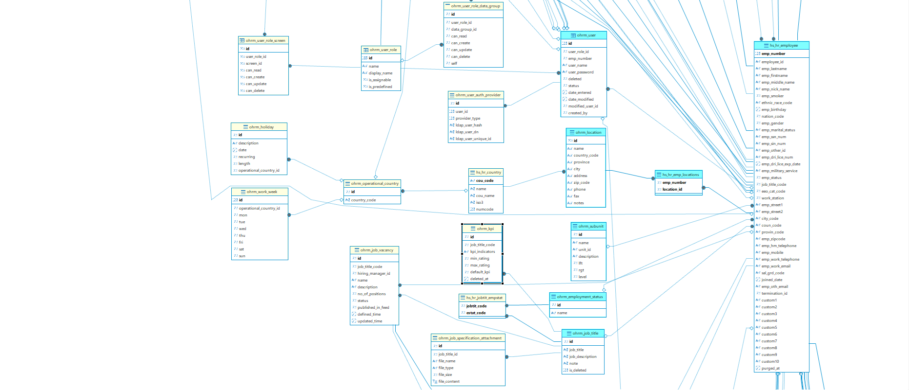

---

## Data Generation Strategy

Dữ liệu được sinh ra tập trung vào 2 module chính là **HR Admin** và **ESS (Buzz, My Info, Leave)** để phục vụ việc test functional sau này.

---

## Data Generation Strategy (HR Admin)
Sau đây là summary phần generate data cho module HR Administation

| Category | Table Name | Randomized Range / Logic |
| :--- | :--- | :--- |
| **Locations** | `ohrm_location` | 5-10 địa điểm. Tên văn phòng + Tên thành phố ngẫu nhiên. |
| **Subunits** | `ohrm_subunit` | Các phòng ban IT cơ bản: Engineering, QC, DevOps. |
| **Job Titles** | `ohrm_job_title` | Random các vị trí: Java Dev, Tester, BA. |
| **System Users** | `ohrm_user` | Tạo account cho nhân viên. Pass mặc định: `admin123`. |
| **Leave Requests** | `ohrm_leave_request` | Mỗi nhân viên có 1-3 đơn nghỉ phép (Random ngày). |

---


## Data Generation Strategy: (HR Admin - advanced)

Để đảm bảo quy trình kiểm thử diễn ra trơn tru từ Admin đến End-user, em bổ sung thêm việc generate dữ liệu trong bảng **ohrm_user** để **Tạo account cho User**

* **System Users (Critical):**
    * **Vấn đề:** Module PIM tạo ra hồ sơ nhân viên (Employee) nhưng chưa có tài khoản đăng nhập (User).
    * **Giải pháp:** Script tự động quét user có trong bảng **hs_hr_employee** nhưng chưa có trong bảng **ohrm_user**
    * **Phân quyền:** Tự động gán quyền **ESS** và **Admin**

---
## Data Generation Strategy: (HR Admin - advanced)

Script tự động quét và cấp tài khoản cho nhân viên chưa có User:

```javascript
// 1. Scan orphan employees
const [orphans] = await connection.query(
  "SELECT emp_number FROM hs_hr_employee WHERE emp_number NOT IN (SELECT emp_number FROM ohrm_user)"
);

// 2. Assign Credentials
for (const emp of orphans) {
   const username = emp.emp_firstname + faker.string.numeric(3);
   const roleId = Math.random() > 0.9 ? 1 : 2; // 90% ESS

   await connection.execute(
       "INSERT INTO ohrm_user (user_role_id, emp_number, user_name...) VALUES (?, ?, ...)",
       [roleId, emp.emp_number, username...]
   );
}
```

---


## Source Code Explanation (HR-Admin)

Script `hr-admin-gen.js` thực hiện kết nối database và chạy các hàm sinh dữ liệu tuần tự

Script này sẽ tạo: Locations -> Subunits -> Job Titles -> Employment Status -> Admin Users..


Logic: Sử dụng vòng lặp for để tạo số lượng bản ghi mong muốn.

Faker: Thư viện được sử dụng để tạo các string có nghĩa cho data được generate

Data Integrity: Script đảm bảo User được tạo ra phải gắn (Foreign Key) với một Employee ID đang tồn tại trong hệ thống.

---

## Kết quả chạy Script (HR-Admin)

Kết quả sau khi chạy script **hr-admin-gen.js**:

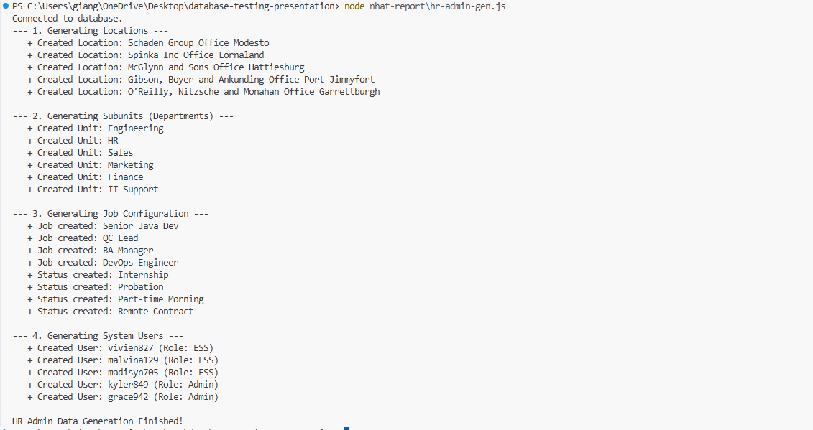

---

## Dữ liệu sau khi chạy Script (HR-Admin)
User: Trang Admin/User management/Users (Các user được tạo tài khoản như đã đề cập trước đó):

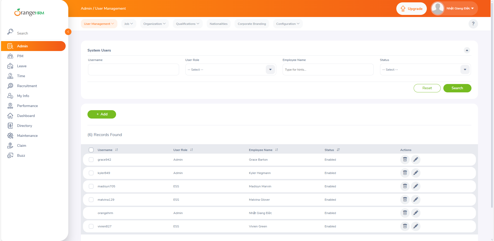

---

## Dữ liệu sau khi chạy Script (HR-Admin)
Job titles: Trang Admin/Job/Job titles

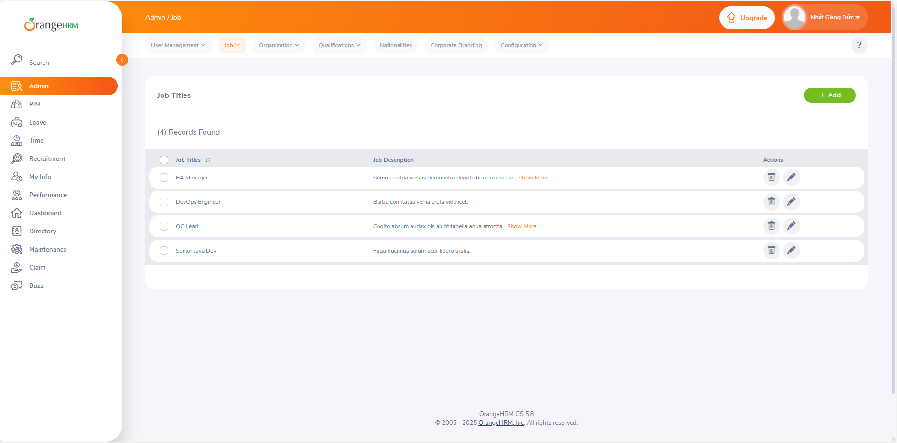

---

## Dữ liệu sau khi chạy Script (HR-Admin)
Employment status: Trang Admin/Job/Employment status


---

## Dữ liệu sau khi chạy Script (HR-Admin)
Subunits: Trang Admin/Job/Job categories

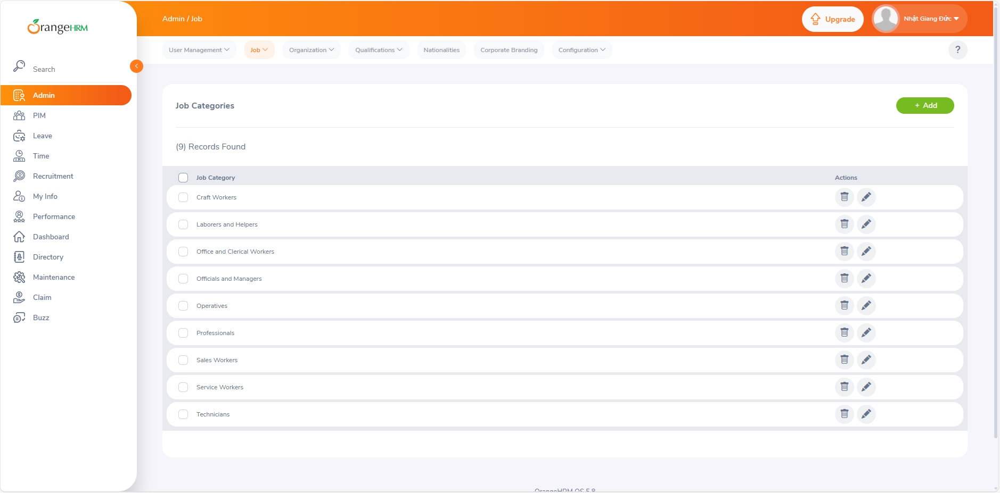

---

## Dữ liệu sau khi chạy Script (HR-Admin)
Locations: Trang Admin/Organization/Location

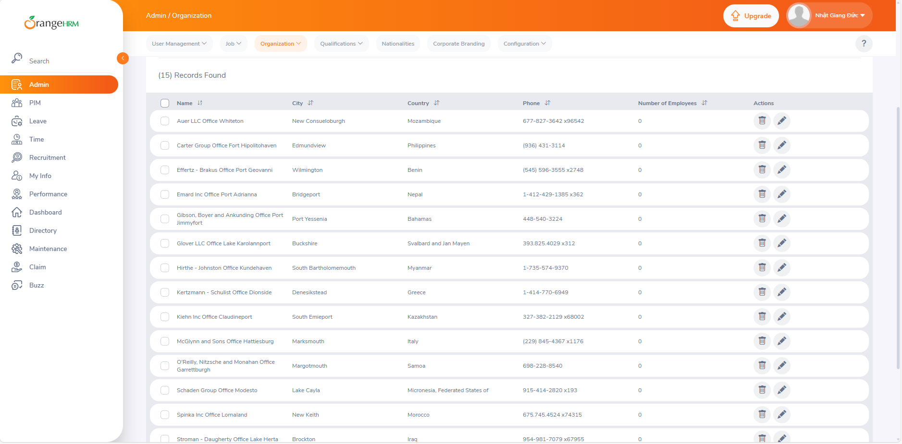

---

## Tổng kết HR Admin Data Generation

Script hr-admin-gen.js được xây dựng nhằm tự động sinh dữ liệu nền tảng cho module HR Administration trong hệ thống OrangeHRM.

Dữ liệu được generate tập trung vào các cấu hình cốt lõi (master data), đóng vai trò làm nền cho toàn bộ hệ thống vận hành, bao gồm cả ESS và các module nghiệp vụ khác.

---

## ESS Overview

Schema diagram related:

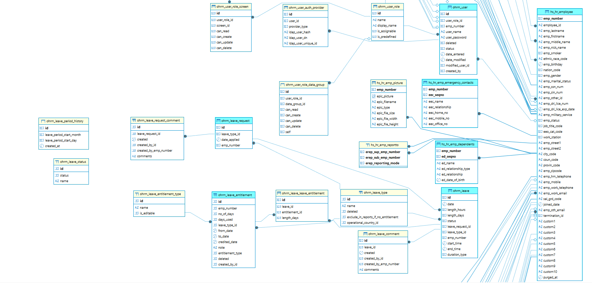

---

## Data Generation Strategy (ESS)

Sau đây là phần generate data cho module ESS

| Category | Table Name | Randomized Range / Logic |
| :--- | :--- | :--- |
| **Buzz Posts** | `ohrm_buzz_post` | Sinh các buzz post ngẫu nhiên.|
| **Buzz Comments** | `ohrm_buzz_comment` | Sinh comment ngẫu nhiên cho buzz posts. |
| **Buzz Shares** | `ohrm_buzz_share` | Sinh ra các bài share ngẫu nhiên cho buzz posts. |
| **Emergency Contacts** | `hs_hr_emp_emergency_contacts` | Mỗi nhân viên có 1–2 người liên hệ khẩn cấp. Thông tin gồm tên, quan hệ và số điện thoại được sinh ngẫu nhiên. |
| **Dependents** | `hs_hr_emp_dependents` | 70% nhân viên có 1–2 người phụ thuộc (con cái hoặc quan hệ khác), ngày sinh được sinh ngẫu nhiên theo độ tuổi hợp lý. |
| **Leave Types** | `ohrm_leave_type` | Sử dụng các loại nghỉ phép phổ biến như Annual Leave, Sick Leave, Casual Leave. |
| **Leave Entitlements** | `ohrm_leave_entitlement` | Mỗi nhân viên được cấp 12 ngày phép cho một loại nghỉ phép ngẫu nhiên trong năm hiện tại. |
| **Leave Requests** | `ohrm_leave_request` | Mỗi nhân viên tạo 1–3 đơn xin nghỉ phép với ngày nghỉ ngẫu nhiên trong vòng 30 ngày gần nhất. |

---

## Source Code Explanation (ESS)

Script ess-gen.js thực hiện kết nối đến database OrangeHRM và sinh dữ liệu mô phỏng cho ESS (Employee Self-Service) theo đúng nghiệp vụ hệ thống.

Script tập trung tạo dữ liệu cho các chức năng mà nhân viên (ESS user) thường sử dụng, bao gồm:
Buzz Post → Buzz Share → Buzz Comment, cùng các dữ liệu cá nhân liên quan (My Info).

---

## Chức năng được generate trong ESS

- Buzz Posts (nhân viên đăng trạng thái)


- Buzz Comments (nhân viên khác tương tác)

- Emergency Contacts

- Dependents

- Leave Requests & Leave Entitlements

---

## Logic Generate (ESS)

Sử dụng vòng lặp for để sinh số lượng bản ghi ngẫu nhiên cho mỗi nhân viên.

Mỗi nhân viên có thể:

- Tạo từ 1–5 Buzz Post

- Mỗi Post có 1 Buzz Share

- Mỗi Share có 1–4 Comment từ các nhân viên khác

Dữ liệu được sinh theo đúng luồng nghiệp vụ của OrangeHRM:

- Buzz Post → Buzz Share → Buzz Comment

Faker: Dùng để tạo ra các string có nghĩa

Data Integrity

- ESS User được chọn chỉ từ các Employee đã tồn tại trong bảng hs_hr_employee

---

## Kết quả chạy Script (ESS)

Kết quả sau khi chạy script ess-gen.js:

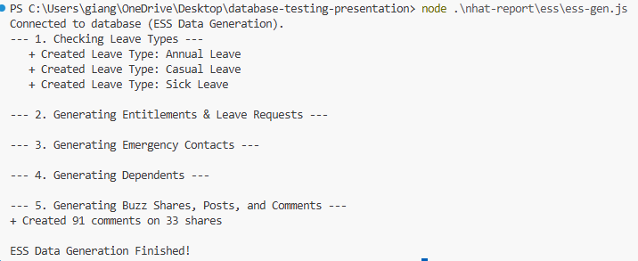

--- 

## Dữ liệu sau khi chạy Script (ESS)

Buzz Feed – Trang Buzz

Nhân viên có thể xem các buzz post được generate tự động:

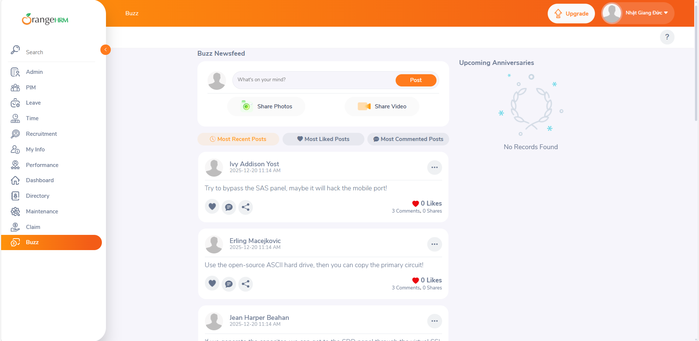

--- 

## Dữ liệu sau khi chạy Script (ESS)

Buzz Feed – Trang Buzz

Nhân viên có thể xem các buzz comment được generate tự động:

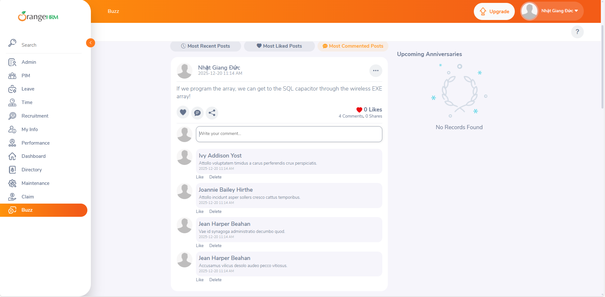


---

## Dữ liệu sau khi chạy Script (ESS)

My Info – Emergency Contacts

Danh sách Emergency Contact được sinh tự động cho mỗi nhân viên:

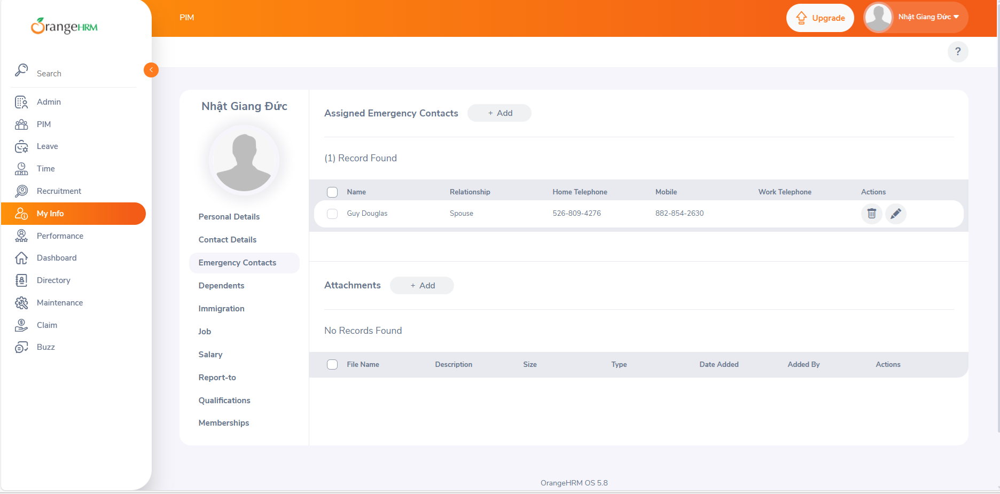


---

## Dữ liệu sau khi chạy Script (ESS)

My Info – Dependents

Thông tin người phụ thuộc (Dependents) được generate cho một số nhân viên:

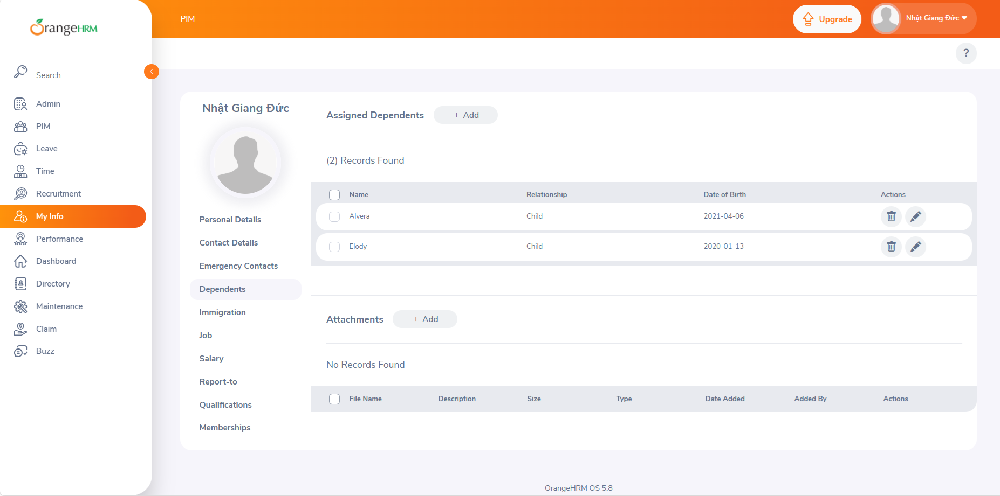

---

## Dữ liệu sau khi chạy Script (ESS)

Leave types:

Một số loại leave types được gen tự động:

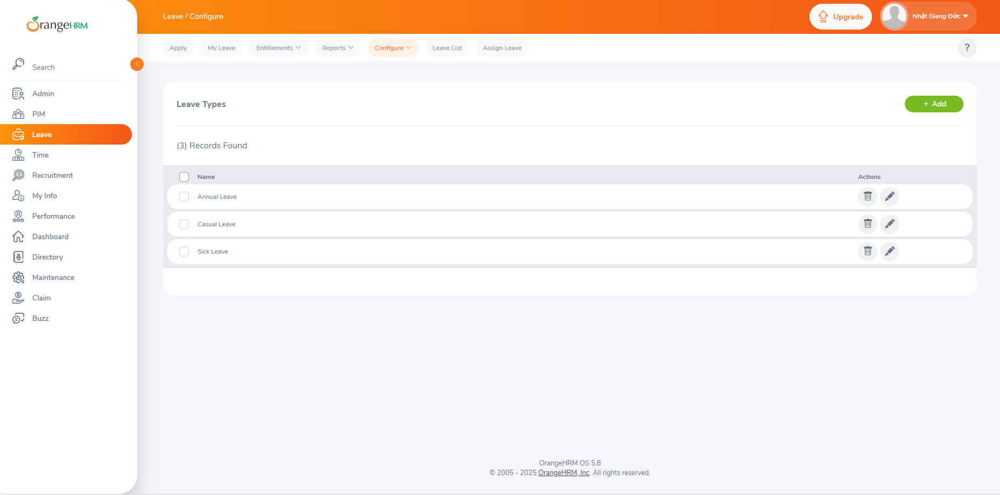

---

## Dữ liệu sau khi chạy Script (ESS)

Leave entitlements:

Một số loại leave entitlements được gen tự động:

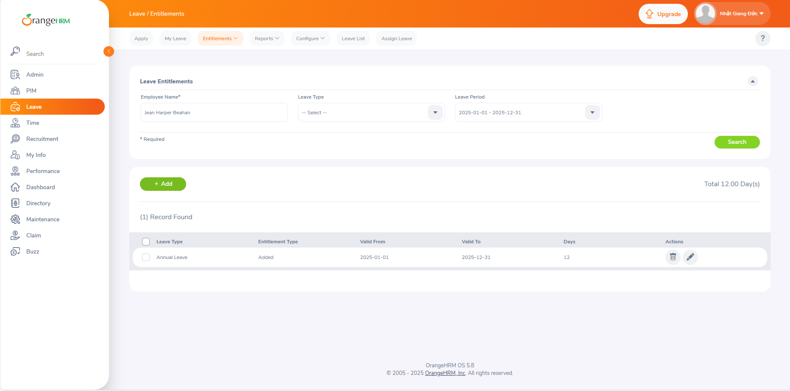

---

## Dữ liệu sau khi chạy Script (ESS)

Leave lists:

Giao diện Leave list với leave data được gen tự động:

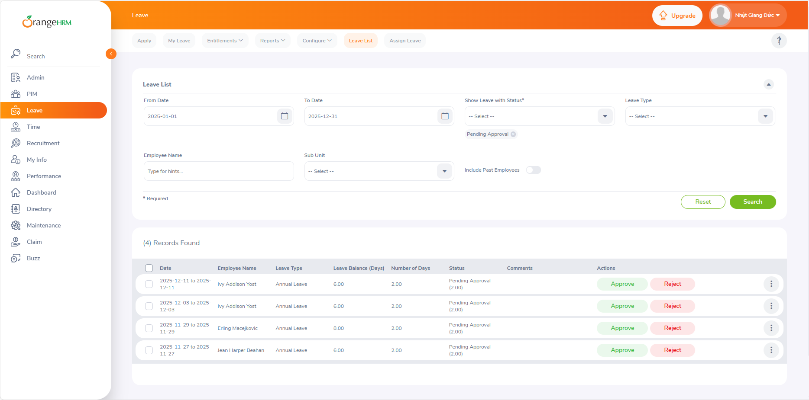

---

## Tổng kết ESS Data Generation

Script mô phỏng đúng hành vi sử dụng thực tế của Employee Self-Service

Dữ liệu sinh ra:

- Đầy đủ

- Không vi phạm ràng buộc CSDL

- Hiển thị được trực tiếp trên giao diện OrangeHRM
