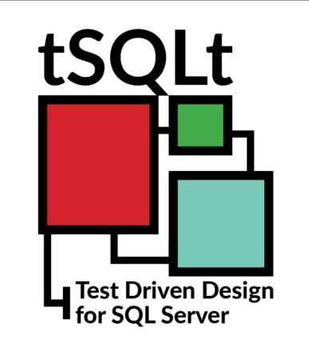
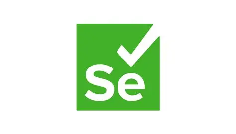
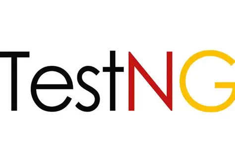

<!-- _class: cover_e --> 
<!-- _footer:  --> 
<!-- _paginate: "" --> 

# HCMUS - Software Engineering
###### Date: Oct, 27. 2025

Lý Trọng Tín
Phan Thanh Tiến
Nguyễn Bùi Vương Tiễn
Giang Đức Nhật

---

<!-- _class: cover_b --> 
<!-- _paginate: "" --> 

# DATABASE TESTING

---

<!-- _class: toc_a -->
<!-- _header: "CONTENTS" -->
<!-- _footer: "" -->
<!-- _paginate: "" -->

- [Giới thiệu về Kiểm thử Cơ sở dữ liệu](#giới-thiệu-về-kiểm-thử-cơ-sở-dữ-liệu)
- [Tổng quan về Database Testing](#tổng-quan-về-database-testing)
- [Các loại Kiểm thử Cơ sở dữ liệu](#các-loại-kiểm-thử-cơ-sở-dữ-liệu)
- [Quy trình Kiểm thử CSDL](#quy-trình-kiểm-thử-csdl)
- [Thách thức trong Kiểm thử CSDL](#thách-thức-trong-kiểm-thử-csdl)
- [Công cụ Kiểm thử CSDL](#công-cụ-kiểm-thử-csdl)
--- 

<!-- _class: trans -->
<!-- _paginate: "" -->

## Giới thiệu

---

<!-- _class: navbar -->
<!-- _header: \ ***@HCMUS*** **Giới thiệu** *Mục tiêu* *Loại kiểm thử* *Quy trình* *Thách thức* *Công cụ* *Kết luận* -->

## Giới thiệu về Kiểm thử Cơ sở dữ liệu

- **Cơ sở dữ liệu (CSDL)**
  - Là một tập hợp dữ liệu có cấu trúc được lưu trữ và quản lý bởi Hệ quản trị cơ sở dữ liệu (DBMS).
  - Ví dụ: MySQL, PostgreSQL, SQL Server, Oracle.

- **Kiểm thử CSDL**
  - Là quá trình xác thực và xác minh chất lượng, chức năng, hiệu suất và bảo mật của CSDL.
  - Đảm bảo việc lưu trữ, truy xuất và quản lý dữ liệu hoạt động chính xác, hiệu quả và an toàn.

- **Vai trò trong quy trình phát triển:**
  - Đảm bảo tính toàn vẹn và chính xác của dữ liệu.
  - Ngăn chặn mất mát hoặc hỏng hóc dữ liệu.
  - Tối ưu hóa hiệu suất và khả năng mở rộng của hệ thống.
  - Tăng cường bảo mật bằng cách xác định các lỗ hổng.

---

<!-- _class: trans -->
<!-- _paginate: "" -->

## Tổng quan

---
<!-- _class: navbar -->
<!-- _header: \ ***@HCMUS*** *Giới thiệu* **Mục tiêu** *Loại kiểm thử* *Quy trình* *Thách thức* *Công cụ* *Kết luận* -->

## Mục đích của Database Testing

- **Database Testing** là quá trình xác thực và xác minh chất lượng, chức năng, hiệu suất và bảo mật của hệ thống CSDL.
- **So với UI Testing:**
  - UI Testing: tập trung vào những gì người dùng thấy (giao diện, bố cục, tương tác).
  - Database Testing: tập trung “bên dưới” giao diện, đảm bảo dữ liệu chính xác, toàn vẹn, an toàn.
- **Vai trò trong quy trình phát triển:**
  - Đảm bảo tính toàn vẹn và chính xác của dữ liệu.
  - Ngăn chặn mất mát hoặc hỏng hóc dữ liệu.
  - Tối ưu hiệu suất và khả năng mở rộng.
  - Tăng cường bảo mật qua việc phát hiện lỗ hổng.
---
<!-- _class: cols2_ul_ci fglass smalltext navbar-->
<!-- _header: \ ***@HCMUS*** *Giới thiệu* **Mục tiêu** *Loại kiểm thử* *Quy trình* *Thách thức* *Công cụ* *Kết luận* -->

## Mục tiêu chính của Database Testing:
- **Ánh xạ Dữ liệu (Data Mapping):** 
  1. Đảm bảo dữ liệu đi từ DB → Backend → Frontend chính xác
  2. Che giấu thông tin nhạy cảm qua DTO phù hợp ngữ cảnh.
- **Toàn vẹn Dữ liệu (Data Integrity):** Xác thực quan hệ và ràng buộc (khóa ngoại, uniqueness, phụ thuộc dữ liệu) theo đặc tả.
- **Tuân thủ & Quy định (Compliance & Regulations):** Bảo đảm thực thi quy tắc nghiệp vụ và tuân thủ GDPR/HIPAA… trong luồng dữ liệu.
- **Thuộc tính ACID của giao dịch:**
  1. Atomicity: hoặc thành công toàn phần, hoặc rollback khi thất bại.
  2. Consistency: dữ liệu đúng sau mỗi giao dịch.
  3. Isolation: các giao dịch độc lập.
  4. Durability: dữ liệu bền vững sau khi commit.

---

<!-- _class: trans -->
<!-- _paginate: "" -->
## Các loại kiểm thử

---
<!-- _class: navbar -->
<!-- _header: \ ***@HCMUS*** *Giới thiệu* *Mục tiêu* **Loại kiểm thử** *Quy trình* *Thách thức* *Công cụ* *Kết luận* -->

## Các loại Kiểm thử Cơ sở dữ liệu

- **Structural Testing:** Tập trung vào việc xác thực các thành phần cấu trúc của CSDL.
- **Functional Testing:** Kiểm tra các chức năng của CSDL từ góc độ người dùng cuối.
- **Non-functional Testing:** Đánh giá các khía cạnh như hiệu suất, bảo mật và khả năng sử dụng của CSDL.

---

<!-- _class: trans -->
<!-- _paginate: "" -->
## Kiểm thử cấu trúc

---
<!-- _class: navbar -->
<!-- _header: \ ***@HCMUS*** *Giới thiệu* *Mục tiêu* **Loại kiểm thử** *Quy trình* *Thách thức* *Công cụ* *Kết luận* -->

## Kiểm thử Cấu trúc

- **Kiểm thử Lược đồ, Bảng và Cột:**
  - Xác thực sự tương thích về kiểu dữ liệu và định dạng giữa ứng dụng và CSDL.
  - Kiểm tra các constraints, khóa chính, khóa ngoại.
  - Đảm bảo không có bảng/cột nào bị thiếu hoặc thừa.
- **Kiểm thử Keys và Indexes:**
  - **Khóa chính/ngoại:** Đảm bảo tính duy nhất, không null và toàn vẹn tham chiếu.
  - **Indexes:** Kiểm tra index được tạo ra đúng và có giúp tăng tốc độ truy vấn không.

---
<!-- _class: navbar -->
<!-- _header: \ ***@HCMUS*** *Giới thiệu* *Mục tiêu* **Loại kiểm thử** *Quy trình* *Thách thức* *Công cụ* *Kết luận* -->

## Kiểm thử Cấu trúc
- **Kiểm thử Stored Procedure:** Xác minh logic, xử lý lỗi, và kết quả trả về có đúng với các đầu vào khác nhau.
- **Kiểm thử Trigger:** Đảm bảo trigger được kích hoạt đúng sự kiện (`INSERT`, `UPDATE`, `DELETE`) và thực thi đúng logic.
---

<!-- _class: trans -->
<!-- _paginate: "" -->
## Kiểm thử chức năng

---
<!-- _class: navbar -->
<!-- _header: \ ***@HCMUS*** *Giới thiệu* *Mục tiêu* **Loại kiểm thử** *Quy trình* *Thách thức* *Công cụ* *Kết luận* -->

## Kiểm thử Chức năng

- **Black Box Testing:**
  - Kiểm tra chức năng từ góc độ người dùng cuối, không quan tâm về cấu trúc bên trong.
  - **Hoạt động CRUD:** Xác minh các thao tác CRUD từ giao diện người dùng được phản ánh chính xác trong CSDL.
- **White Box Testing:**
  - **Logic:** Xác thực các trigger, stored procedure và view, đảm bảo tuân thủ đúng quy tắc nghiệp vụ.
  - **Kiểm tra ràng buộc:** Đảm bảo CSDL chỉ chấp nhận input hợp lệ.

---

<!-- _class: trans -->
<!-- _paginate: "" -->
## Kiểm thử phi chức năng

---
<!-- _class: navbar -->
<!-- _header: \ ***@HCMUS*** *Giới thiệu* *Mục tiêu* **Loại kiểm thử** *Quy trình* *Thách thức* *Công cụ* *Kết luận* -->

## Kiểm thử Phi chức năng

- **Performance Testing:**
  - **Load Testing:** Đánh giá hiệu suất của CSDL dưới tải trọng người dùng dự kiến và đo thời gian phản hồi của truy vấn.
  - **Stress Testing:** Xác định điểm giới hạn của CSDL bằng cách áp dụng tải trọng cực lớn để tìm ra điểm gãy.
- **Security Testing:** Ngăn chặn các lỗ hổng như SQL Injection và đảm bảo kiểm soát truy cập đúng đắn.
---
<!-- _class: navbar  -->
<!-- _header: \ ***@HCMUS*** *Giới thiệu* *Mục tiêu* **Loại kiểm thử** *Quy trình* *Thách thức* *Công cụ* *Kết luận* -->

## Kiểm thử Phi chức năng
- **Recovery Testing:** Xác minh rằng CSDL có thể được phục hồi từ các bản sao lưu sau sự cố.
- **Compatibility Testing:** Đảm bảo CSDL hoạt động tốt trên các hệ điều hành, nền tảng khác nhau.

---

<!-- _class: bq-red -->

> Bảo mật CSDL cần ưu tiên: đảm bảo kiểm soát truy cập chặt chẽ, phòng chống SQL Injection, và mã hóa dữ liệu nhạy cảm ở trạng thái nghỉ và khi truyền tải.

---

<!-- _class: trans -->
<!-- _paginate: "" -->
## Quy trình kiểm thử

---

## Quy trình Kiểm thử CSDL

<!-- _class: cols2_ol_ci fglass smalltext navbar-->
<!-- _header: \ ***@HCMUS*** *Giới thiệu* *Mục tiêu* *Loại kiểm thử* **Quy trình** *Thách thức* *Công cụ* *Kết luận* -->

- **Chuẩn bị Môi trường:** Thiết lập một máy chủ thử nghiệm riêng biệt với cấu hình CSDL cần thiết.
- **Thực thi Kiểm thử:** Chạy các kịch bản và trường hợp kiểm thử đã chuẩn bị.
- **Kiểm tra Kết quả:** Xác minh kết quả đầu ra và kiểm tra xem có lỗi hoặc sai lệch nào không.
- **Xác thực:** So sánh kết quả thực tế với kết quả mong đợi.
- **Báo cáo:** Ghi lại các phát hiện và báo cáo lỗi cho đội phát triển.

---

<!-- _class: trans -->
<!-- _paginate: "" -->
## Thách thức

---

## Thách thức trong Kiểm thử CSDL
<!-- _class: cols2_ul_ci fglass smalltext navbar-->
<!-- _header: \ ***@HCMUS*** *Giới thiệu* *Mục tiêu* *Loại kiểm thử* *Quy trình* **Thách thức** *Công cụ* *Kết luận* -->

- **Dữ liệu lớn và phức tạp:** Việc kiểm thử với khối lượng dữ liệu lớn có thể rất khó khăn và tốn thời gian.
- **Quản lý dữ liệu thử nghiệm:** Tạo và quản lý dữ liệu thử nghiệm phù hợp là rất quan trọng nhưng cũng đầy thách thức.
- **Kiến thức về SQL:** Người kiểm thử cần có hiểu biết tốt về SQL và các khái niệm CSDL.
- **Cô lập môi trường thử nghiệm:** Đảm bảo môi trường thử nghiệm được tách biệt hoàn toàn với môi trường sản phẩm.
- **Chi phí và Thời gian:** Kiểm thử CSDL có thể tốn kém và mất nhiều thời gian, đặc biệt với các hệ thống lớn.

---

<!-- _class: trans -->
<!-- _paginate: "" -->
## Công cụ kiểm thử

---
<!-- _class: navbar -->
<!-- _header: \ ***@HCMUS*** *Giới thiệu* *Mục tiêu* *Loại kiểm thử* *Quy trình* *Thách thức* **Công cụ** *Kết luận* -->

## Công cụ Kiểm thử CSDL

- **Công cụ tạo dữ liệu:**
  - **MS SQL Server Data Generator, ApexSQL Generate:** Dùng để tạo khối lượng lớn dữ liệu thử nghiệm.
- **Công cụ quản lý và kiểm thử:**
  - **tSQLt, DbUnit, TestNG:** Các framework cho kiểm thử đơn vị CSDL.
  - **Selenium:** Dùng để kiểm thử giao diện người dùng và sự tương tác của nó với CSDL.
- **Công cụ kiểm thử hiệu suất:**
  - **JMeter, LoadRunner:** Dùng cho kiểm thử tải và sức chịu đựng.

---

<!-- _class: cols-2 navbar -->
<!-- _header: \ ***@HCMUS*** *Giới thiệu* *Mục tiêu* *Loại kiểm thử* *Quy trình* *Thách thức* **Công cụ** *Kết luận* -->

## Công cụ Kiểm thử CSDL

  

  - **Công cụ tạo dữ liệu:**

  
  
  

  - **Công cụ quản lý và kiểm thử:**

  
  
  

  - **Công cụ kiểm thử hiệu suất:**

  

  

  

  

  

  

  

  

  
  

  

  

  

  

---
<!-- _class: navbar -->
<!-- _header: \ ***@HCMUS*** *Giới thiệu* *Mục tiêu* *Loại kiểm thử* *Quy trình* *Thách thức* **Công cụ** *Kết luận* -->

## Các phương pháp tốt nhất (Best Practices)

- **Sử dụng dữ liệu thực tế:**
  - Kiểm thử với dữ liệu gần giống với môi trường sản phẩm nhất có thể.
- **Tự động hóa khi có thể:**
  - Tự động hóa các bài kiểm thử lặp đi lặp lại để tiết kiệm thời gian và giảm lỗi do con người.
- **Cô lập môi trường thử nghiệm:**
  - Giữ môi trường thử nghiệm tách biệt khỏi môi trường sản phẩm để tránh xung đột.
- **Kết hợp với kiểm thử giao diện:**
  - Kiểm thử CSDL cùng với giao diện người dùng của ứng dụng.
- **Theo dõi hiệu suất:**
  - Liên tục theo dõi hiệu suất CSDL để xác định và giải quyết các tắc nghẽn.

---

## Kết luận

- **Kiểm thử CSDL là cực kỳ quan trọng** để đảm bảo độ tin cậy, tính toàn vẹn và hiệu suất của ứng dụng.
- Quá trình này bao gồm sự kết hợp của **kiểm thử cấu trúc, chức năng và phi chức năng**.
- Mặc dù có nhiều thách thức, việc sử dụng **công cụ phù hợp và các phương pháp tốt nhất** sẽ giúp xây dựng một hệ thống CSDL mạnh mẽ và an toàn.

---

<!-- _class: footnote -->

## Thuật ngữ và tài liệu

- Một số khái niệm tham chiếu trong bài trình bày.

1 Elmasri, R., & Navathe, S. Fundamentals of Database Systems.

2 Date, C. J. An Introduction to Database Systems.

---

<!-- _class: lastpage -->
<!-- _footer: "" -->

###### QnA

