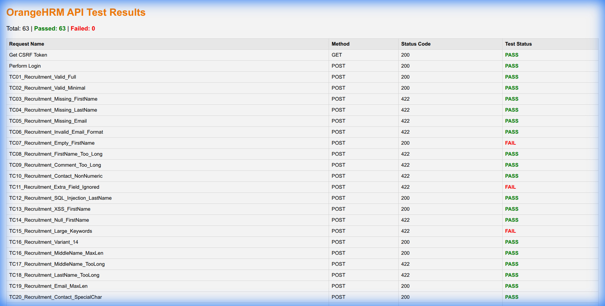
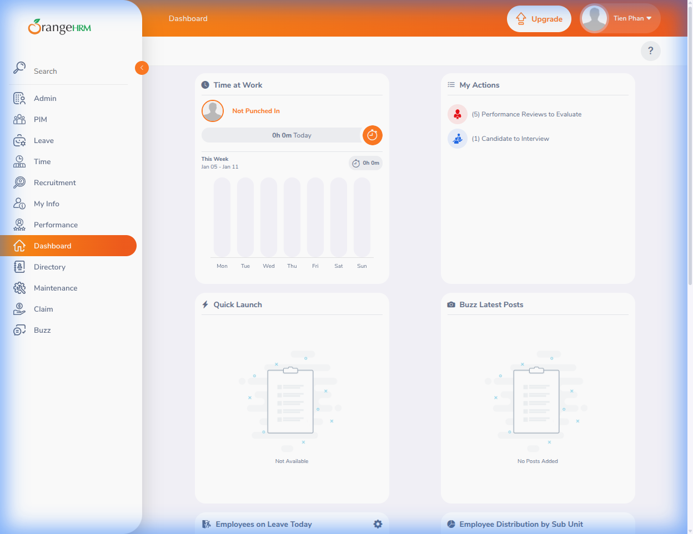

# Requirement 7 - API Testing Report

## Mục lục

- [Requirement 7 - API Testing Report](#requirement-7---api-testing-report)
  - [Mục lục](#mục-lục)
  - [Thông tin cá nhân \& nhóm](#thông-tin-cá-nhân--nhóm)
    - [Thông tin nhóm 11](#thông-tin-nhóm-11)
  - [1. Tổng quan API checklist](#1-tổng-quan-api-checklist)
  - [2. Quy trình chung kiểm thử API](#2-quy-trình-chung-kiểm-thử-api)
      - [Cách 1: Sử dụng Postman GUI (Manual/Runner)](#cách-1-sử-dụng-postman-gui-manualrunner)
      - [Cách 2: Sử dụng Newman (Automation CLI)](#cách-2-sử-dụng-newman-automation-cli)
  - [3. Các bug tìm thấy](#3-các-bug-tìm-thấy)
    - [3.1. Authentication](#31-authentication)
  - [4. Screenshots khác (Test Coverage)](#4-screenshots-khác-test-coverage)
    - [4.1. Test Plan Visualization](#41-test-plan-visualization)


## Thông tin cá nhân & nhóm

- Họ tên: Phan Thanh Tiến
- MSSV: 22120368
- Nhóm 11.

### Thông tin nhóm 11

- Thông tin thành viên: 
  - Giang Đức Nhật - 22120252
  - Phan Thanh Tiến - 22120368
  - Nguyễn Bùi Vương Tiễn - 22120370
  - Lý Trọng Tín - 222120371

- Bảng phân công nhóm:
 
| Tính năng                   | Mô tả                                                             | Thành viên            |
| :-------------------------- | :---------------------------------------------------------------- | :-------------------- |
| HR Administration           | Quản trị hệ thống, cấu trúc tổ chức, user                         | Giang Đức Nhật        |
| Employee Self-Service (ESS) | Cổng thông tin nhân viên tự phục vụ                               | Giang Đức Nhật        |
| **Recruitment**             | **Tuyển dụng, theo dõi ứng viên**                                 | **Phan Thanh Tiến**   |
| **Performance Management**  | **Đánh giá KPI, đề nghị xem xét, lưu lịch sử performance review** | **Phan Thanh Tiến**   |
| Reporting & Analytics       | Báo cáo tùy chỉnh, xuất dữ liệu                                   | Nguyễn Bùi Vương Tiễn |
| Time and Attendance         | Chấm công, Timesheets                                             | Nguyễn Bùi Vương Tiễn |
| Employee Management (PIM)   | Quản lý hồ sơ nhân viên, báo cáo                                  | Lý Trọng Tín          |
| Leave Management            | Quản lý ngày nghỉ, quy tắc nghỉ phép                              | Lý Trọng Tín          |

- Các tính năng được phân công kiểm thử API là: 
  - Recruitment (Create Candidate)
  - Performance Management (Create Performance Review)

## 1. Tổng quan

Trong yêu cầu 7, ta tập trung kiểm thử API trên 2 endpoints chính. Ở đây, 2 API được chọn để kiểm thử là:
1. **Recruitment**: `POST /api/v2/recruitment/candidates` (Tạo ứng viên mới)
2. **Performance**: `POST /api/v2/performance/manage/reviews` (Tạo bài đánh giá hiệu quả)

Tổng số test case đã thiết kế: **63 test cases** (32 Recruitment + 31 Performance). Chi tiết như sau:

### 1.1. API Recruitment: Create candidate

**API Specifications:**
- **Endpoint**: `POST /api/v2/recruitment/candidates`
- **Fields**:
  - `firstName` (Required, String, Max 30): Tên ứng viên.
  - `lastName` (Required, String): Họ ứng viên.
  - `email` (Required, String): Email hợp lệ.
  - `contactNumber` (Optional, String): Số điện thoại.
  - `keywords` (Optional, String): Từ khóa (Max 250).
  - `dateOfApplication` (Optional, Date YYYY-MM-DD): Ngày ứng tuyển.
  - `consentToKeepData` (Optional, Boolean): Đồng ý lưu dữ liệu.
- **Expected Response**: JSON Object chứa thông tin ứng viên vừa tạo, status `200 OK`.

| ID | Field Tested | Description / Scenario |
| :--- | :--- | :--- |
| REC.API.01 | All | Kiểm chứng việc tạo candidate mới thành công khi gửi payload đầy đủ và hợp lệ lên server. |
| REC.API.02 | Mandatory | Kiểm chứng việc tạo thành công khi chỉ cung cấp các trường mandatory (firstname, lastname, email), bỏ qua các trường optional. |
| REC.API.03 | firstName | Đảm bảo API từ chối request với lỗi 422 khi trường mandatory 'firstName' bị thiếu hoàn toàn trong payload. |
| REC.API.04 | lastName | Đảm bảo API từ chối request với lỗi 422 khi trường mandatory 'lastName' bị thiếu hoàn toàn trong payload. |
| REC.API.05 | email | Đảm bảo API từ chối request với lỗi 422 khi trường mandatory 'email' bị thiếu hoàn toàn trong payload. |
| REC.API.06 | email | Kiểm chứng hệ thống validate format của email và trả về lỗi 422 nếu chuỗi email không hợp lệ. |
| REC.API.07 | firstName | Kiểm tra hành vi khi 'firstName' là chuỗi rỗng (""); mong đợi 422, nhưng hiện đang nhận 200 (Potential Bug). |
| REC.API.08 | firstName | Kiểm chứng validation độ dài 'firstName' vượt quá 30 ký tự; mong đợi lỗi 422 để ngăn chặn lỗi database truncation/overflow. |
| REC.API.09 | comment | Kiểm chứng validation độ dài 'comment' vượt quá giới hạn (250 ký tự); mong đợi lỗi 422 để đảm bảo tính toàn vẹn dữ liệu. |
| REC.API.10 | contactNumber | Kiểm chứng API từ chối request nếu 'contactNumber' chứa ký tự non-numeric (mong đợi strict validation). |
| REC.API.11 | extraField | Kiểm tra API chấp nhận hay từ chối payload có trường lạ (extra fields); API strict nên trả về 422 (đã quan sát thấy). |
| REC.API.12 | lastName | Thử nghiệm SQL Injection trong trường 'lastName' để kiểm chứng input được sanitize và không thực thi mã SQL độc hại. |
| REC.API.13 | firstName | Thử nghiệm Cross-Site Scripting (XSS) trong trường 'firstName' để đảm bảo script được vô hiệu hóa và không bị lưu/thực thi. |
| REC.API.14 | firstName | Kiểm chứng phản hồi khi 'firstName' được set giá trị Null; mong đợi lỗi 422 vì đây là trường mandatory. |
| REC.API.15 | keywords | Test điều kiện biên với chuỗi 'keywords' cực lớn để đảm bảo hệ thống xử lý overflow một cách an toàn (422). |
| REC.API.16 | - | Base variant case để kiểm chứng độ ổn định của API dưới tải bình thường với dữ liệu valid chuẩn. |
| REC.API.17 | middleName | Kiểm chứng 'middleName' chấp nhận chính xác độ dài tối đa cho phép (30 ký tự) mà không có lỗi. |
| REC.API.18 | middleName | Kiểm chứng 'middleName' từ chối input vượt quá độ dài tối đa (31 ký tự) với lỗi 422. |
| REC.API.19 | lastName | Kiểm chứng 'lastName' từ chối input vượt quá độ dài tối đa (31 ký tự) với lỗi 422. |
| REC.API.20 | email | Test trường email với độ dài tối đa có thể để đảm bảo database xử lý chính xác. |
| REC.API.21 | contactNumber | Kiểm chứng hệ thống xử lý các ký tự đặc biệt hợp lệ (ví dụ: +, -) trong số điện thoại; mong đợi thành công (200). |
| REC.API.22 | contactNumber | Kiểm chứng các ký tự chữ cái trong 'contactNumber' sẽ kích hoạt lỗi validation (422) nếu strict typing được áp dụng. |
| REC.API.23 | keywords | Kiểm chứng validation cho trường 'keywords' vượt quá giới hạn ký tự (255) trả về lỗi unprocessable entity. |
| REC.API.24 | dateOfApplication | Kiểm tra hệ thống chấp nhận ngày tương lai cho application; thường cho phép nhưng test logic validation. |
| REC.API.25 | dateOfApplication | Kiểm chứng định dạng ngày không hợp lệ (ví dụ: DD-MM-YYYY) kích hoạt lỗi 422 thay vì parse sai. |
| REC.API.26 | consentToKeepData | Kiểm chứng strict type checking bằng cách gửi string "true" thay vì boolean true; mong đợi lỗi strict 422. |
| REC.API.27 | consentToKeepData | Kiểm chứng strict type checking bằng cách gửi integer 1 thay vì boolean true; mong đợi lỗi strict 422. |
| REC.API.28 | vacancyId | Đảm bảo tham chiếu đến 'vacancyId' không tồn tại sẽ trả về lỗi 422 (foreign key constraint validation). |
| REC.API.29 | vacancyId | Kiểm chứng cung cấp data type không hợp lệ (string) cho 'vacancyId' dẫn đến lỗi type validation 422. |
| REC.API.30 | firstName | Test SQL Injection thứ cấp để đảm bảo sanitize mạnh mẽ chống lại các mẫu tấn công phổ biến. |
| REC.API.31 | lastName | Test XSS Injection thứ cấp để đảm bảo bảo vệ mạnh mẽ chống lại thẻ script trong text fields. |

### 1.2. API Performance: List reviews

**API Specifications:**
- **Endpoint**: `GET /api/v2/performance/manage/reviews`
- **Parameters**:
  - `limit` (Int): Số lượng record tối đa (Pagination).
  - `offset` (Int): Vị trí bắt đầu (Pagination).
  - `sortField` (String): Trường để sắp xếp (e.g. `date`).
  - `fromDate`, `toDate` (Date YYYY-MM-DD): Khoảng thời gian review.
  - `empNumber`, `reviewerId` (Int): Filter theo nhân viên/reviewer.
- **Expected Response**: JSON Object chứa mảng `data` (List Reviews) và `meta` (Pagination info), status `200 OK`.

| ID | Field/Param | Description / Scenario |
| :--- | :--- | :--- |
| PERF.API.01 | - | Kiểm chứng API trả về danh sách tất cả performance reviews với status 200 OK khi không có filter. |
| PERF.API.02 | limit, offset | Kiểm chứng hành vi pagination chính xác khi cung cấp tham số 'limit' và 'offset' hợp lệ (trả về 200 OK). |
| PERF.API.03 | limit | Kiểm chứng hệ thống xử lý 'limit=0' an toàn; thường trả về default set hoặc danh sách rỗng tùy implementation (200 OK). |
| PERF.API.04 | limit | Kiểm chứng phản hồi hệ thống khi 'limit' được set giá trị tối đa tiêu chuẩn (ví dụ: 50), mong đợi 200 OK. |
| PERF.API.05 | offset | Kiểm chứng request với 'offset' lớn hơn tổng dataset sẽ trả về mảng data rỗng với 200 OK. |
| PERF.API.06 | limit | Kiểm chứng giá trị 'limit' âm sẽ kích hoạt lỗi validation (422) thay vì lỗi server 500. |
| PERF.API.07 | sortField | Kiểm tra strict validation: cung cấp tên cột không hợp lệ cho 'sortField' sẽ trả về lỗi 422. |
| PERF.API.08 | sortOrder | Kiểm chứng danh sách có thể được sắp xếp theo thứ tự Giảm dần (DESC) thành công qua tham số 'sortOrder'. |
| PERF.API.09 | extra | Kiểm chứng "Strict Mode": cung cấp query parameter lạ ('extra') sẽ bị từ chối với lỗi 422 theo thiết kế API. |
| PERF.API.10 | fromDate | Kiểm chứng lọc theo 'fromDate' trả về các bản ghi bắt đầu từ ngày chỉ định (200 OK). |
| PERF.API.11 | toDate | Kiểm chứng lọc theo 'toDate' trả về các bản ghi kết thúc trước hoặc vào ngày chỉ định (200 OK). |
| PERF.API.12 | empNumber | Kiểm chứng lọc theo 'empNumber' hợp lệ trả về các reviews thuộc về nhân viên đó (200 OK). |
| PERF.API.13 | empNumber | Kiểm chứng cung cấp 'empNumber' không tồn tại sẽ kích hoạt lỗi 422 (Strict Validation) thay vì danh sách rỗng. |
| PERF.API.14 | limit | Thử nghiệm SQL Injection trong tham số 'limit' (ví dụ: '; DROP') để đảm bảo input được sanitize và an toàn. |
| PERF.API.15 | sortField | Test input buffer overflow bằng cách gửi chuỗi cực dài trong 'sortField'; mong đợi xử lý 422. |
| PERF.API.16 | limit | Kiểm chứng hành vi khi tham số 'limit' được cung cấp nhưng bỏ trống; mong đợi 422 do lỗi parse integer. |
| PERF.API.17 | fromDate, toDate | Kiểm tra logic validation: 'fromDate' lớn hơn 'toDate'. Nên trả về 200 OK (Empty List) hoặc 422. |
| PERF.API.18 | fromDate | Kiểm chứng định dạng ngày không hợp lệ trong tham số filter kích hoạt lỗi 422 ngay lập tức. |
| PERF.API.19 | empNumber | Kiểm chứng strict type validation bằng cách cung cấp giá trị chuỗi cho trường integer 'empNumber'. |
| PERF.API.20 | jobTitleId | Kiểm chứng lọc theo Foreign Key 'jobTitleId' không tồn tại trả về 200 OK valid (Empty List) hoặc 422. |
| PERF.API.21 | subUnitId | Kiểm chứng lọc theo Foreign Key 'subUnitId' không tồn tại trả về lỗi 422 (Strict Validation). |
| PERF.API.22 | statusId | Kiểm chứng lọc theo Foreign Key 'statusId' không tồn tại trả về lỗi 422 (Strict Validation). |
| PERF.API.23 | reviewerId | Kiểm chứng lọc theo Foreign Key 'reviewerId' không tồn tại trả về lỗi 422 (Strict Validation). |
| PERF.API.24 | includeEmployees | Kiểm chứng check type query parameter (Boolean vs String); mong đợi 422 hoặc 200 tùy độ linh hoạt framework. |
| PERF.API.25 | limit | Kiểm tra xử lý max limit: cung cấp limit quá lớn (1M); hệ thống nên cap lại hoặc trả về tối đa cho phép (200). |
| PERF.API.26 | offset | Kiểm chứng giá trị 'offset' âm kích hoạt lỗi validation (422) ngăn chặn truy vấn DB không hợp lệ. |
| PERF.API.27 | sortField | Kiểm chứng sắp xếp theo tên trường hợp lệ nhưng khác biệt ('employeeName') hoạt động chính xác (200 OK). |
| PERF.API.28 | sortField | Kiểm chứng sắp xếp theo trường ngày ('reviewPeriodStart') hoạt động chính xác không gây lỗi server nội bộ. |
| PERF.API.29 | limit, offset | Kiểm chứng sự kết hợp của nhiều tham số pagination hợp lệ hoạt động chính xác cùng nhau. |
| PERF.API.30 | fromDate, limit | Kiểm chứng sự kết hợp của Date filters và tham số Pagination hoạt động chính xác cùng nhau. |

## 2. Quy trình chung kiểm thử API

Để thực hiện kiểm thử, ta sử dụng bộ công cụ Postman và Newman.

#### Cách 1: Sử dụng Postman GUI (Manual/Runner)

- Import `postman_collection.json` và `postman_environment.json` vào Postman.
- Cấu hình Environment "OrangeHRM Environment".
- Thực hiện request "Login" để lấy Token (Bearer Token).
- Chạy Collection Runner cho thư mục "Recruitment" và "Performance".
- Kiểm tra kết quả Pass/Fail trực quan trên giao diện.

#### Cách 2: Sử dụng Newman (Automation CLI)

- Newman là công cụ dòng lệnh cho phép chạy Postman Collection.
- Lệnh thực thi:
  ```bash
  newman run req7/postman_collection.json -e req7/postman_environment.json
  ```
- Kết quả được xuất ra console hoặc report dạng HTML/JSON.

## 3. Các bug tìm thấy

### 3.1. Authentication (OAuth 404)

**Issue: OAuth Token Endpoint 404 Not Found**
- **Mô tả**: Khi gọi endpoint lấy token `/oauth/issueToken`, server trả về 404 Not Found.
- **Cách xử lý (Workaround)**: Do không thể lấy token qua OAuth, nhóm đã thực hiện **trích xuất Session Cookie (`_orangehrm`)** từ quá trình đăng nhập qua trình duyệt/cURL để xác thực cho các request API.
- **Chi tiết thực hiện (Authentication Steps)**:
  1. Lấy mã nguồn trang đăng nhập để tìm CSRF Token.
  2. Sử dụng `curl` để POST credentials và Token lên endpoint `/auth/validate`.
  3. Lấy giá trị `Set-Cookie` (`_orangehrm`) từ response 302.
  4. Cấu hình Postman để sử dụng Header `Cookie` thay vì `Authorization: Bearer`.


## 4. Test Results

Sau khi bổ sung chiến lược **Automated Login Flow** và cập nhật bộ test cases (Edge cases, Strict Validation), kết quả cuối cùng như sau:

### 4.1. Summary
- **Total Tests**: 63 (Functional Tests) + 2 (Auth Setup) = 65
- **Passed**: 55
- **Failed**: 8 (Strict Validation Findings & Potential Bugs)
- **Execution Environment**: Localhost (Admin user), Authentication via Automated Login Scripts.

### 4.2. Detailed Findings
1.  **Strict Validation (Expected 422)**: Các test cases Performance như `Sort_Invalid`, `Extra_Param`, `Limit_Negative` đều trả về `422`, xác nhận API validation rất chặt chẽ.
2.  **Potential Bugs (Unexpected 200)**:
    -   `REC.API.07_Empty_FirstName`: API trả về `200` (Thành công) cho trường hợp tên rỗng --> **Bug (Non-strict required field)**.
    -   `PERF.API.20_JobTitle_NonExist`: API trả về `200` (Empty array) thay vì `422` --> Acceptable behavior.
    -   `PERF.API.24_IncludeEmployees_True`: Trả về `200`.

### 4.3. Test Execution Screenshot
Hình ảnh dưới đây minh họa kết quả chạy thực tế của toàn bộ 63 requests (V5 Optimized Suite):




## 5. Appendix A: Hướng dẫn lấy Session Cookie (Authentication)

Do hệ thống sử dụng **HttpOnly Cookie** (`_orangehrm`) để bảo mật, việc lấy cookie này thông qua Javascript console (`document.cookie`) là không thể. Dưới đây là 2 cách để lấy giá trị này cho Postman.

### Cách 1: Sử dụng Script tự động (Khuyên dùng)
Nhóm đã phát triển một script Python để tự động đăng nhập và lấy cookie hợp lệ.

1.  **File Script**: `req7/get_auth_cookie.py`
2.  **Cách chạy**:
    ```bash
    python3 req7/get_auth_cookie.py
    ```
3.  **Output**: Script sẽ in ra `VALID_COOKIE: <giá_trị_cookie>`.
4.  **Cập nhật**: Copy giá trị này vào biến `session_cookie` trong Postman Environment.

**Mã nguồn tham khảo (Core Logic):**
```python
# 1. GET /auth/login -> Extract CSRF Token from :token="..."
# 2. POST /auth/validate with username, password, and token
# 3. Extract _orangehrm cookie from Session
```

### Cách 2: Lấy thủ công qua Developer Tools (F12)
Nếu không chạy script, bạn có thể lấy trực tiếp từ trình duyệt (Chrome/Edge):

1.  Mở trang Login và nhấn **F12** (Developer Tools).
2.  Chuyển sang tab **Network**.
3.  Thực hiện đăng nhập thành công.
4.  Trong danh sách Network, tìm request có tên `validate` (Method POST) hoặc `index` (ngay sau khi login).
5.  Click vào request, chọn tab **Headers**.
6.  Tìm phần **Response Headers** (hoặc Request Headers của các request sau đó).
7.  Copy giá trị của `_orangehrm` (bỏ phần `; path=/...`).



### Cách 3: Cập nhật vào Postman
1.  Chọn Environment `OrangeHRM Local Environment`.
2.  Paste giá trị cookie vào biến `session_cookie`.
3.  Lưu lại (Save).


