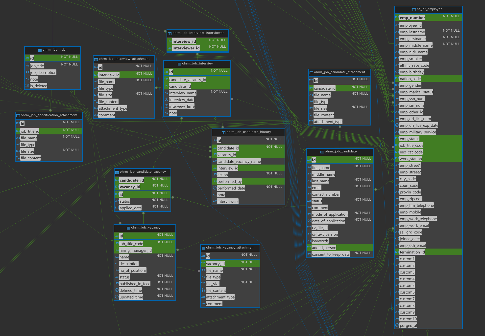
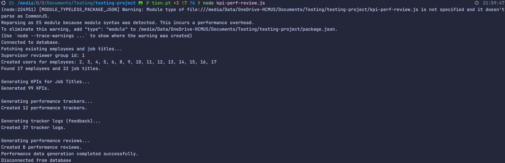
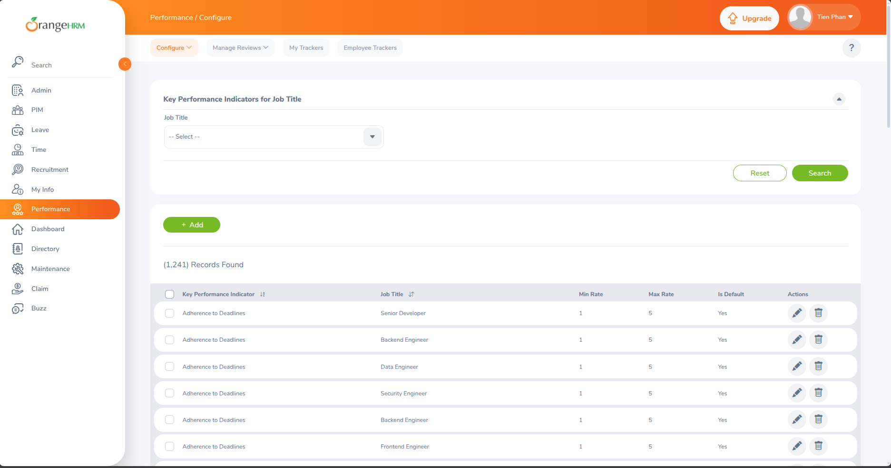
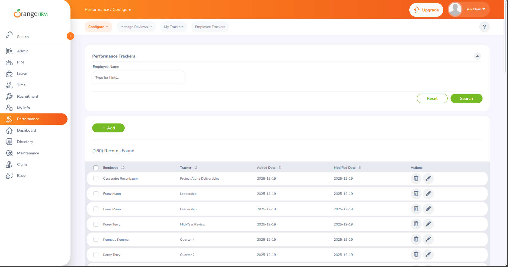
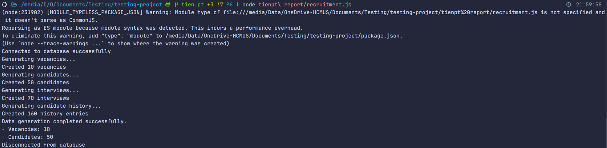
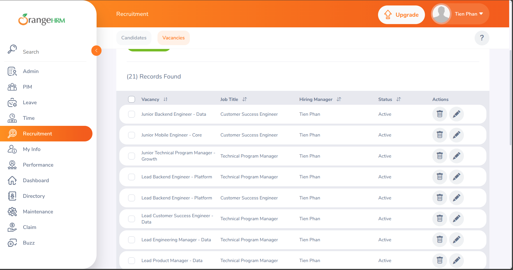

# Personal report - Requirement 2: Data Generation

## Thông tin cá nhân

- Họ tên: Phan Thanh Tiến
- MSSV: 22120368
- Nhóm 11.

### Thông tin nhóm 11

- Thông tin thành viên: 
  - Giang Đức Nhật - 22120252
  - Phan Thanh Tiến - 22120368
  - Nguyễn Bùi Vương Tiễn - 22120370
  - Lý Trọng Tín - 222120371

- Bảng phân công nhóm:
 
| Tính năng                   | Thành viên phụ trách |
| --------------------------- | -------------------- |
| Recruitment                 | Phan Thanh Tiến      |
| Performance Review          | Phan Thanh Tiến      |
| HR Administration           |                      |
| Employee Management (PIM)   |                      |
| Leave Management            |                      |
| Time and Attendance         |                      |
| Reporting and Analytics     |                      |
| Employee Self-Service (ESS) |                      |

## Requirememt 2: Data Generation

### 1.1. Cách chạy

Trong project này, sử dụng Faker.js để generate data giả lập cho các bảng trong hệ thống.

Để chạy các script generate data, chạy các lệnh dưới đây:
```sh
npm install
# node <filename>, for example:
export MYSQL_HOST=localhost
export MYSQL_PORT=3310
export MYSQL_USER=root
export MYSQL_PASSWORD=secret
export MYSQL_DATABASE=orangehrm
node <tên script>
```

- Chú ý:
  - Chạy theo thứ tự: `recruitment.js` (tạo job titles, vacancies, candidates) → `generate-employees.js` (nếu cần thêm nhân viên) → `kpi-perf-review.js`.
  - Nếu database có dữ liệu cũ, các script đều thiết kế để không gây lỗi và kiểm tra dữ liệu trước khi insert thực tế.

### 1.2. Cách hoạt động của các Script

#### 1.2.1. Tổng quan

- Để đảm bảo tính chính xác trong các dữ liệu quan hệ, các script được thiết kế để sinh dữ liệu một cách có thứ tự, và đảm bảo có tính liên kết với các bảng khác.
- Ví dụ: Khi bảng A có foreign key đến bảng B:
  - Đầu tiên, script sinh dữ liệu ở bảng A.
  - Tiếp theo, đi theo khóa ngoại, script sẽ chọn dữ liệu đúng từ bảng A cho khóa ngoại này trước. Sau đó mới sinh các dữ liệu còn lại cho bảng B.
- Với cách làm như vậy, các dữ liệu sinh ra sẽ có tính liên kết đúng đắn, tránh lỗi ràng buộc khóa ngoại.

#### 1.2.2. `generate-employees.js`
- Mục đích: Sinh employee mẫu để phục vụ cho các script khác (ví dụ: performance review).

- Các bảng liên quan:
  - `hs_hr_employee` (emp_number, emp_firstname, emp_lastname, emp_middle_name, employee_id, job_title_code)
- Flow:
  1. Kết nối DB.
  2. Lấy danh sách job titles có trong DB. Nếu không có tiến hành insert.
  3. Tạo 15 nhân viên mới (có `employee_id` dạng `EMP00001`, `EMP00002`, ...), gán `job_title_code` ngẫu nhiên từ danh sách job titles.

#### 1.2.3. `recruitment.js`
- Mục đích: Tạo dữ liệu demo cho module recruitment (job titles, vacancies, candidates, interviews, candidate history).
- Cấu hình thêm:
  - Số lượng vacancies sẽ sinh ra: `GEN_VACANCIES`
  - Số lượng candidate sẽ sinh ra: `GEN_CANDIDATES`
- Các bảng liên quan:
  
  - `ohrm_job_title` (id, job_title, job_description, is_deleted)
  - `ohrm_job_vacancy` (id, job_title_code, hiring_manager_id, name, description, no_of_positions, status, published_in_feed, defined_time, updated_time)
  - `ohrm_job_candidate` (id, first_name, middle_name, last_name, email, contact_number, status, comment, mode_of_application, date_of_application, keywords, added_person)
  - `ohrm_job_candidate_vacancy` (candidate_id, vacancy_id, status, applied_date)
  - `ohrm_job_interview` (candidate_id, interview_name, interview_date, interview_time)
  - `ohrm_job_candidate_history` (candidate_id, action, performed_date, note)
- Flow:
  1. Kết nối DB.
  2. Check bảng `ohm_job_titles` đã có dữ liệu chưa, nếu chưa insert thêm.
  3. Tạo `vacancies` dựa trên job title (mỗi vacancy có `job_title_code`, `hiring_manager_id`, `defined_time`, `updated_time`). Trong đó, `job_title_code` lấy từ bảng `ohrm_job_title`, `hiring_manager_id` lấy từ bảng `hs_hr_employee` theo dữ liệu đã insert trước đó, lấy ngẫu nhiên.
  4. Tạo `candidates` (thông tin cá nhân, status, keywords) và lưu `added_person=1`.
  5. Gán một số candidate vào `ohrm_job_candidate_vacancy` và lưu trạng thái dạng chuỗi trong bảng liên kết.
  6. Tạo `interviews` và `candidate history` cho mỗi candidate.


#### 1.2.4. `kpi-perf-review.js`

- Mục đích: Sinh dữ liệu performance review (KPIs, performance trackers, tracker logs, reviews) cho module Performance.

- Các bảng liên quan:
  
  - `ohrm_kpi` (id, job_title_code, kpi_indicators, min_rating, max_rating, default_kpi)
  - `ohrm_performance_track` (id, emp_number, tracker_name, added_date, added_by, status, modified_date)
  - `ohrm_performance_tracker_reviewer` (performance_track_id, reviewer_id, added_date, status)
  - `ohrm_performance_tracker_log` (performance_track_id, log, comment, status, added_date, user_id, reviewer_id, achievement)
  - `ohrm_performance_review` (status_id, employee_number, work_period_start, work_period_end, job_title_code, due_date, activated_date)
  - `ohrm_reviewer` (review_id, employee_number, status, reviewer_group_id)
- Flow:
  1. Kết nối DB.
  2. Kiểm tra các dữ liệu quan hệ cần thiết, đảm bảo có đủ job titles, đủ nhân viên, reviewer group, users cho employees và reporting relationships. Nếu thiếu, script tự chèn các bản ghi thiết yếu.
  3. Sinh KPIs cho mỗi job title (3–6 KPIs/job title) và ghi vào `ohrm_kpi`.
  4. Sinh performance trackers (mỗi tracker gán cho 1 `emp_number`) và reviewer tương ứng.
  5. Sinh tracker logs (feedback) liên quan đến từng tracker; sử dụng `user_id` hợp lệ (script tạo user accounts cho employees nếu cần).
  6. Sinh performance reviews và mapping reviewer (`ohrm_reviewer`).

### 1.3. Kết quả chạy

- Sau khi chạy script sinh performance review:
  
- Trên hệ thống, các thông tin được sinh ra gồm: KPI, Tracker, Review
  
  

- Sau khi chạy script sinh recruitment:
  
- Recruitment candidates xuất hiện trên hệ thống:
  
- Recruitment vacancies xuất hiện trên hệ thống:
  
- Một candidate có đầy đủ chi tiết được sinh ra:
  
