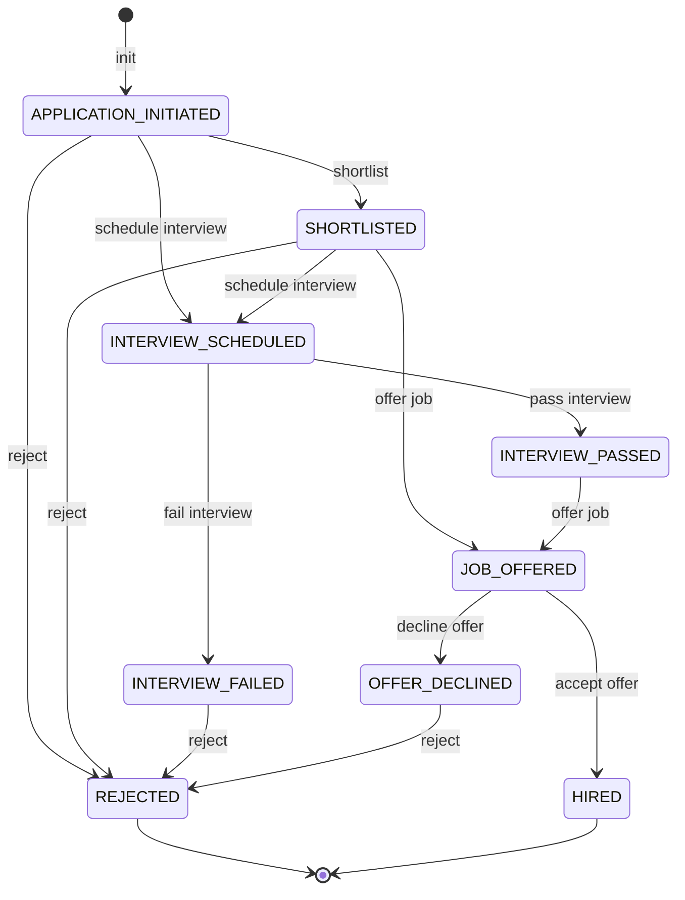
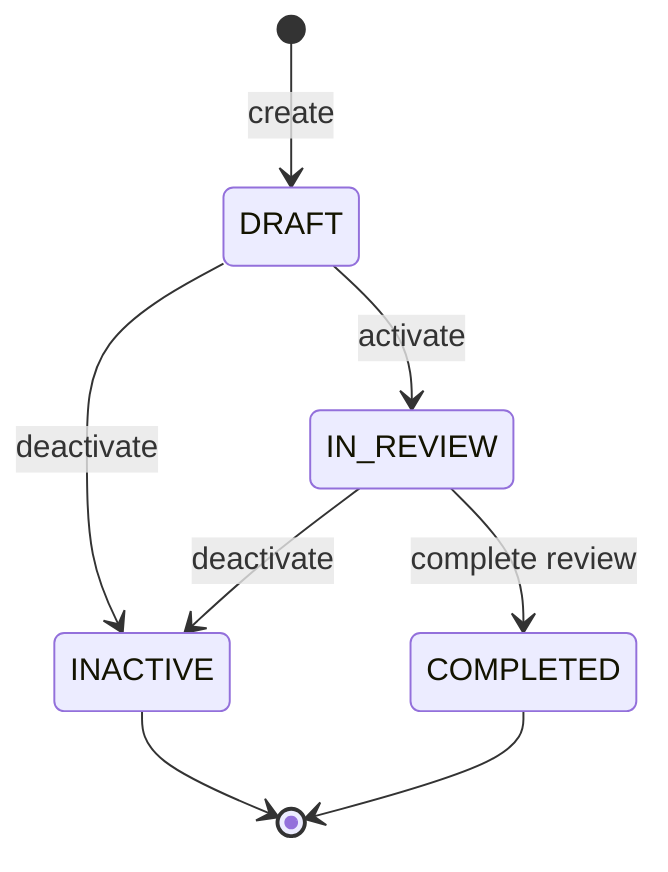

# Personal report - Requirement 2: Data Generation

## Thông tin cá nhân & nhóm

- Họ tên: Phan Thanh Tiến
- MSSV: 22120368
- Nhóm 11.

### Thông tin nhóm 11

- Thông tin thành viên: 
  - Giang Đức Nhật - 22120252
  - Phan Thanh Tiến - 22120368
  - Nguyễn Bùi Vương Tiễn - 22120370
  - Lý Trọng Tín - 222120371

- Bảng phân công nhóm:
 
| Tính năng                   | Thành viên phụ trách |
| --------------------------- | -------------------- |
| Recruitment                 | Phan Thanh Tiến      |
| Performance Review          | Phan Thanh Tiến      |
| HR Administration           |                      |
| Employee Management (PIM)   |                      |
| Leave Management            |                      |
| Time and Attendance         |                      |
| Reporting and Analytics     |                      |
| Employee Self-Service (ESS) |                      |


## Mục lục

- [Personal report - Requirement 2: Data Generation](#personal-report---requirement-2-data-generation)
  - [Thông tin cá nhân \& nhóm](#thông-tin-cá-nhân--nhóm)
    - [Thông tin nhóm 11](#thông-tin-nhóm-11)
  - [Mục lục](#mục-lục)
  - [1. Requirement 3 - Tính năng 1: Recruitment](#1-requirement-3---tính-năng-1-recruitment)
    - [1.1. Domain testing:](#11-domain-testing)
    - [1.2. Use case testing](#12-use-case-testing)
    - [1.3. State transition testing](#13-state-transition-testing)
    - [1.4. All-pairs testing / Decision table testing](#14-all-pairs-testing--decision-table-testing)
  - [2. Requirement 3 - Tính năng 2: Performance Review](#2-requirement-3---tính-năng-2-performance-review)
    - [2.1. Domain testing](#21-domain-testing)
    - [2.2. Use case testing](#22-use-case-testing)
    - [2.3. State transition testing](#23-state-transition-testing)
    - [2.4. All-pairs testing / Decision table testing](#24-all-pairs-testing--decision-table-testing)


## 1. Requirement 3 - Tính năng 1: Recruitment

### 1.1. Domain testing: 

Trước hết, về tính năng REC01, Thêm/Sửa Vacancy, ta sẽ áp dụng kĩ thuật Domain Testing để thiết kế test case như sau:

- Đầu tiên, xác định các miền giá trị hợp lệ và không hợp lệ cho các trường trong form, như sau:
  - Vacancy name:
    - Hợp lệ: Chuỗi không rỗng
    - Không hợp lệ: Chuỗi rỗng, độ dài dưới 50 ký tự.
  - Job Title:
    - Hợp lệ: Chọn từ danh sách có sẵn.
    - Không hợp lệ: Không chọn.
  - Hiring Manager:
    - Hợp lệ: Chọn từ danh sách có sẵn.
    - Không hợp lệ: Không chọn.
  - No. of Positions:
    - Hợp lệ: Số nguyên dương, 1 <= x <= 99.
    - Không hợp lệ: Số nằm ngoài khoảng hợp lệ, số thập phân, ký tự không phải là số.
  - Document Upload:
    - Hợp lệ: File có định dạng được phép (ví dụ: .pdf, .doc, .txt) và kích thước dưới 1MB.
    - Không hợp lệ: File có định dạng không được phép hoặc kích thước vượt quá giới hạn.

- Với mỗi trường, ta sẽ thiết kế các test case để kiểm tra cả giá trị hợp lệ và không hợp lệ, đảm bảo hệ thống xử lý đúng các tình huống này.
- Tận dụng các giá trị biên, ví dụ: kiểm tra No. of Positions với giá trị 1, 99, 0, 100 để đảm bảo hệ thống xử lý đúng các giá trị biên này.

Từ các phân tích trên, ta có danh sách test case như sau:

```
REC01.01	Thêm vacancy mới thành công (tất cả hợp lệ)
REC01.02	Để trống Vacancy name
REC01.03	Để trống job title
REC01.04	Number position nhỏ hơn giá trị tối thiểu (0)
REC01.05	Number position lớn hơn giá trị tối đa (99)
REC01.06	Number position là giá trị không phải số
REC01.07	Thêm attachment hợp lệ: Là attachment nhỏ hơn 1MB, thuộc định dạng cho phép như txt, pdf, doc
REC01.08	Thêm attachment không hợp lệ: Là attachment lớn hơn 1MB HOẶC thuộc định dạng không hỗ trợ: md, ipynb, ...
```

Tương tự cách làm như trên, ta sẽ thiết kế các test case cho tính năng REC02 và REC03 như sau:
```
REC02.09	Nhập lịch interview trước ngày hiện tại
REC03.02	Email không đúng định dạng
REC03.03	Để trống First name hoặc Last name
REC03.04	Contact number không đúng định dạng (là chuỗi bao gồm các kí tự: 0-9,+,-,/,()) 
```

### 1.2. Use case testing

- Xác định các use case chính của tính năng Recruitment. Ở đây em đưa ra các use case để test như sau:

```
REC01	Thêm/Sửa Vacancy
REC02	Quản lí trạng thái candidate
REC03	Quản lí thông tin candidate
```

- Với mỗi tính năng, có ít nhất 1 test case để kiểm tra main flow và các alternative flow nếu có.
```
REC01.01	Thêm vacancy mới thành công
REC03.01	Tạo mới candidate với đầy đủ thông tin
```

### 1.3. State transition testing

Sau đây là state diagram mô tả trạng thái của một candidate trong quá trình tuyển dụng:



Sử dụng sơ đồ trên, áp dụng kĩ thuật state transition testing, ta cần test trên các transition, với danh sách test như sau:

```
REC02.02	Chuyển ứng viên từ trạng thái "APPLICATION INITIATED" sang "REJECTED"
REC02.03	Chuyển ứng viên từ trạng thái "SHORTLISTED" sang "INTERVIEW SCHEDULED"
REC02.04	Chuyển ứng viên từ trạng thái "INTERVIEW SCHEDULED" sang "INTERVIEW PASSED"
REC02.05	Chuyển ứng viên từ trạng thái "INTERVIEW SCHEDULED" sang "INTERVIEW FAILED"
REC02.06	Chuyển ứng viên từ trạng thái "INTERVIEW PASSED" sang "JOB OFFERED"
REC02.07	Chuyển ứng viên từ trạng thái "JOB OFFERED" sang "HIRED"
REC02.08	Chuyển ứng viên từ trạng thái "JOB OFFERED" sang "OFFER DECLINED"
```

### 1.4. All-pairs testing / Decision table testing

Trong 2 tính năng được phân công, nhận thấy rằng cả 2 tính năng này không có phần đưa ra các quyết định dựa trên các điều kiện. Do đó, không áp dụng kĩ thuật Decision table testing hoặc All-pairs testing cho các tính năng này.

## 2. Requirement 3 - Tính năng 2: Performance Review

### 2.1. Domain testing

Đối với tính năng PERF01, Tạo/Sửa Performance Review, ta sẽ áp dụng kĩ thuật Domain Testing để thiết kế test case như sau:

- Xác định các miền giá trị hợp lệ và không hợp lệ cho các trường trong form Performance Review, như sau:
  - Key performance Indicator (KPI) Title:
    - Hợp lệ: Chuỗi hợp lệ, không rỗng, độ dài bé hơn hoặc bằng 100 ký tự.
    - Không hợp lệ: Chuỗi rỗng, hoặc chuỗi có độ dài trên 100 ký tự.
  - Job Title:
    - Hợp lệ: Chọn từ danh sách có sẵn.
    - Không hợp lệ: Không chọn.
  - Minimum/Maximum rating Rating:
    - Hợp lệ: Số nguyên không âm, min rating < max rating.
    - Không hợp lệ: Không phải số nguyên, min rating > max rating.
- Từ danh sách trên, thiết kế test case để kiểm tra miền hợp lệ và không hợp lệ trên mỗi field. Danh sách test case như sau, gồm 1 test case tất cả hợp lệ và các test case không hợp lệ:
```
PERF01.01	Thêm KPI mới thành công (tất cả hợp lệ)
PERF01.03	Thêm KPI, bỏ trống title
PERF01.05	Thêm KPI với Min/Max Rating âm
PERF01.06	Thêm KPI có Min rating > Max Rating
PERF03.09	Nhập điểm là ký tự chữ
```

### 2.2. Use case testing

Cũng tương tự tính năng Recruiment, ta xác định các use case chính của tính năng Performance Review như sau:

```
PERF01	Tạo/Sửa KPI
PERF02	Thêm/Sửa Performance Tracker
PERF03	Tạo/Sửa Performance Review
```

Với mỗi tính năng, tập trung vào main flow và alternative flow nếu có:

```
PERF01.01	Thêm KPI mới thành công
PERF01.02	Chỉnh sửa KPI default thành công
PERF01.04	Cập nhật tên KPI
PERF01.07	Xóa KPI ra khỏi danh sách 

PERF02.01	Thêm mới tracker thành công
PERF02.02	Thêm log vào tracker
PERF02.03	Sửa nội dung log tracker
PERF02.04	Thêm reviewer vào Tracker

PERF03.01	Tạo review
PERF03.02	Tạo review với due date = end date
PERF03.10	Resume evaluation
PERF03.11	Lưu đánh giá bản draft
PERF03.13	Mở 2 tab trên cùng 1 màn hình review employee
```

### 2.3. State transition testing

Dưới đây là state diagram mô tả trạng thái của một Performance Review trong hệ thống:



Áp dụng kĩ thuật state transition testing, ta cần test trên các transition, với danh sách test như sau:

```
PERF03.03	Chuyển trạng thái "Draft" sang "Activate Review"
PERF03.04	Chuyển trạng thái "Activate Review" sang "In Progress"
PERF03.05	Chuyển trạng thái "In Progress" sang "Inactive"
PERF03.12	Chuyển trạng thái "In Progress" sang "Completed"
```

Ở đây có 5 transtition nhưng có 4 test case vì có 2 transition từ trạng thái DRAFT sang INACTIVE và từ IN_REVIEW sang INACTIVE. Trạng thái INACTIVE có thể được chuyển đến từ bất kì trạng thái nào trong 2 trạng thái này.


### 2.4. All-pairs testing / Decision table testing

Trong 2 tính năng được phân công, nhận thấy rằng cả 2 tính năng này không có phần đưa ra các quyết định dựa trên các điều kiện. Do đó, không áp dụng kĩ thuật Decision table testing hoặc All-pairs testing cho các tính năng này.