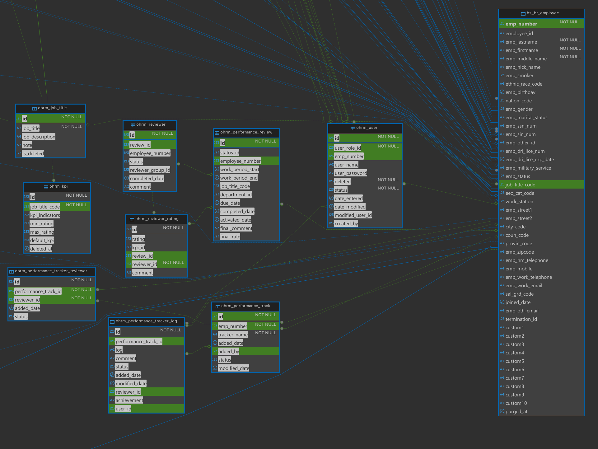

# Personal report

## Data Generation

Trong project này, sử dụng Faker.js để generate data giả lập cho các bảng trong hệ thống.

Để bắt đầu, chạy các lệnh sau: 
```sh
npm install
# node <filename>, for example:
node recruitment.js
```

## Tính năng 1: Performance review

- Dưới đây là ảnh lược đồ quan hệ có liên quan đến tính năng performance review:
  
- Script `kpi-perf-review.js` được đùng để generate data cho bảng trên. 

  