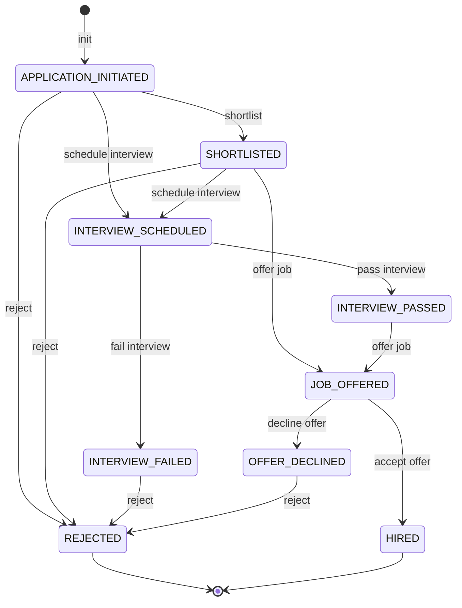
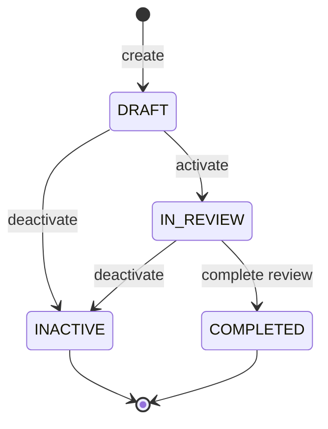

# Personal report - Requirement 1,2,3

## Thông tin cá nhân

- Họ tên: Phan Thanh Tiến
- MSSV: 22120368
- Nhóm 11.

## 1. Requirememt 2: Data Generation

### 1.1. Cách chạy

Trong project này, sử dụng Faker.js để generate data giả lập cho các bảng trong hệ thống.

Để chạy các script generate data, chạy các lệnh dưới đây:
```sh
npm install
# node <filename>, for example:
export MYSQL_HOST=localhost
export MYSQL_PORT=3310
export MYSQL_USER=root
export MYSQL_PASSWORD=secret
export MYSQL_DATABASE=orangehrm
node <tên script>
```

- Chú ý:
  - Chạy theo thứ tự: `recruitment.js` (tạo job titles, vacancies, candidates) → `generate-employees.js` (nếu cần thêm nhân viên) → `kpi-perf-review.js`.
  - Nếu database có dữ liệu cũ, các script đều thiết kế để không gây lỗi và kiểm tra dữ liệu trước khi insert thực tế.

### 1.2. Cách hoạt động của các Script

#### 1.2.1. Tổng quan

- Để đảm bảo tính chính xác trong các dữ liệu quan hệ, các script được thiết kế để sinh dữ liệu một cách có thứ tự, và đảm bảo có tính liên kết với các bảng khác.
- Ví dụ: Khi bảng A có foreign key đến bảng B:
  - Đầu tiên, script sinh dữ liệu ở bảng A.
  - Tiếp theo, đi theo khóa ngoại, script sẽ chọn dữ liệu đúng từ bảng A cho khóa ngoại này trước. Sau đó mới sinh các dữ liệu còn lại cho bảng B.
- Với cách làm như vậy, các dữ liệu sinh ra sẽ có tính liên kết đúng đắn, tránh lỗi ràng buộc khóa ngoại.

#### 1.2.2. `generate-employees.js`
- Mục đích: Sinh employee mẫu để phục vụ cho các script khác (ví dụ: performance review).

- Các bảng liên quan:
  - `hs_hr_employee` (emp_number, emp_firstname, emp_lastname, emp_middle_name, employee_id, job_title_code)
- Flow:
  1. Kết nối DB.
  2. Lấy danh sách job titles có trong DB. Nếu không có tiến hành insert.
  3. Tạo 15 nhân viên mới (có `employee_id` dạng `EMP00001`, `EMP00002`, ...), gán `job_title_code` ngẫu nhiên từ danh sách job titles.

#### 1.2.3. `recruitment.js`
- Mục đích: Tạo dữ liệu demo cho module recruitment (job titles, vacancies, candidates, interviews, candidate history).
- Cấu hình thêm:
  - Số lượng vacancies sẽ sinh ra: `GEN_VACANCIES`
  - Số lượng candidate sẽ sinh ra: `GEN_CANDIDATES`
- Các bảng liên quan:
  
  - `ohrm_job_title` (id, job_title, job_description, is_deleted)
  - `ohrm_job_vacancy` (id, job_title_code, hiring_manager_id, name, description, no_of_positions, status, published_in_feed, defined_time, updated_time)
  - `ohrm_job_candidate` (id, first_name, middle_name, last_name, email, contact_number, status, comment, mode_of_application, date_of_application, keywords, added_person)
  - `ohrm_job_candidate_vacancy` (candidate_id, vacancy_id, status, applied_date)
  - `ohrm_job_interview` (candidate_id, interview_name, interview_date, interview_time)
  - `ohrm_job_candidate_history` (candidate_id, action, performed_date, note)
- Flow:
  1. Kết nối DB.
  2. Check bảng `ohm_job_titles` đã có dữ liệu chưa, nếu chưa insert thêm.
  3. Tạo `vacancies` dựa trên job title (mỗi vacancy có `job_title_code`, `hiring_manager_id`, `defined_time`, `updated_time`). Trong đó, `job_title_code` lấy từ bảng `ohrm_job_title`, `hiring_manager_id` lấy từ bảng `hs_hr_employee` theo dữ liệu đã insert trước đó, lấy ngẫu nhiên.
  4. Tạo `candidates` (thông tin cá nhân, status, keywords) và lưu `added_person=1`.
  5. Gán một số candidate vào `ohrm_job_candidate_vacancy` và lưu trạng thái dạng chuỗi trong bảng liên kết.
  6. Tạo `interviews` và `candidate history` cho mỗi candidate.


#### 1.2.4. `kpi-perf-review.js`

- Mục đích: Sinh dữ liệu performance review (KPIs, performance trackers, tracker logs, reviews) cho module Performance.

- Các bảng liên quan:
  
  - `ohrm_kpi` (id, job_title_code, kpi_indicators, min_rating, max_rating, default_kpi)
  - `ohrm_performance_track` (id, emp_number, tracker_name, added_date, added_by, status, modified_date)
  - `ohrm_performance_tracker_reviewer` (performance_track_id, reviewer_id, added_date, status)
  - `ohrm_performance_tracker_log` (performance_track_id, log, comment, status, added_date, user_id, reviewer_id, achievement)
  - `ohrm_performance_review` (status_id, employee_number, work_period_start, work_period_end, job_title_code, due_date, activated_date)
  - `ohrm_reviewer` (review_id, employee_number, status, reviewer_group_id)
- Flow:
  1. Kết nối DB.
  2. Kiểm tra các dữ liệu quan hệ cần thiết, đảm bảo có đủ job titles, đủ nhân viên, reviewer group, users cho employees và reporting relationships. Nếu thiếu, script tự chèn các bản ghi thiết yếu.
  3. Sinh KPIs cho mỗi job title (3–6 KPIs/job title) và ghi vào `ohrm_kpi`.
  4. Sinh performance trackers (mỗi tracker gán cho 1 `emp_number`) và reviewer tương ứng.
  5. Sinh tracker logs (feedback) liên quan đến từng tracker; sử dụng `user_id` hợp lệ (script tạo user accounts cho employees nếu cần).
  6. Sinh performance reviews và mapping reviewer (`ohrm_reviewer`).

### 1.3. Kết quả chạy

- Sau khi chạy script sinh performance review:
  
- Trên hệ thống, các thông tin được sinh ra gồm: KPI, Tracker, Review
  
  

- Sau khi chạy script sinh recruitment:
  
- Recruitment candidates xuất hiện trên hệ thống:
  
- Recruitment vacancies xuất hiện trên hệ thống:
  
- Một candidate có đầy đủ chi tiết được sinh ra:
  

## 2. Requirement 3 - Tính năng 1: Recruitment

### 2.1. Domain testing: 

Trước hết, về tính năng REC01, Thêm/Sửa Vacancy, ta sẽ áp dụng kĩ thuật Domain Testing để thiết kế test case như sau:

- Đầu tiên, xác định các miền giá trị hợp lệ và không hợp lệ cho các trường trong form, như sau:
  - Vacancy name:
    - Hợp lệ: Chuỗi không rỗng
    - Không hợp lệ: Chuỗi rỗng, độ dài dưới 50 ký tự.
  - Job Title:
    - Hợp lệ: Chọn từ danh sách có sẵn.
    - Không hợp lệ: Không chọn.
  - Hiring Manager:
    - Hợp lệ: Chọn từ danh sách có sẵn.
    - Không hợp lệ: Không chọn.
  - No. of Positions:
    - Hợp lệ: Số nguyên dương, 1 <= x <= 99.
    - Không hợp lệ: Số nằm ngoài khoảng hợp lệ, số thập phân, ký tự không phải là số.
  - Document Upload:
    - Hợp lệ: File có định dạng được phép (ví dụ: .pdf, .doc, .txt) và kích thước dưới 1MB.
    - Không hợp lệ: File có định dạng không được phép hoặc kích thước vượt quá giới hạn.

- Với mỗi trường, ta sẽ thiết kế các test case để kiểm tra cả giá trị hợp lệ và không hợp lệ, đảm bảo hệ thống xử lý đúng các tình huống này.
- Tận dụng các giá trị biên, ví dụ: kiểm tra No. of Positions với giá trị 1, 99, 0, 100 để đảm bảo hệ thống xử lý đúng các giá trị biên này.

Từ các phân tích trên, ta có danh sách test case như sau:

```
REC01.01	Thêm vacancy mới thành công (tất cả hợp lệ)
REC01.02	Để trống Vacancy name
REC01.03	Để trống job title
REC01.04	Number position nhỏ hơn giá trị tối thiểu (0)
REC01.05	Number position lớn hơn giá trị tối đa (99)
REC01.06	Number position là giá trị không phải số
REC01.07	Thêm attachment hợp lệ: Là attachment nhỏ hơn 1MB, thuộc định dạng cho phép như txt, pdf, doc
REC01.08	Thêm attachment không hợp lệ: Là attachment lớn hơn 1MB HOẶC thuộc định dạng không hỗ trợ: md, ipynb, ...
```

Tương tự cách làm như trên, ta sẽ thiết kế các test case cho tính năng REC02 và REC03 như sau:
```
REC02.09	Nhập lịch interview trước ngày hiện tại
REC03.02	Email không đúng định dạng
REC03.03	Để trống First name hoặc Last name
REC03.04	Contact number không đúng định dạng (là chuỗi bao gồm các kí tự: 0-9,+,-,/,()) 
```

### 2.2. Use case testing

- Xác định các use case chính của tính năng Recruitment. Ở đây em đưa ra các use case để test như sau:

```
REC01	Thêm/Sửa Vacancy
REC02	Quản lí trạng thái candidate
REC03	Quản lí thông tin candidate
```

- Với mỗi tính năng, có ít nhất 1 test case để kiểm tra main flow và các alternative flow nếu có.
```
REC01.01	Thêm vacancy mới thành công
REC03.01	Tạo mới candidate với đầy đủ thông tin
```

### 2.3. State transition testing

Sau đây là state diagram mô tả trạng thái của một candidate trong quá trình tuyển dụng:



Sử dụng sơ đồ trên, áp dụng kĩ thuật state transition testing, ta cần test trên các transition, với danh sách test như sau:

```
REC02.02	Chuyển ứng viên từ trạng thái "APPLICATION INITIATED" sang "REJECTED"
REC02.03	Chuyển ứng viên từ trạng thái "SHORTLISTED" sang "INTERVIEW SCHEDULED"
REC02.04	Chuyển ứng viên từ trạng thái "INTERVIEW SCHEDULED" sang "INTERVIEW PASSED"
REC02.05	Chuyển ứng viên từ trạng thái "INTERVIEW SCHEDULED" sang "INTERVIEW FAILED"
REC02.06	Chuyển ứng viên từ trạng thái "INTERVIEW PASSED" sang "JOB OFFERED"
REC02.07	Chuyển ứng viên từ trạng thái "JOB OFFERED" sang "HIRED"
REC02.08	Chuyển ứng viên từ trạng thái "JOB OFFERED" sang "OFFER DECLINED"
```

### 4. All-pairs testing / Decision table testing

Do không có nhiều điều kiện và phần đưa ra quyết định của hệ thống trong tính năng Recruitment nên không sử dụng kĩ thuật này để thiết kế test case.

## 3. Requirement 3 - Tính năng 2: Performance Review

### 3.1. Domain testing

Đối với tính năng PERF01, Tạo/Sửa Performance Review, ta sẽ áp dụng kĩ thuật Domain Testing để thiết kế test case như sau:

- Xác định các miền giá trị hợp lệ và không hợp lệ cho các trường trong form Performance Review, như sau:
  - Key performance Indicator (KPI) Title:
    - Hợp lệ: Chuỗi hợp lệ, không rỗng, độ dài bé hơn hoặc bằng 100 ký tự.
    - Không hợp lệ: Chuỗi rỗng, hoặc chuỗi có độ dài trên 100 ký tự.
  - Job Title:
    - Hợp lệ: Chọn từ danh sách có sẵn.
    - Không hợp lệ: Không chọn.
  - Minimum/Maximum rating Rating:
    - Hợp lệ: Số nguyên không âm, min rating < max rating.
    - Không hợp lệ: Không phải số nguyên, min rating > max rating.
- Từ danh sách trên, thiết kế test case để kiểm tra miền hợp lệ và không hợp lệ trên mỗi field. Danh sách test case như sau, gồm 1 test case tất cả hợp lệ và các test case không hợp lệ:
```
PERF01.01	Thêm KPI mới thành công (tất cả hợp lệ)
PERF01.03	Thêm KPI, bỏ trống title
PERF01.05	Thêm KPI với Min/Max Rating âm
PERF01.06	Thêm KPI có Min rating > Max Rating
PERF03.09	Nhập điểm là ký tự chữ
```

### 3.2. Use case testing

Cũng tương tự tính năng Recruiment, ta xác định các use case chính của tính năng Performance Review như sau:

```
PERF01	Tạo/Sửa KPI
PERF02	Thêm/Sửa Performance Tracker
PERF03	Tạo/Sửa Performance Review
```

Với mỗi tính năng, tập trung vào main flow và alternative flow nếu có:

```
PERF01.01	Thêm KPI mới thành công
PERF01.02	Chỉnh sửa KPI default thành công
PERF01.04	Cập nhật tên KPI
PERF01.07	Xóa KPI ra khỏi danh sách 

PERF02.01	Thêm mới tracker thành công
PERF02.02	Thêm log vào tracker
PERF02.03	Sửa nội dung log tracker
PERF02.04	Thêm reviewer vào Tracker

PERF03.01	Tạo review
PERF03.02	Tạo review với due date = end date
PERF03.10	Resume evaluation
PERF03.11	Lưu đánh giá bản draft
PERF03.13	Mở 2 tab trên cùng 1 màn hình review employee
```

### 3.3. State transition testing

Dưới đây là state diagram mô tả trạng thái của một Performance Review trong hệ thống:



Áp dụng kĩ thuật state transition testing, ta cần test trên các transition, với danh sách test như sau:

```
PERF03.03	Chuyển trạng thái "Draft" sang "Activate Review"
PERF03.04	Chuyển trạng thái "Activate Review" sang "In Progress"
PERF03.05	Chuyển trạng thái "In Progress" sang "Inactive"
PERF03.12	Chuyển trạng thái "In Progress" sang "Completed"
```

Ở đây có 5 transtition nhưng có 4 test case vì có 2 transition từ trạng thái DRAFT sang INACTIVE và từ IN_REVIEW sang INACTIVE. Trạng thái INACTIVE có thể được chuyển đến từ bất kì trạng thái nào trong 2 trạng thái này.